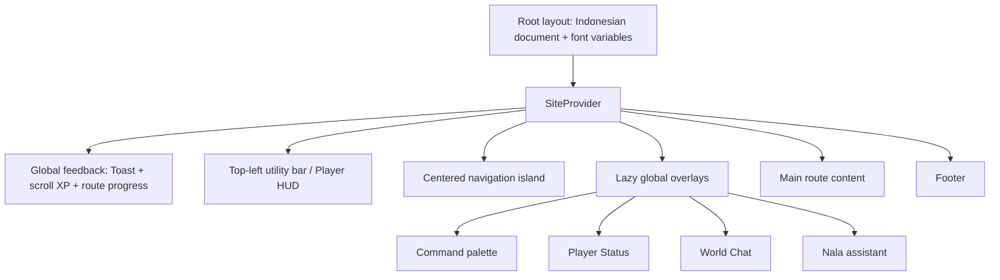
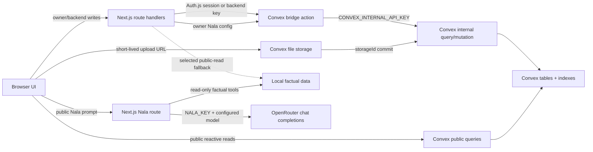

# MB · NST — Current-State Design and Data Architecture

> **Status:** audit of the implemented product, not a new visual proposal
> **Audit date:** 2026-08-23 (Asia/Jakarta)
> **Evidence base:** 12 supplied desktop screenshots in `docs/screenshots/`, task-specific desktop/tablet/mobile evidence in `validation/`, source code, local design/product documents, production-response checks, and read-only queries against the active Convex deployment
> **Scope:** visual language, layout, states, interaction, responsive behavior, database model, data flow, access boundaries, and known inconsistencies

This document records what MB · NST currently is, how its visible surfaces are assembled, and which data systems drive them. It deliberately separates observed facts from inferred intent. It does **not** authorize unconfirmed production changes, especially color/rarity assignments already marked as assumptions in `design-system.md`.

---

## 1. How to read this document

### 1.1 Evidence labels

Every substantial conclusion is grounded with one or more of these labels:

| Label           | Meaning                                                                                                | Strength                                                                    |
| --------------- | ------------------------------------------------------------------------------------------------------ | --------------------------------------------------------------------------- |
| **[SHOT]**      | Directly visible in `docs/screenshots/` or a named `validation/` evidence folder                       | Strong for appearance at the captured viewport and state only               |
| **[CODE]**      | Defined in the current application source or CSS                                                       | Strong for implementation; does not prove the browser rendered it correctly |
| **[LIVE]**      | Confirmed by a read-only query against the active Convex deployment on 2026-08-22 or 2026-08-23        | Strong for that point in time; counts and content may later change          |
| **[SOURCE]**    | Required or described by `PRODUCT.md`, `design-system.md`, `report.md`, `TASKS.md`, or a plan document | Strong according to the source hierarchy below                              |
| **[WEB]**       | Verified against primary technical documentation                                                       | Strong for the named platform behavior                                      |
| **[INFERENCE]** | A conclusion that connects multiple facts but is not directly stated by one source                     | Must not be treated as a confirmed product decision                         |
| **[GAP]**       | Missing, stale, conflicting, or unconfirmed evidence                                                   | Requires resolution before it can become a new production rule              |

### 1.2 Source hierarchy

When sources disagree, the repository establishes this order:

1. `PRODUCT.md` — brand, anti-references, design principles, accessibility target.
2. `design-system.md` and `components/NUMBER-RATIONALE.md` — visual tokens and component rules.
3. `report.md` — gamification audit and recommendations.
4. `TASKS.md` — current work status and known debt.
5. Current code and screenshots — implementation reality; useful evidence, but not automatic authorization to override higher-level rules.

`components/NUMBER-RATIONALE.md` is referenced by both the workflow and the CSS comments, but the file is absent from the audited repository. This is a provenance gap, not permission to invent its content. **[GAP]**

### 1.3 What the screenshots do and do not prove

All 12 supplied `docs/screenshots/` files are 1920 × 1080 desktop captures. They prove the rendered desktop appearance for the single state shown in each image. The later World Chat, live Nala, management, and SEO changes have their own named validation captures at 1440 px, 768 px, and 375 px where applicable. Those later files strengthen only the surfaces and states they show; they do not retroactively prove responsive behavior for every original page.

The Chrome tab bar, address bar, browser controls, blue/cyan desktop surround, and outer window border visible in the captures are **capture artifacts**, not MB · NST product UI. The product viewport begins below browser chrome; the thin 3 px aurora-to-gold line at the top of that viewport is the application XP scroll bar. **[SHOT][CODE]**

---

## 2. Product design north star

### 2.1 Product metaphor

MB · NST presents a personal portfolio as a compact RPG cockpit rather than as a corporate résumé or generic SaaS dashboard. The user explores a world, opens quests, sees achievements, visits contact “portals,” and can talk through World Chat or the Nala assistant. The RPG layer supports orientation and narrative; it must not create false scores, fake accomplishments, or fictional backend state. **[SOURCE]**

### 2.2 Personality

The core character is:

- **Warm:** parchment, pale gold, meadow greens, rounded natural scenery, approachable Indonesian copy.
- **Mechanical:** pixel labels, segmented meters, status chips, hard borders, offset shadows, explicit system states.
- **Exploratory:** parallax landscape, “quest” language, navigation island, build carousel, portals, locked future slots.

These traits must coexist. Pure fantasy illustration loses the cockpit; pure dashboard chrome loses the warmth; generic game UI loses the personal portfolio content. **[SOURCE][INFERENCE]**

### 2.3 Non-negotiable anti-references

The product must not drift into:

- generic purple/blue AI gradients or ambient neon glow;
- translucent glass-card grids used as the primary content system;
- fabricated XP, repository, citation, achievement, or rarity data;
- emoji as permanent achievement, rarity, or navigation icons;
- a full-screen blocking level-up flow;
- decorative motion that repeats whenever content re-enters the viewport;
- color-only rarity/tier meaning;
- desktop-only hover interactions with no touch or keyboard equivalent.

The current command palette and legacy Player Status popup partially conflict with the anti-glass/hardcard direction; they are recorded as existing debt in §17, not normalized into the target language. **[SOURCE][CODE][SHOT]**

---

## 3. Screenshot inventory and visual coverage

| File                 | Surface/state captured                      | Primary evidence recorded here                                                             |
| -------------------- | ------------------------------------------- | ------------------------------------------------------------------------------------------ |
| `landing-hero.png`   | Home hero, default desktop state            | Scenic world, utility bar, navigation island, hero typography, CTA hierarchy, entity layer |
| `landing-build.png`  | Home “Build Glimpses” carousel              | Active/side-card hierarchy, screenshot treatment, controls, dark forest transition         |
| `landing-quest.png`  | Home featured quests and footer             | Light parchment cards, rarity labels, tech chips, CTA treatment, page completion footer    |
| `about.png`          | About page, top/experience state            | Inner-page header, status strip, dashed divider, experience card and rarity placement      |
| `projects.png`       | Projects page, filter state                 | GitHub activity, filter pills, two-column quest cards                                      |
| `research.png`       | Research page                               | Research HUD stats, publication grid, citation meter, locked slot                          |
| `contact.png`        | Contact page                                | Five colored portal cards, brand-specific tones and CTA pills                              |
| `blog.png`           | Blog page, list view                        | Category filters, grid/list control, three live seeded entries                             |
| `world-chat.png`     | World Chat open                             | Right-side panel, reactive status, message timeline, composer                              |
| `assistant.png`      | Nala open                                   | Assistant header/avatar, greeting, quick prompts, composer, separate FAB                   |
| `player-profile.png` | Expanded Player HUD plus World Chat         | HUD anatomy, profile/progress metrics, authenticated action area, overlay coexistence      |
| `player-status.png`  | Legacy Player Status overlay, Inventory tab | Modal layer, tabs, progress summary, filters, inventory grid, visual-system divergence     |

No mobile screenshot is present in `docs/screenshots/`. New evidence now covers World Chat reply/focus states, Nala live/error states, and the management cockpit at 375 px; the remaining original pages still require route-specific mobile validation. Fixed or strip-like additions also require a 768 px capture. **[SHOT][GAP][SOURCE]**

Additional current-state evidence:

| Folder | Coverage |
| --- | --- |
| `validation/manage-world-chat-nala-seo/world-chat/` | Desktop reply selection, right-edge reply action, 375 px composer/quote, and focus-visible state |
| `validation/manage-world-chat-nala-seo/nala-live/` | Desktop greeting/thinking/live responses plus mobile live, empty-result, disabled/error expressions |
| `validation/manage-world-chat-nala-seo/manage-unlocked/` | Desktop moderation/config/expression states, tablet workbench, mobile World Chat and Nala config |
| `validation/nala-reliability-2026-08-23/` | Desktop provider failure/retry-in-place, 393 px live navigation answer, 1280 px reflow, and route handoff |
| `validation/manage-world-chat-nala-seo/manage-locked/` | Anonymous redirect state after the final owner guard |
| `validation/manage-world-chat-nala-seo/seo/` | Generated 1200 × 630 social card and parsed production-response audit |

---

## 4. Foundational visual language

### 4.1 Implemented color system: “Verdant Dusk / Aurora Cockpit”

The active root variables define Scheme 2. These values describe current implementation. Because the earlier gamification document still marks parts of the rarity/tier mapping as assumptions, their presence in CSS does not itself close that approval gap. **[CODE][GAP]**

| Token                 |                   Value | Role in the interface                                |
| --------------------- | ----------------------: | ---------------------------------------------------- |
| `--sky-1`             |               `#123642` | Deep petrol sky/top of scenic gradients              |
| `--sky-2`             |               `#1f5b5c` | Teal sky transition                                  |
| `--sky-3`             |               `#3f8f7f` | Aurora teal-green atmosphere                         |
| `--sky-4`             |               `#7db98f` | Soft meadow/green transition                         |
| `--sky-5`             |               `#e7c66a` | Golden horizon band                                  |
| `--sky-6`             |               `#f2dfa6` | Pale horizon light                                   |
| `--ink`               |               `#16241f` | Primary dark ink, border, dark surface               |
| `--ink-soft`          |               `#47584f` | Secondary text and subdued marks                     |
| `--cream`             |               `#f5ecd8` | Light text and warm surface highlight                |
| `--parchment`         |               `#eaddc0` | Main inner-page surface                              |
| `--parchment-dark`    |               `#ddcba4` | Secondary parchment bands/cards                      |
| `--moss`              |               `#6a9a55` | Nature accent and mapped tier tone                   |
| `--moss-dark`         |               `#3f5f34` | Dark green surface/shadow                            |
| `--pine-deep`         |               `#22392a` | Forest sections and dark panels                      |
| `--gold`              |               `#ecb63f` | Primary highlight, active/progress/CTA accent        |
| `--aurora`            |               `#45b8a4` | Signature interactive accent and focus ring          |
| `--aurora-deep`       |               `#2b8a7a` | Stronger aurora state                                |
| `--coral`             |               `#e06a45` | Small warm accent only                               |
| `--coral-dark`        |               `#b8492b` | Dark coral state/shadow                              |
| `--glass-fill`        | `rgba(245,236,216,.10)` | Limited translucent fill, not the main card language |
| `--glass-fill-strong` | `rgba(245,236,216,.18)` | Stronger limited translucent fill                    |
| `--glass-border`      | `rgba(255,248,226,.34)` | Border over scenic/dark surfaces                     |
| `--shadow-warm`       |    `rgba(12,24,20,.45)` | Deep warm shadow                                     |

Color rules:

1. Parchment plus ink is the default editorial/content pairing.
2. Dark pine plus cream is the default cockpit/overlay pairing.
3. Gold identifies earned value, attention, and primary progress.
4. Aurora identifies interaction, connection, and focus.
5. Coral is intentionally sparse; it must not become the dominant “AI orange” palette.
6. Tier/rarity always retains a text label; hue is supplementary.
7. New production colors must be mapped to approved tokens rather than introduced as new hex values.

The contact portals currently contain channel-specific hard-coded gradients outside this root token list. Their visible differentiation is real, but their token provenance is unresolved. See §17. **[CODE][SHOT][GAP]**

### 4.2 Typography

| Family         | Implemented use                                              | Character                          |
| -------------- | ------------------------------------------------------------ | ---------------------------------- |
| **Fraunces**   | `h1`, `h2`, `h3`, major card titles                          | Human, editorial, warm, expressive |
| **Silkscreen** | Uppercase micro-labels, chips, tabs, counters, system status | Pixel/mechanical/RPG telemetry     |
| **Nunito**     | Body copy, descriptions, form text, secondary UI             | Friendly, readable, contemporary   |

The visual hierarchy is not created by size alone. It uses a deliberate font-role contrast:

- Display statement → Fraunces, tight `-0.01em` tracking.
- System metadata → Silkscreen, uppercase, roughly `0.08em` tracking.
- Explanatory prose → Nunito with softer color and comfortable line height.

Avoid using Silkscreen for long paragraphs or Fraunces for tiny telemetry. **[CODE][SOURCE]**

### 4.3 Spacing, radius, border, and shadow

Implemented base spacing tokens are 8, 12, 16, and 24 px. They form the recurring rhythm for chip padding, card internals, content gaps, and fixed-overlay insets. **[CODE]**

Implemented radius tokens are 8, 12, 16, 10, and pill. However, the most recognizable content cards intentionally override this softer scale with very small 2–4 px corners, 2 px ink borders, and 4–8 px hard offset shadows. That hardcard treatment is the primary product signature. **[CODE][SHOT]**

Use the following hierarchy:

- **Primary content card:** 2 px ink border, 2–4 px radius, solid warm surface, 4–6 px hard offset shadow.
- **Compact control/chip:** small rectangle or full pill depending semantics, with pixel label.
- **Dark cockpit overlay:** 2 px border, dark solid/translucent surface, 6–8 px hard shadow.
- **Decorative/scenic layer:** no generic card container; content may sit directly over the scene.
- **Press state:** move down/right by 2 px and reduce the corresponding shadow to 2 px.

Soft shadows, large 16 px corners, blur, and gradient panels should not be introduced into new primary components merely because legacy overlays use them. **[SOURCE][CODE]**

### 4.4 Iconography and image assets

Permanent interface icons are monoline/pixel-style SVGs rendered with `currentColor`, generally on a 24 × 24 view box with approximately 1.6 stroke weight. The icon set covers navigation, status, data, editing, inventory, medals, chat, and system actions. **[CODE]**

Relevant asset families:

- `public/assets/avatar-pixelated.png` — 16 × 16 player avatar source.
- `public/assets/glimpses/*.webp` — six 1200 × 675 build screenshots.
- Nala expressions — six transparent 352 × 432 PNGs.
- Hero parallax — cloud, hills, meadow, sun/moon, and mountain layers up to 2048 px wide.
- Hero entities — optimized transparent four-frame WebP sprite sheets.
- SVG — pointer cursors, sprite/icon sources, rarity badge, and bronze/silver/gold medal assets.

Emoji in older reports are conceptual shorthand only and must not be copied into production markup. **[SOURCE]**

### 4.5 Texture and material

The visual material alternates between two worlds:

1. **Open world:** atmospheric sky, illustrated mountains, hills, cloud layers, meadow, and small moving entities.
2. **Portfolio ledger/cockpit:** parchment, ink, hard borders, pixel telemetry, status panels, and explicit progress.

Transitions between these worlds are intentional. Home can move from scenic hero to dark forest carousel to parchment quest ledger. Inner routes enter directly into the parchment/cockpit language. **[SHOT][INFERENCE]**

---

## 5. Motion and interaction language

### 5.1 Core motion principles

- Motion should communicate state, spatial continuity, or successful action.
- One-time reveal/unlock animations must unobserve after activation; re-entry must not replay them.
- Looping motion must stop completely under `prefers-reduced-motion: reduce` and expose the final static state.
- Press feedback must have a visible keyboard `:focus-visible` equivalent.
- External-link ripples and toast feedback are brief and non-blocking.
- Motion does not fabricate progress; it visualizes real scroll, real action, or real state.

The shared pixel easing is `cubic-bezier(0.2, 0.9, 0.25, 1.15)`. The navigation island’s principal transition duration is 520 ms. **[CODE][SOURCE]**

### 5.2 Hero entities

The hero uses small animated creatures/particles as direct-manipulation ambience. Hover alone does not change their state. Click/tap, Enter, or Space produces a spark and a nearby dodge, then the entity resumes its flight path inside the hero. Motion is a continuous cancellable Web Animation sequence; reduced-motion presents a static state. **[CODE][SOURCE]**

### 5.3 Build carousel

The carousel advances every 3.6 seconds, pauses while pointer/focus interaction is active, enlarges the current screenshot, and dims/scales neighboring screenshots. Desktop preserves side context; tablet/mobile hides side cards to protect readability. The active card uses a one-time unlock/reveal treatment. **[CODE]**

### 5.4 Global progress and feedback

- The top XP bar is scroll-derived, 3 px high, fixed, non-interactive, and layered above the navigation island.
- A separate 4 px route rail temporarily covers the top edge while an internal
  pathname is prepared. It is indeterminate rather than a fake percentage,
  uses a solid gold fill with an aurora pixel cap, and clears after the pathname
  changes. Reduced motion shows a static full-width band. **[CODE][SHOT]**
- Toasts are queued with at most one visible at a time, appear above the Nala FAB zone, and use `aria-live="polite"`.
- The custom cursor appears only on fine pointers. Coarse pointers retain the platform cursor/touch behavior.

### 5.5 Accessibility grounding

The project targets WCAG 2.1 AA. The implementation requirement to stop non-essential motion under the OS preference is aligned with the W3C technique for `prefers-reduced-motion`; visible keyboard focus aligns with WCAG Focus Visible. **[SOURCE][WEB]**

Primary references:

- [WCAG 2.1](https://www.w3.org/TR/WCAG21/)
- [W3C technique C39: using `prefers-reduced-motion`](https://www.w3.org/WAI/WCAG21/Techniques/css/C39)
- [Understanding Focus Visible](https://www.w3.org/WAI/WCAG21/Understanding/focus-visible?lang=en)

---

## 6. Global application shell

### 6.1 Runtime composition

### 6.2 Fixed-layer contract

| Layer                    | Implemented position             |        Z-index | Notes                                                        |
| ------------------------ | -------------------------------- | -------------: | ------------------------------------------------------------ |
| Skip link                | Top-left when focused            |            999 | Highest intentional accessibility escape                     |
| Nala widget/FAB          | Bottom-right                     |            330 | Shares level with Player Status; collision risk noted in §17 |
| Player Status overlay    | Full viewport                    |            330 | Legacy modal-like surface                                    |
| World Chat               | Right, top 88 px to bottom 22 px |            320 | Full-height desktop side panel                               |
| Command palette          | Centered overlay                 |            300 | Functional Cmd/Ctrl-K palette                                |
| Toast                    | Right, above FAB                 |            280 | Pointer-events disabled; one visible at a time               |
| Route progress rail      | Top edge while navigating        |            270 | Indeterminate; temporarily covers the scroll rail             |
| XP scroll bar            | Top edge                         |            260 | Above navigation island                                      |
| Utility bar / Player HUD | Top-left                         |            210 | Collapses at narrower desktop widths                         |
| Navigation island        | Top-center                       |            200 | Hidden at ≤800 px                                            |
| Page content             | Normal stacking context          | Route-specific | Must not be obscured by fixed controls                       |

### 6.3 Navigation island

The desktop navigation is a centered dark pill at `top: 16px`, constrained to 92 vw. It uses a translucent ink surface, 18 px blur, cream text, and compact pixel-like controls. This is one of the few deliberate glass-adjacent surfaces because it floats over changing scenic/content backgrounds; it is navigation chrome, not a repeated card system. **[CODE][SHOT][INFERENCE]**

At ≤800 px the desktop island is hidden. Responsive navigation behavior is code-derived; it is not visually proven by the supplied screenshot set. **[CODE][GAP]**

### 6.4 Utility bar and Player HUD

The utility area sits at `top: 16px; left: 18px`. In compact form it exposes Chat and the Player trigger. At expanded desktop widths the Player HUD becomes a hard-edged cockpit card containing:

- pixel avatar;
- level and class title;
- System Integrity/status line;
- Player Points total;
- segmented current-level progress;
- counts for inventory, achievements, and active missions;
- World Chat shortcut;
- authenticated identity/action area.

At ≤1100 px the expanded card collapses to its icon/compact trigger. **[CODE][SHOT]**

### 6.5 Theme phases

The shell stores a `cockpit-phase` preference in local storage and supports morning, noon, sunset, and night phases. This phase system changes environmental presentation rather than changing the information architecture. **[CODE]**

### 6.6 Footer

The footer acts as a level-completion marker. It reveals once through Intersection Observer, includes a “Level complete” style message and external links, and must stay static after its first reveal. **[CODE][SHOT]**

### 6.7 Private-route shell exception

`SiteProvider` treats `/manage` as a focused owner workstation. The public
utility bar, global overlays, Nala FAB, command palette, and footer do not render
there; the centered navigation island remains as a stable way back to the public
site. This is route-scoped shell behavior, not a second global design system.
The route is never added to navigation, footer links, palette actions, Nala
suggestions, sitemap entries, or other discovery surfaces. **[CODE][SHOT]**

---

## 7. Home page specification

### 7.1 Hero — `landing-hero.png`

**Observed composition [SHOT]**

- Full-viewport scenic area with bright blue/teal atmosphere, layered pale mountains, clouds, rolling green meadow, and a warm sun.
- A small orange flying entity adds life without competing with the headline.
- Utility actions sit top-left; the centered navigation island floats at the top.
- Hero text is centered in open air rather than enclosed by a card.
- The kicker reads as a system boot/save-file line.
- The main name/title uses large Fraunces; supporting copy is compact and friendly.
- Two hard-shadow CTA buttons form primary/secondary actions.
- A small scroll cue anchors the bottom-center.

**Implemented geometry [CODE]**

- Hero height: `100svh`; minimum height: 640 px.
- Scene and entity layers are behind content; copy is at a higher local layer.
- Copy container: up to approximately 980 px, capped around 88 vw.
- Main heading: `clamp(2rem, 5vw, 3.3rem)`.
- Kicker: approximately 10.5 px pixel label.
- Supporting text: approximately 1.02 rem.
- CTA: approximately 11 px label, 14 × 22 px padding, 2 px border, 4 px hard shadow.
- `homeConfig.hero.showGlassContainer` is false, matching the observed open-air composition.

**Interaction and constraints [CODE][SOURCE]**

- The parallax/WebGL scene and entities are performance-sensitive because “Improve Home performance” remains active in `TASKS.md`.
- Entities respond to deliberate click/tap/keyboard input, not hover.
- Reduced-motion must preserve a legible final composition with no looping travel.
- No text or control may rely on the scenic background alone for contrast at every theme phase.

### 7.2 Build Glimpses — `landing-build.png`

**Observed composition [SHOT]**

- A dark pine/forest section creates a strong tonal break from the sky hero.
- The active 16:9 project screenshot is centered, crisp, outlined in gold, and lifted by a hard shadow.
- Previous/next cards remain visible as smaller, dimmer flanking context.
- A small rarity/system label sits near the active card.
- Pixel arrows and square indicators provide manual position controls.

**Implemented behavior [CODE]**

- Six WebP screenshots, each 1200 × 675.
- Active width: up to 620 px or about 56 vw.
- Neighbor offset: about 430 px on desktop.
- Active scale/opacity: 1/1; side scale/opacity: approximately .58/.72.
- Automatic interval: 3.6 seconds.
- Autoplay pauses under focus or pointer interaction.
- On tablet/mobile, side cards are hidden rather than squeezed.
- Unlock/reveal is a one-time event.

**Design intent [INFERENCE]**

The section behaves like a gallery checkpoint: actual product evidence is foregrounded, while game framing remains subordinate. The screenshots must stay readable and should never be blurred into decorative background art.

### 7.3 Featured Quests — `landing-quest.png`

**Observed composition [SHOT]**

- Warm parchment background with a centered section heading.
- Three featured quest cards in a desktop row.
- Each card has a hard border/shadow, top-left rarity tag, title, concise description, technology chips, and two action affordances.
- The dark completion footer is visible beneath the light section.

**Implemented/component rules [CODE][SOURCE]**

- Cards use 2 px ink borders and hard offset shadows.
- Rarity labels are clipped pixel-corner tags at roughly 12 px from the top/left, around 9.5 px type.
- Current mapping in code is epic→gold, rare→moss, common→coral.
- Rarity assignment must be based on real project weight and confirmed source data, not visual variety.
- Technology chips use the gold/system language and remain secondary to project title and description.
- CTA press feedback moves by 2 px and retains keyboard focus visibility.

---

## 8. Inner-page framework

### 8.1 Shared page shell

Inner pages use a warm parchment field and a narrower editorial column. The typical page wrapper is approximately 940 px wide with desktop padding around 112 px top, 32 px horizontal, and 96 px bottom. At widths below 1024 px it shifts to roughly 92 px top, 20 px horizontal, and 72 px bottom. Generic wide light sections can extend to approximately 1100 px with 24 px side padding. **[CODE]**

The recurring page sequence is:

1. Pixel/system eyebrow.
2. Fraunces page title.
3. Nunito description.
4. Optional HUD/stat strip.
5. Dashed or hard divider.
6. Primary content grid/list.

### 8.2 About — `about.png`

**Observed [SHOT]**

- Introductory header on parchment.
- Four compact HUD chips: class, Level 4, Jambi, and “About DB Synced.”
- A dashed horizontal divider reinforces the ledger/route-map metaphor.
- The first experience card appears below, with a rarity tag and structured role/company/date information.

**Contract [CODE][SOURCE]**

- Experience cards use the hardcard treatment and reserve a stable top-left area for the rarity label.
- The “Kamu di sini” journey marker has a 2.2 second pulse under normal motion and becomes static under reduced motion.
- Skill visualization uses eight discrete blocks rather than an ambiguous continuous glow.
- Achievement medals use SVG assets, not emoji.
- Experience rarity and achievement medal tier remain confirmation-sensitive data decisions.

**Data caveat [CODE][LIVE]**

The `About DB Synced` chip communicates that page content can be read from the current backend, but Level 4 and most player progression are derived locally from `lib/data.js`, not from a Convex player-profile row. The UI must not imply that every displayed player metric is independently persisted in the database.

### 8.3 Projects — `projects.png`

**Observed [SHOT]**

- Page title and short explanation on parchment.
- A GitHub-style activity grid near the top.
- Two filter groups: Type and Category, presented as compact pills/buttons.
- A two-column desktop grid of quest/project cards.
- Cards use rarity tags, technology metadata, and hard-shadow action controls.

**Contract [CODE][SOURCE]**

- Repository and activity figures must come from actual project/Git evidence; no fabricated contribution density.
- Filters must be keyboard reachable and expose selected state semantically.
- At narrow widths the two-column grid must become one column with no horizontal overflow.
- Hover detail must have a tap/touch equivalent if expanded in future.

### 8.4 Research — `research.png`

**Observed [SHOT]**

- Three top HUD stat chips: 5 citations, h-index 2, and 4 publications.
- Four publication cards arranged 2 × 2 on desktop.
- Each card includes publication metadata, title, description, and a “cited” pill with a five-dot visual scale.
- A dashed locked-publication slot communicates future capacity without inventing a publication.

**Contract [CODE][SOURCE]**

- Publication cards have a minimum grid width around 300 px.
- Citation dots supplement the explicit numerical/text value; dots alone cannot carry meaning.
- The locked slot is decorative/anticipatory and must not be announced as an existing publication.
- Citation, h-index, and publication totals must remain traceable to real data.
- Current live Convex inventory contains four publication-derived scrolls, but the research page’s exact citation metadata remains a local content concern rather than a dedicated publications table.

### 8.5 Contact — `contact.png`

**Observed [SHOT]**

- Five large portal cards arranged as three on the first row and two on the second.
- Each portal has a distinct dark-to-brand tone, large white label, compact description, monoline icon, and a white/light pill CTA.
- Channels shown: LinkedIn, GitHub, Google Scholar, Blog, and Instagram.
- Cards remain content-rich and solid; they do not use glass.

**Implemented behavior [CODE][LIVE]**

- Convex stores five active channels in a fixed `sortOrder`.
- Activation creates a public contact event, starts a short ripple, then delays external navigation by about 150 ms.
- The current event schema accepts arbitrary metadata; no retention or analytics policy is documented.
- Channel-specific gradients use several hard-coded colors outside the global token palette. They visually match external identities but currently violate the repository’s “no new hex without confirmation” discipline.

### 8.6 Blog — `blog.png`

**Observed [SHOT]**

- Page title and a caption explicitly stating Convex synchronization.
- Category filter pills and a grid/list view toggle.
- The captured default is list view.
- Three entries appear inside a hard-bordered container; each row has a 52 px thumbnail, title, excerpt, and metadata.

**Live data [LIVE]**

The active deployment contained three published seeded posts at audit time:

1. Mentor Study Club Batch 4.
2. Dev Log E-Ticket TNKS.
3. Catatan Riset KNN Pendidikan.

Their date labels are still CMS-oriented placeholders/pending labels in seed data. The UI should present them honestly rather than inventing publish dates. **[LIVE][SOURCE]**

**Behavior [CODE]**

- Public listing is a Convex query.
- Slug detail is also a public Convex query.
- List/grid choice is presentation state, not a database mutation.
- Grid covers and list thumbnails first honor a valid explicit
  `featuredImage`/`coverImage` value if a data source supplies one. Otherwise
  they derive the cover from the first valid image block in stored order. This
  is presentation-only: the selected block remains in the article body.
- A post with no renderable image keeps the existing tone panel and document
  sprite. A failed cover request hides only the image layer, exposing that same
  fallback instead of a broken-image glyph. **[CODE][SHOT]**
- Owner editing routes through Auth.js-protected Next.js endpoints and an internal Convex bridge.
- A local factual fallback exists for selected public reads if Convex is unavailable; fallback content must remain visibly consistent with seeded source data.

### 8.7 Data Management — `/manage`

**Purpose and access [CODE][SHOT]**

The route combines World Chat moderation and Nala runtime configuration in one
owner-only workbench. It was intentionally rendered without the page guard for
its first visual-validation phase, then locked with `requireOwner()` before the
feature was considered complete. Auth.js assigns `owner` only to
`mukhtadanasution@gmail.com`; anonymous requests redirect to
`/forbidden?reason=login`, and a signed-in non-owner redirects with
`reason=role`. Write APIs repeat the role check independently, so page
visibility is not the authorization boundary.

**Visual anatomy [CODE][SHOT]**

- The top introduction uses `// OWNER DATA CONSOLE`, a large Fraunces “Data
  Management” heading, one explanatory sentence, and a hard-shadow “Kembali ke
  situs” action.
- Desktop uses an asymmetric workbench: a narrow status rail beside a broad tab
  panel. The rail reports access state, current reactive message count,
  OpenRouter-key presence, and the persisted model slug. It never reveals the
  key itself.
- The tab shell has a dark frame, two native `role="tab"` buttons, a gold active
  panel, aurora focus outline, and parchment content. Arrow Left/Right plus
  Home/End change the active tab and move focus.
- World Chat moderation renders the same active Convex rows as the public
  channel. Each row shows author, timestamp, shortened database ID, body, and a
  coral delete control. Deletion uses an inline two-action confirmation rather
  than a modal. The explanatory copy states that deletion is a soft delete.
- Nala configuration exposes the live kill switch, editable OpenRouter model
  slug, temperature, maximum response tokens, and a bounded prompt supplement.
  “Terakhir disimpan” and a polite status line distinguish persisted, saving,
  error, and unchanged states.
- A six-card expression legend records `greeting`, `thinking`, `happy`,
  `pointing`, `confused`, and `idle` with the real transparent sprite assets and
  their routing meaning.

The surface reuses `--ink`, `--cream`, `--parchment`, `--gold`, `--aurora`, and
`--coral`; borders are 2 px and shadows are hard offsets. It adds no gradient,
glow, glass card, decorative metric, emoji, or color token. **[CODE][SOURCE]**

**Responsive contract [SHOT][CODE]**

- At 1440 px the status rail and workbench remain side by side.
- Around 768 px the status rail becomes a full-width header with three
  horizontally distributed system facts; the workbench follows below.
- At 375 px the heading wraps deliberately, the back action fills the content
  width, rail facts stack, tabs become two full-width rows, and every form field
  remains inside a 360 px document width. No horizontal overflow was measured.
- Evidence lives in
  `validation/manage-world-chat-nala-seo/manage-unlocked/`; the final anonymous
  gate is in `validation/manage-world-chat-nala-seo/manage-locked/`. Some
  management captures show two active messages because a temporary visual-test
  row was present; that row was soft-deleted through the implemented moderation
  path after capture, leaving the original single active message.

---

## 9. Overlays and cockpit surfaces

### 9.1 World Chat — `world-chat.png`

**Observed [SHOT]**

- A tall right-anchored panel with a dark header and parchment body.
- Header title: “WORLD CHAT”; subtitle identifies a reactive Convex channel.
- A live/connected status appears in the header.
- The captured timeline contains one short message.
- Composer consists of a textarea and explicit send control.

**Geometry and responsive behavior [CODE]**

- Desktop: `top: 88px; right: 22px; bottom: 22px`, width up to approximately 420 px.
- Border: 2 px; radius: about 4 px; hard shadow: about 8 px.
- Mobile ≤760 px: `top: 124px`, 12 px side/bottom insets, width equal to viewport minus 24 px.
- Message query subscribes only while the panel is open and caps the visible latest set at 40.
- Message body limit is 280 characters.
- Every active message has a compact `BALAS` control at the right side of its
  author row. Selecting it inserts a parent quote above the composer, moves
  focus to the textarea, and exposes an explicit cancel action.
- The reply quote wraps inside the mobile panel; validation at 375 px measured
  no document overflow and a 2 px aurora focus outline.

**Data behavior [CODE][LIVE][WEB]**

- Reads use `useQuery(api.worldChat.listLatest)`, so the open client receives reactive updates from Convex rather than 15-second polling.
- Writes pass through a Next.js route that requires Auth.js or a backend key, then through the authenticated bridge to an internal mutation.
- `replyToId` is a same-table relation. The send mutation accepts only an active
  parent ID; a missing, invalid, or deleted parent is rejected. The public query
  resolves the parent author/body into a bounded quote object rather than asking
  each client to perform another lookup.
- Owner deletion is a soft delete: the row remains auditable with deletion time
  and actor key, while public lists omit its body. Existing child replies remain
  visible but return `replyUnavailable: true`, so deleted parent content cannot
  leak through a quote.
- `DELETE /api/chat/messages` returns 401 without a session, 403 for a visitor,
  and succeeds only for the owner or the explicitly protected backend path.
- After soft-deleting every task-created validation row, the live database held
  one active message on 2026-08-23. Personal author details are intentionally
  omitted from this document.
- Convex queries are cached, reactive, and consistent by platform design; see [Convex query functions](https://docs.convex.dev/functions/query-functions).

### 9.2 Nala assistant — `assistant.png`

**Observed [SHOT]**

- A compact panel floats above the bottom-right Nala FAB.
- Dark header contains a transparent character portrait, Nala label, and status.
- Body opens with a greeting bubble and three quick-prompt chips.
- Composer has a text input and send control.
- The FAB remains visually separate from the panel.

**Geometry and behavior [CODE]**

- FAB: roughly 64 px, clipped 6 px corners, gold fill, 2 px ink border, 6 px hard shadow.
- Desktop panel: about 380 px maximum width, 560 px maximum height, `right: 24px; bottom: 100px`, 2 px border, 8 px hard shadow.
- Mobile ≤640 px: approximately 10 px side insets and 86 px bottom clearance.
- Up to three quick prompts are displayed.
- Escape and outside click close the non-modal dialog on desktop.
- Input length is capped at 1000 characters.

**Runtime and data boundary [CODE][LIVE][WEB][GAP]**

- Successful answers are live OpenRouter completions from
  `https://openrouter.ai/api/v1/chat/completions`; there is no successful local
  template fallback. Missing key, disabled runtime, provider error, timeout,
  empty completion, serialized tool markup, invalid route, and ungrounded numeric response all surface as
  explicit failures with the `confused` expression.
- `NALA_KEY` stays in the Next.js server environment. Neither the browser nor
  Convex receives its value; management surfaces expose only “key installed” or
  “key missing.”
- The current persisted model is
  `nvidia/nemotron-3-ultra-550b-a55b:free`. `/manage` can replace the OpenRouter
  slug without a redeploy. The live singleton also stores enabled state,
  temperature `0.25`, maximum tokens `620`, and an optional owner supplement.
- Every factual response must execute at least one server-side read-only
  portfolio tool. Tool selection and execution happen locally before the model
  request; the configured model receives plain, verified context through the
  standard chat-completions message format. Nala therefore does not require the
  selected model to support function calling, `tool_choice`, or a provider-specific
  tool syntax. This is the compatibility boundary for owner-selected OpenRouter
  chat models.
- Each provider request times out after 24 seconds. Network failures plus HTTP
  `408`, `429`, `500`, `502`, `503`, `504`, `524`, and `529` receive one bounded
  retry; an HTTP 200 response without a completion is retried at most twice.
  Provider error metadata is logged server-side without exposing the API key.
- A numeric grounding check rejects or repairs numbers absent from tool results.
  The validated Player Stats response returned Level 4, 71 Player Points, and
  19 points remaining without calculating an unsupported percentage.
- Expressions are response semantics: `greeting` before interaction,
  `thinking` during the provider call, `happy` for found factual data,
  `pointing` for contact/navigation, `confused` for empty/error results, and
  `idle` for a general profile summary.
- Navigation intent is resolved on the server against the public allowlist `/`,
  `/about`, `/blog`, `/contact`, `/projects`, and `/research`; `/manage` and
  arbitrary model-produced paths can never become client actions. The action is
  rendered as a real link, while the copy must say the page is ready rather than
  claiming it already opened.
- A failed browser request leaves one user turn and one honest error bubble. Its
  `Coba lagi` control replaces that failure in place, excludes the failed turn
  from model history, and does not append a duplicate user message. Quick prompts
  are hidden while a request is pending so the compact thread keeps its working
  state visible.

Nala now has a Convex **configuration** table, but still has no conversation or
message persistence table. History remains client/session-local, the API reports
`storage: null`, and inaccessible Supabase history is not restored. Rate limits
are in-process: 12 requests per IP per minute and 60 total requests per process
per minute. They reset with process lifecycle and do not coordinate across
instances. The UI must not imply cross-device memory. **[CODE][LIVE][GAP]**

### 9.3 Expanded Player HUD — `player-profile.png`

**Observed [SHOT]**

- Pixel avatar and `Lv.4 Systems Builder` identity.
- System Integrity indicator.
- 71 Player Points.
- Segmented 11/30 progress toward the next level.
- 15 inventory items, 12 achievements, and 5 active missions.
- Chat shortcut and authenticated account/logout area.
- World Chat can remain open alongside the HUD.

**Current calculation source [CODE]**

These metrics are derived from `lib/data.js` through `lib/playerProgress.js`:

- 12 of 13 achievements unlocked.
- 0 of 5 missions completed, therefore 5 active.
- 71 total Player Points.
- Level 4, title “Systems Builder.”
- 11/30 progress toward Level 5.
- 15 local inventory items: 12 achievement-derived items plus 3 level keys.

They are real derivations from repository content, but they are not stored as a player row in Convex. This distinction is part of the product contract.

### 9.4 Legacy Player Status — `player-status.png`

**Observed [SHOT]**

- Dimmed/blurred full-screen background.
- Large centered rounded panel with gradient/blur treatment.
- Tabs for Inventory, Achievement, and Mission.
- Top summary chips for Level 4, 71 PP, and 15 items.
- Segmented level progress, category filters, and item grid.

**Current status [SOURCE][CODE][SHOT]**

This is the clearest visual outlier in the supplied screenshot set. It uses larger radii, softer blur, and gradient/glass cues that conflict with the hard-border parchment cockpit language. `TASKS.md` already records alignment of the old Player Status popup as future work. Until redesigned and confirmed, this screenshot documents legacy reality, not a component template for new surfaces.

**Data inconsistency [CODE][LIVE]**

The HUD summary remains local-derived at 15 items. When the Inventory grid opens, it fetches `/api/inventory/items` and can replace the grid with 14 live Convex items. The header and body can therefore disagree: **15 local progression items versus 14 backend inventory records**. This is a split data contract that should be resolved explicitly rather than hidden through copy or styling.

### 9.5 Command palette

The command palette is functional, despite older report uncertainty. Cmd/Ctrl-K opens it; it supports page navigation, external destinations, and theme phase cycling. However, its large soft radius, dark translucency, and blur are closer to generic command-palette/glass conventions than the product’s hardcard grammar. Function and visual consistency should be treated as separate questions. **[CODE][SOURCE]**

### 9.6 Coexistence rules

| Pair                        | Current behavior/risk                                                                                                 |
| --------------------------- | --------------------------------------------------------------------------------------------------------------------- |
| Player HUD + World Chat     | Proven to coexist in `player-profile.png`; left/right placement avoids direct desktop overlap.                        |
| Nala + World Chat           | Resolved through shell orchestration: opening World Chat obscures/closes the Nala surface, so two right-edge conversations do not compete. |
| Nala + Player Status        | Both use z-index 330. DOM order can determine which wins; this is an explicit layering risk.                          |
| Command palette + chat/Nala | Palette is z-index 300, below chat (320) and Nala (330); an already-open assistant can visually dominate the palette. |
| Toast + Nala FAB            | Toast bottom offset reserves FAB height and gap.                                                                      |
| XP bar + navigation         | XP bar z-index 260 intentionally remains above island z-index 200.                                                    |

---

## 10. Component grammar

| Component       | Visual signature                                         | Content/data role                            | Required states                                         |
| --------------- | -------------------------------------------------------- | -------------------------------------------- | ------------------------------------------------------- |
| Hard card       | Solid surface, 2 px border, 2–4 px corner, offset shadow | Projects, experience, publication, blog rows | Default, hover/focus, press, mobile                     |
| Blog cover      | Cropped real image over the existing tone/sprite fallback | Visual identity for a published article       | Explicit source, first-block derived, missing/failed    |
| Pixel label     | Silkscreen uppercase, spaced letters                     | Kicker, tier, system state                   | Must remain legible at small sizes                      |
| Rarity tag      | Clipped top-left colored block plus text                 | Real rarity classification                   | Common/rare/epic, never color-only                      |
| HUD chip        | Compact icon + label/value                               | Real stat/status                             | Static, responsive wrap; decorative icon hidden from AT |
| Segmented meter | Discrete filled/unfilled cells                           | Skill/level progress                         | Current, complete, reduced motion                       |
| CTA button      | Ink/gold/cream solid fill, hard shadow                   | Route/action                                 | Hover, active, focus-visible, disabled where relevant   |
| Filter pill     | Pixel label, selected contrast                           | Local filtering                              | Selected/unselected, focus-visible, wrapping            |
| Locked slot     | Dashed border, restrained tone                           | Honest future capacity                       | Static; cannot masquerade as real content               |
| Portal card     | Large solid/gradient branded panel                       | External contact channel                     | Hover/focus lift, press/ripple, touch action            |
| Toast           | Small dark fixed card                                    | New non-blocking information                 | Queue of one, polite live region, reduced motion        |
| Side panel      | Dark header + parchment body, hard shell                 | Chat/assistant                               | Closed/open, loading, empty, error, mobile              |
| Sprite icon     | Monoline/pixel SVG, currentColor                         | Navigation/status/action                     | Decorative or named according to semantic role          |
| Reply quote     | Slim aurora rule, parent author/body, bounded wrap       | World Chat parent context                    | Selected, cancelled, parent unavailable, 375 px          |
| Owner workbench | Status rail + dark tab frame + parchment form/list       | Moderation and runtime configuration         | Desktop/tablet/mobile, focus, confirm, saved/error       |

### 10.1 Semantic rules

- Decorative icons must use `aria-hidden="true"`.
- New information such as a toast uses `aria-live="polite"`.
- A rarity tag contains meaningful text and should not be hidden if it is the only textual tier label.
- Locked decorative slots must not be focusable.
- Custom clickable cards need native links/buttons or complete keyboard semantics.
- Status roles should be reserved for state that can change or needs announcement; static decoration should not spam assistive technology.

---

## 11. Current database architecture

### 11.1 System of record

Convex is the active runtime database. The Supabase schema and setup documentation remain only for offline recovery and audit. The application no longer reads or writes Supabase at runtime. **[CODE][LIVE][SOURCE]**

`plans/convex-migration-plan.md` still labels itself as a not-yet-implemented plan, but current dependencies, server code, Convex modules, and successful live queries show that the migration has been implemented. The plan header is stale and must not be used as current-state evidence. **[GAP]**

### 11.2 Request and trust flow

Convex terminology used here follows the platform’s current documentation:

- Queries are read-only, cached, reactive, and consistent.
- Mutations are transactional database writes.
- Actions may perform non-deterministic work and call external services.
- Internal functions cannot be called directly by an untrusted client.
- Indexes support ordered field-based query paths.

Primary sources: [function overview](https://docs.convex.dev/functions/overview), [internal functions](https://docs.convex.dev/functions/internal-functions), [indexes](https://docs.convex.dev/database/reading-data/indexes/), and [actions](https://docs.convex.dev/functions/actions). **[WEB]**

### 11.3 Convex tables and indexes

#### `blogPosts`

Purpose: published and editable portfolio writing.

Key fields:

- Legacy migration identifiers: optional `legacyId`, `legacyShardId`.
- Identity/content: `slug`, `title`, `excerpt`, block content.
- State: `draft | published | archived`.
- Taxonomy/presentation: `tags`, `readTime`, `coverTone`, `sourceHref`.
- Date fields: optional machine `publishedAt` and display `publishedAtLabel`.
- Ownership/audit: optional `ownerKey`, timestamps, optional schema version.

Indexes:

- `by_slug`
- `by_status_and_publishedAt`
- `by_legacyId`

Public reads return published posts only. Owner/backend functions create,
update, or archive. The schema does not currently persist a dedicated featured
image. The Blog presentation therefore derives a cover from the first valid
resolved image block unless an upstream record supplies a valid explicit cover
property. Seeded posts currently lack a confirmed machine publish date, so
order/date presentation must not imply precision absent from data.
**[CODE][LIVE]**

#### `worldChatMessages`

Purpose: live public channel timeline.

Key fields:

- Actor: `actorKey`, `actorRole` (`owner | visitor | backend`), `authorName`.
- Message: `body`.
- Relation: optional `replyToId` pointing to another `worldChatMessages` row.
- Lifecycle: `active | deleted`, `sentAt`, optional deletion time/key.
- Optional schema version.

Indexes:

- `by_status_and_sentAt`
- `by_actorKey_and_sentAt`

Public clients can query active recent messages. A query batch-resolves active
parents into `replyTo`; if the parent is deleted, clients receive
`replyUnavailable` without its author/body. Sending is available to authenticated
actors, while deletion is rechecked as owner/backend in the Next.js route,
feature store, bridge action, and internal mutation. Deletion is idempotent and
soft; it never removes the audit row. **[CODE][LIVE]**

#### `nalaSettings`

Purpose: owner-managed runtime configuration for the public Nala assistant.

Key fields:

- Singleton identity: `configKey: "primary"`.
- Runtime: `enabled`, OpenRouter `model`, `temperature`, `maxTokens`.
- Prompt extension: `systemPromptSupplement`, limited to 2400 characters.
- Audit: `updatedAt`, `updatedByKey`, `schemaVersion`.

Index: `by_configKey`.

The model slug is trimmed and syntax-validated. Temperature is clamped to
`0..2`; max tokens are rounded and clamped to `64..1200`. Only owner/backend
actors can update the row. The OpenRouter API key is deliberately absent from
this table. If the singleton does not exist, code returns a truthful in-memory
default without inserting a row as a side effect. On 2026-08-23 the row was
persisted and enabled with model
`nvidia/nemotron-3-ultra-550b-a55b:free`. **[CODE][LIVE]**

#### `inventoryItems`

Purpose: persistent backend inventory/artifact catalog.

Key fields:

- Source identity: `sourceKey`, optional `sourceId`, legacy identifiers.
- Type: `scroll | tool | artifact | medal | key`.
- Display: name, description, icon.
- Tier: `common | rare | epic`.
- State: `unlocked | hidden`.
- Acquisition/link: acquisition time, optional destination.
- Ownership/extension: optional owner key, arbitrary metadata, timestamps, schema version.

Indexes:

- `by_sourceKey`
- `by_status_and_createdAt`

At audit time there were 14 unlocked records: 4 scrolls, 6 artifacts, and 4 medals; no Convex tool or key records. Rarity counts reflect current seed mapping, not a newly approved design decision. **[LIVE][GAP]**

#### `contentEntries`

Purpose: compact CMS-like public/private copy fragments.

Key fields: `entryKey`, title, body, arbitrary payload, `public | private` status, optional owner, legacy identifiers, timestamps, schema version.

Indexes:

- `by_entryKey`
- `by_status_and_updatedAt`

The six live seeded entries contain the global intro plus About, Projects, Research, Blog, and Contact captions. **[LIVE]**

#### `contactChannels`

Purpose: ordered contact-portal definitions.

Key fields: `channelKey`, label, supporting text, CTA, destination URL, tone, `sortOrder`, active flag, optional owner, migration/audit fields.

Indexes:

- `by_channelKey`
- `by_active_and_sortOrder`

The five live records correspond to LinkedIn, GitHub, Google Scholar, Blog, and Instagram. **[LIVE]**

#### `contactEvents`

Purpose: lightweight portal-interaction log.

Key fields: channel key, event name, arbitrary metadata, occurrence time, schema version.

Index: `by_channelKey_and_occurredAt`.

Writes are public through the current route and the schema accepts arbitrary metadata. There were zero live events at audit time. Retention, metadata minimization, and abuse controls are not documented. **[CODE][LIVE][GAP]**

#### `records`

Purpose: generic compatibility surface for public/private collections and payloads.

Key fields: collection, optional slug, `public | private` visibility, optional owner, arbitrary payload, `fileCount`, migration identifiers, timestamps, schema version.

Indexes:

- `by_collection_and_createdAt`
- `by_visibility_and_createdAt`
- `by_collection_and_visibility_and_createdAt`
- `by_legacyId`

There were zero live records at audit time. Public queries expose only public records; protected routes manage writes. **[LIVE][CODE]**

#### `files`

Purpose: metadata for objects uploaded to Convex file storage.

Key fields: optional linked record ID, Convex `_storage` ID, original name, MIME type, byte size, arbitrary metadata, creation time, schema version.

Index: `by_recordId_and_createdAt`.

There were zero live file rows. Upload flow uses a short-lived URL, direct storage upload, then a protected commit that can link the file to a record and increment `fileCount`. No matching delete/decrement lifecycle was found in the audited path. See [Convex file upload flow](https://docs.convex.dev/file-storage/upload-files). **[CODE][LIVE][WEB][GAP]**

#### `seedManifests`

Purpose: verifiable provenance for deterministic imported data.

Key fields: version, schema version, source commit, generation time, source files, per-table counts/checksums, content hash, import time.

Index: `by_version`.

One manifest existed at audit time. The current generated version is
`convex-seed-v1-e5d4a727b15e`, with content hash prefix `e5d4a727b15e`; it
records three blog posts, fourteen inventory items, six content entries, and
five contact channels. **[CODE][SOURCE]**

### 11.4 Live snapshot, 2026-08-23

| Table               | Live rows | Audit result                                   |
| ------------------- | --------: | ---------------------------------------------- |
| `blogPosts`         |         3 | No duplicate seed keys; schema version present |
| `worldChatMessages` |         1 | Original active public message preserved; test rows soft-deleted |
| `nalaSettings`      |         1 | Persisted enabled singleton; owner-managed model/config          |
| `inventoryItems`    |        14 | No duplicate seed keys; schema version present |
| `contentEntries`    |         6 | No duplicate seed keys; schema version present |
| `contactChannels`   |         5 | Ordered active channel set present             |
| `contactEvents`     |         0 | Empty                                          |
| `records`           |         0 | Empty                                          |
| `files`             |         0 | Empty                                          |
| `seedManifests`     |         1 | Current import manifest present                |

This is a point-in-time audit, not a fixture guarantee. Dynamic counts should be queried, not copied into UI constants. **[LIVE]**

### 11.5 Seed and recovery model

Seed generation is deterministic and derived from repository facts. The build/import scripts generate records and a manifest with checksums, source file list, commit, and a content hash. This design supports auditability and avoids manually invented counts. **[CODE]**

`nalaSettings`, World Chat rows, and all event/record/file rows are operational
post-cutover data and are not replaced by the deterministic content seed. Nala
conversation history is not recoverable and is not represented by a seed or a
runtime table. **[CODE][SOURCE]**

The legacy Supabase system used three shards, fan-out reads, round-robin writes, routed IDs (`s1_`, `s2_`, `s3_`), Postgres RLS, a Realtime chat trigger, and S3-compatible storage. It is now a recovery/audit reference only. It must not be described to users as the active backend. **[SOURCE][CODE]**

### 11.6 Consistency and atomicity

Convex mutations provide transactional write behavior, so related database updates inside one mutation commit atomically or retry under optimistic concurrency. That is especially relevant to file commit plus record count and to message lifecycle changes. Platform behavior is grounded in [Convex OCC and atomicity](https://docs.convex.dev/database/advanced/occ). **[WEB]**

---

## 12. UI-to-data mapping

| Visible surface              | Primary read source                                  | Write path                                         | Fallback/derived behavior                           | Important caveat                                        |
| ---------------------------- | ---------------------------------------------------- | -------------------------------------------------- | --------------------------------------------------- | ------------------------------------------------------- |
| Home hero                    | Local config/assets                                  | None                                               | Theme/local animation state                         | Performance-sensitive; not DB-driven                    |
| Build Glimpses               | Local WebP asset list                                | None                                               | Carousel state in client                            | Project evidence is static build content                |
| Featured quests/projects     | Local repository data                                | None in public view                                | Real project facts                                  | Rarity assignment must be confirmed                     |
| About copy                   | Convex `contentEntries` or local factual fallback    | Protected content route                            | Local captions can render if backend unavailable    | “DB synced” does not mean player level is persisted     |
| Player HUD progress          | `lib/data.js` → `playerProgress.js`                  | None                                               | Fully derived locally                               | 15 local items differs from 14 Convex inventory records |
| Player Status inventory grid | Convex `inventoryItems` after fetch                  | Protected inventory route                          | Initially/local-derived content may flash or differ | Split summary/body contract                             |
| Research stats/publications  | Local portfolio/research data                        | None in current surface                            | Inventory scrolls mirror some publications          | No dedicated Convex publications table                  |
| Contact portals              | Convex `contactChannels` or local factual fallback   | Public `contactEvents` route                       | Fixed local channels can render                     | Public arbitrary event metadata                         |
| Blog list/detail             | Convex `blogPosts`                                   | Auth.js route → bridge → internal functions        | Explicit cover, else first valid resolved image block; tone/sprite if none | Derived cover never removes or reorders article blocks; seed dates are not all final |
| World Chat                   | Reactive Convex public query + resolved parent quote | Authenticated send; owner/backend soft delete       | No polling fallback                                 | Latest 40; deleted parent quote is unavailable          |
| Nala                         | Session history + locally selected factual tool + plain live OpenRouter completion | Public rate-limited `/api/nala/chat` | Honest retryable error only; no successful template fallback | No durable Convex memory/history; model need not support tool calling |
| Data Management             | Chat query + Convex `nalaSettings` singleton         | Owner page/API → bridge → internal mutations        | Config read can show explicit warning/default       | Route hidden from discovery and guarded server-side     |
| SEO discovery               | Local profile facts + published Convex Blog rows     | Build/runtime metadata routes                       | Static public routes survive backend failure; local previews stay excluded | Unknown Blog timestamps omit `lastmod`; never use epoch |
| Generic records              | Convex `records`                                     | Protected routes                                   | Compatibility abstraction                           | Live set empty                                          |
| File upload                  | Convex `_storage` + `files`                          | Protected URL generation and commit                | None                                                | Delete/decrement lifecycle unresolved                   |

---

## 13. Authentication, authorization, privacy, and configuration

### 13.1 Authentication boundary

Google OAuth through Auth.js is the interactive owner authentication mechanism. Next.js route handlers verify a session or a backend API key before invoking protected bridge actions. The bridge separately validates `CONVEX_INTERNAL_API_KEY` using timing-safe comparison before calling internal Convex functions. **[CODE]**

The owner role is deliberately pinned in `auth.js` to
`mukhtadanasution@gmail.com`. `/manage` and Blog Admin call `requireOwner()` on
the server before protected reads. World Chat delete and Nala configuration
updates then repeat authorization through their API and Convex mutation layers.
This defense in depth means a hidden link, client state, or direct endpoint URL
cannot grant management authority. **[CODE]**

Internal functions are appropriate for trusted server orchestration because they cannot be called directly from untrusted clients; this matches [Convex internal function guidance](https://docs.convex.dev/functions/internal-functions). **[WEB]**

### 13.2 Current configuration gaps

- Owner identity is intentionally hard-coded in `auth.js`; deployment notes
  must not suggest that an arbitrary environment value can replace it.
- The inspected local environment contains both the correct `CONVEX_INTERNAL_API_KEY` name and a misspelled `CONVEXT_INTERNAL_API_KEY` residue.
- `BACKEND_API_KEY` was not present in the redacted key-name inventory, so the non-session backend header path may not be usable locally.
- Legacy Supabase credentials remain in `.env.local` even though runtime access has migrated to Convex.

No secret values are reproduced here. These are configuration-hygiene findings, not evidence of an exposed secret. **[CODE][GAP]**

### 13.3 Public-write surfaces

- Contact event creation is intentionally public but needs documented metadata limits, retention, and abuse controls.
- World Chat sends are not anonymous public writes in the current route; they require a valid session or backend key.
- World Chat delete and both Nala-settings methods are owner/backend-only.
- Nala accepts public chat requests but applies 12 requests per IP per minute and
  a 60-request process-wide ceiling. Both counters reset with process lifecycle
  and do not coordinate globally.

### 13.4 Privacy presentation

- UI screenshots may contain signed-in email/account information. Design documentation and fixtures should use redacted or synthetic placeholders unless identity itself is under test.
- World Chat is a public channel; composer copy should communicate that messages can be publicly visible.
- Nala must disclose the absence of durable history rather than suggesting permanent memory.

### 13.5 Indexing and crawler contract

The verified public origin is `https://me.mukhtada.my.id`; the apex domain did
not serve the portfolio during the 2026-08-23 check. `NEXT_PUBLIC_SITE_URL` may
override the origin, but normalization accepts only HTTP(S) and reduces it to a
single origin. **[CODE][LIVE]**

- Root metadata defines a title template, authorship, creator/publisher,
  route-independent description, focused keywords, canonical `/`, Open Graph,
  Twitter large-card metadata, public robot defaults, and optional Google
  verification.
- About, Projects, Research, Blog, Contact, and each published Blog detail add a
  unique description and canonical path. Blog details use `og:type=article`.
- `/sitemap.xml` contains six public route entries plus Convex rows whose status
  is exactly `published`. Draft/local-preview rows, owner routes, state routes,
  redirects, and API endpoints are excluded. An unknown migrated timestamp such
  as `0` omits `lastmod`; the code never converts it into a misleading 1970 date.
- `/robots.txt` allows the public site, advertises the absolute sitemap, and
  disallows `/api/`, `/manage`, `/blog/admin`, `/forbidden`, and `/redirect`.
  Robots exclusion is not used as an authorization mechanism.
- `/manage`, Blog Admin, forbidden, and redirect metadata use `noindex,
  nofollow`; private routes are still protected independently.
- The generated 1200 × 630 PNG social card and SVG icon reuse exact existing
  palette values. The web manifest uses the same ink theme and Indonesian
  language declaration.
- A JSON-LD `@graph` contains only repository-backed `WebSite`, `ProfilePage`,
  and `Person` facts. It omits email, fabricated dates, and synthetic metrics.

Production-response evidence in
`validation/manage-world-chat-nala-seo/seo/audit.md` confirms valid XML/JSON,
nine sitemap URLs, absolute metadata images, parsed structured data, private
route exclusion, and HTTP 200 for every metadata asset. **[CODE][SHOT]**

---

## 14. Responsive behavior

The following is implementation-derived unless a screenshot is explicitly named. **[CODE][GAP]**

### 14.1 Desktop, ≥1280 px

- Full navigation island and expanded scene composition.
- Utility controls occupy the upper-left; expanded HUD is available where width permits.
- Featured quests and portal cards use multi-column layouts.
- Build carousel keeps side-card context.
- Chat uses a fixed 420 px right panel.
- Data Management uses a narrow status rail beside the main workbench; long
  model slugs wrap rather than widening the rail.

### 14.2 Tablet, around 768–1023 px

- Inner-page horizontal padding reduces from 32 to 20 px.
- Build side cards are hidden.
- Multi-column content collapses according to available minimum card widths.
- XP bar, HUD strip, and fixed overlays require explicit overflow checks.
- Route progress is validated at 768 px as a fixed 4 px strip with no overflow.
- Desktop navigation island is hidden at ≤800 px, so an equivalent route-access mechanism must remain available.
- Data Management moves its status rail above the tab panel and distributes the
  live channel, provider, and model facts across the available width.

### 14.3 Mobile, 375–640 px

- Cards stack to one column.
- Fixed panels use 10–12 px insets and reserve top/bottom space for global controls.
- Nala becomes nearly full-width with 86 px bottom clearance.
- World Chat becomes viewport width minus 24 px and begins lower at 124 px.
- Custom cursor is disabled through coarse-pointer behavior.
- Hover-only details require tap/touch equivalents.
- No new horizontal scrolling is acceptable.
- Route progress stays within the 375 px viewport and does not create a focus target.
- Data Management stacks its rail facts and tabs; the back action fills the
  workbench width, controls remain label-first, and long OpenRouter slugs wrap.

### 14.4 Required missing evidence

Before treating this responsive description as visually validated, capture at minimum:

- 375 × 812: every still-unvalidated inner page, navigation substitute, and Player Status. World Chat, Nala, and Data Management now have task-specific 375 px evidence.
- 768 × 1024: HUD/status strips, XP bar, Build Glimpses, portal grid, chat coexistence.
- Reduced-motion equivalents for hero, build unlock, journey marker, toast, and overlay transitions.
- Keyboard-focus screenshots for primary CTA, filters, tabs, portal cards, chat composer, Nala quick prompts, and close controls.

---

## 15. Content and microcopy system

### 15.1 Language

The document language is Indonesian (`lang="id"`), with intentionally retained English game/system terms such as World Chat, Level, Player Points, Quest, Inventory, Achievement, Mission, System Integrity, and Build Glimpses. **[CODE][SHOT]**

Use this distinction consistently:

- Natural explanatory sentences → Indonesian/Nunito.
- Compact mechanic/system names → established English label/Silkscreen.
- Personal/project titles → preserve their official names.

### 15.2 Voice

- Concise, inviting, slightly playful.
- Specific about what the user can do.
- Honest about backend and availability state.
- No inflated claims, fabricated numbers, or fake urgency.
- Technical language may appear where it supports the cockpit metaphor, but must remain understandable.

### 15.3 State vocabulary

| State                | Preferred expression                                                       |
| -------------------- | -------------------------------------------------------------------------- |
| Backend connected    | “DB Synced” or explicit connected state only when a real check supports it |
| Chat reactive        | “Reactive channel · Convex” when subscription is active                    |
| Future content       | “Locked”/future slot, never an invented item                               |
| Missing publish date | Neutral pending/CMS label, not a fabricated date                           |
| Nala memory          | Explicitly session-only/no restored history                                |
| Nala provider        | “OpenRouter live” only after a real completion; otherwise a named honest error |
| Nala key             | “Key terpasang” / “Key belum ada”; never the credential or a key fragment     |
| Deleted reply parent | “Pesan asal tidak lagi tersedia”; never cached author/body content             |
| Rarity               | COMMON / RARE / EPIC plus text, based on approved real mapping             |

---

## 16. Accessibility and quality contract

### 16.1 Keyboard and focus

- Every interactive element must be reachable in logical order.
- `:focus-visible` uses a 2 px aurora outline with 2 px offset unless a component-specific treatment is demonstrably equivalent.
- Press/active movement cannot be the only focus cue.
- Tabs, filters, carousel arrows, close buttons, and card-level links need correct native semantics and labels.
- A skip link becomes visible at the top-left when focused.

### 16.2 Motion

- All loops stop under reduced motion; duration reduction alone is insufficient.
- Route progress becomes a static full-width pending band under reduced motion;
  its stepped fill and opacity transitions are removed completely.
- Revealed content remains visible as its static final state.
- Scroll behavior must not force smooth animation when reduced motion is requested.
- Entity interaction, current-location pulse, toast motion, build unlock, and carousel transitions must each be tested.

### 16.3 Color and contrast

- Text/background contrast targets WCAG 2.1 AA.
- Gold on cream/parchment requires numerical verification; do not approve it by eye.
- Rarity, citation strength, online state, and filter selection must include text/shape/state, not hue alone.
- White text over contact gradients must be checked against the lightest point of each gradient.

### 16.4 Assistive technology

- Decorative sprite icons, dividers, scenery, rarity ornament when duplicated by text, and locked ornaments use appropriate hidden semantics.
- Toasts use a polite live region.
- Changing chat status should avoid repeated noisy announcements.
- Dialog-like panels need names, clear close mechanisms, and sensible focus return.

### 16.5 Visual validation contract

For any component change, evidence must include:

1. Desktop and 375 px mobile screenshots.
2. Tablet when the component is fixed, wide, or strip-like.
3. Default plus hover/focus/triggered state as applicable.
4. Reduced-motion capture.
5. Programmatic checks for computed structure, contrast, overflow, and ARIA.
6. Triaged P0–P4 findings with re-screenshot after fixes.

---

## 17. Known inconsistencies, risks, and decisions still needed

| Priority              | Finding                                                                                         | Evidence                                        | Required resolution                                                                         |
| --------------------- | ----------------------------------------------------------------------------------------------- | ----------------------------------------------- | ------------------------------------------------------------------------------------------- |
| P0 provenance         | `components/NUMBER-RATIONALE.md` is referenced but missing                                      | Workflow and CSS comment                        | Restore the source or remove/replace references with an approved rationale document         |
| P0 approval           | Rarity/tier token mapping remains marked `[ASUMSI]` while current code uses a mapping           | `design-system.md`, CSS                         | Obtain owner confirmation and record it before treating mapping as canonical                |
| P0 guardrail          | Contact portal gradients/accents introduce hard-coded hex values beyond root tokens             | `ContactCards.jsx`, CSS, screenshot             | Confirm an approved brand-color exception or remap through documented tokens                |
| P1 data contract      | Player HUD says 15 inventory items; live Convex inventory has 14 and can replace the grid       | `playerProgress.js`, Inventory grid, live query | Choose a single inventory meaning or label local progression and backend catalog separately |
| P1 state claim        | About can show “DB Synced” next to locally derived Level 4                                      | About screenshot/code                           | Make the sync label’s scope explicit                                                        |
| P1 stale source       | Convex migration plan still says “not implemented”                                              | Plan header vs live runtime                     | Mark the plan executed/superseded and link current architecture                             |
| P1 lifecycle          | File commit increments record count; no audited delete/decrement lifecycle                      | Convex file/record functions                    | Define deletion, orphan cleanup, and count reconciliation                                   |
| P1 ordering           | Seed blog posts may lack machine `publishedAt` while query index sorts on it                    | Schema/seed/live output                         | Define deterministic fallback ordering and honest date copy                                 |
| P2 visual consistency | Player Status uses large radii, blur, gradient/glass, unlike hardcards                          | Screenshot, CSS, `TASKS.md`                     | Execute the already-recorded neobrutalist alignment as a separately confirmed task          |
| P2 visual consistency | Command palette is functional but visually generic/soft/glass-like                              | Current component/CSS                           | Retain function; redesign shell only if scoped and approved                                 |
| P2 layering           | Nala and Player Status still share z-index 330; Nala/World Chat collision is now explicitly orchestrated | CSS/SiteProvider                         | Extend the same mutual-exclusion/focus policy to every remaining overlay pair               |
| P2 privacy/abuse      | Contact events accept arbitrary public metadata with no documented retention                    | Schema/routes                                   | Minimize allowed fields, rate-limit, document retention                                     |
| P2 resilience         | Nala rate limits are process-local, history is non-durable, and any selected provider/model can still be unavailable after the bounded retry | Nala route/live validation | Keep honest session-only/retry copy; use durable rate state or paid/provider SLA only as separately scoped work |
| P2 configuration      | A misspelled Convex key residue, optional backend key gap, and legacy Supabase secrets remain locally | Environment audit                         | Remove obsolete local residues after recovery needs are confirmed; keep tracked docs aligned with the pinned owner rule |
| P2 token drift        | Root `themeColor` uses `#0c1f2b`, outside the documented root palette                           | `app/layout.js`                                 | Map to an approved token/value or document the browser-chrome exception                     |
| P3 performance        | Home hero/WebGL/parallax work remains an active performance concern                             | `TASKS.md`, hero implementation                 | Benchmark before/after future hero or global fixed-layer changes                            |
| Evidence gap          | Supplied screenshots contain no mobile/focus/error states; new feature folders cover only World Chat, Nala, Data Management, and SEO | Supplied plus validation inventory | Complete the remaining route and reduced-motion matrix in §14.4                             |

No item in this table should be silently “fixed” while implementing an unrelated component. Follow the repository’s discover → plan → confirm → implement → validate → log workflow. **[SOURCE]**

---

## 18. Design invariants for future work

A change remains faithful to MB · NST only if all applicable statements are true:

1. It supports the warm, mechanical, exploratory character.
2. It cites an existing product/design/data source or records a confirmed new decision.
3. It uses real data or clearly labeled empty/future state.
4. It uses approved tokens; any brand-color exception is documented.
5. It preserves the hardcard/pixel telemetry grammar where the component is content UI.
6. It avoids generic AI glow, primary glass-card grids, emoji gamification, and blocking celebration modals.
7. It has keyboard, touch, focus-visible, reduced-motion, and no-overflow behavior at implementation time.
8. It does not replay one-time reveal animation on viewport re-entry.
9. It does not add a dependency without explicit owner approval.
10. It does not claim database persistence where state is only local/derived.
11. It does not claim responsive quality without mobile visual evidence.
12. It records screenshots and numerical/DOM checks before a task is marked done.
13. It never places private, admin, state, redirect, or API routes in public discovery metadata.
14. It omits unknown dates and values instead of translating sentinels into plausible-looking public facts.

---

## 19. Route and subsystem review checklist

### Global shell

- [ ] XP bar is 3 px, accurate, non-interactive, and above navigation.
- [ ] Route progress is indeterminate, non-interactive, above XP, and static under reduced motion.
- [ ] Navigation and utility controls remain readable across scene and parchment surfaces.
- [ ] Overlay focus, Escape, outside-click, and focus return are coherent.
- [ ] At most one right-edge conversation surface dominates at a time.
- [ ] Toast queue never stacks visually.
- [ ] Fine/coarse pointer behavior is correct.

### Home

- [ ] Hero copy remains unboxed and legible.
- [ ] Entity action requires click/tap/keyboard and stays local to the hero.
- [ ] Build screenshots remain the focal evidence.
- [ ] Quest rarity is approved and text-labeled.
- [ ] Performance is measured before and after added animation.

### About / Projects / Research

- [ ] Stats trace to real local or backend data.
- [ ] Experience rarity and medal tier are confirmed.
- [ ] Filters expose semantic selection.
- [ ] Citation value is not encoded by dots/color alone.
- [ ] Locked slots cannot be mistaken for completed work.

### Contact / Blog

- [ ] Contact brand colors have approved token provenance.
- [ ] External navigation remains keyboard/touch accessible.
- [ ] Contact event payload is minimal.
- [ ] Blog publish labels match actual stored dates.
- [ ] Blog cover remains a real source image or the documented tone/sprite
      fallback; never fabricate a decorative project image.
- [ ] Empty, loading, backend-offline, and error states are honest.

### World Chat / Nala / Player

- [ ] Public-chat visibility and authentication behavior are clear.
- [ ] Chat query subscribes only while needed and limits timeline size.
- [ ] Reply parents are validated on write and deleted parent content cannot leak through quotes.
- [ ] Chat deletion is soft, idempotent, and owner/backend-only at every trusted layer.
- [ ] Nala does not imply durable history.
- [ ] A Nala success came from OpenRouter after a factual tool; errors never masquerade as a template answer.
- [ ] Model/config can change through `/manage`, while `NALA_KEY` remains server-only.
- [ ] Player inventory summary and grid use one documented meaning.
- [ ] Legacy Player Status visual debt is not copied into new components.

### Data Management / SEO

- [ ] `/manage` calls `requireOwner()` before protected reads and stays absent from public navigation.
- [ ] Management tabs, confirmation controls, form labels, focus order, saved/error states, and 375 px wrapping are verified.
- [ ] Sitemap includes only public routes and `published` Blog slugs; unknown timestamps omit `lastmod`.
- [ ] Public pages have unique descriptions, absolute canonicals, Open Graph/Twitter images, and index/follow defaults.
- [ ] Private/state routes have noindex metadata and remain excluded from sitemap and robots crawl paths.
- [ ] JSON-LD parses and contains only source-backed identity/profile facts.

---

## 20. Reference map

### Repository sources

- `PRODUCT.md` — brand and anti-reference authority.
- `design-system.md` — gamification token/component specification and explicit assumptions.
- `report.md` — gamification recommendations and priorities.
- `TASKS.md` — active performance work and recorded Player Status debt.
- `AGENTS.md` — implementation, validation, confirmation, and evidence workflow.
- `app/globals.css` — implemented token, layout, responsive, overlay, and motion rules.
- `app/layout.js`, `lib/seo.js` — fonts, document language, metadata base, public discovery defaults, and grounded JSON-LD.
- `app/sitemap.js`, `app/robots.js`, `app/manifest.js`, `app/opengraph-image.js`, `app/icon.svg` — crawl, canonical, sharing, and install metadata surfaces.
- `app/manage/` — owner workbench, route metadata, final server guard, reactive moderation, and Nala configuration UI.
- `components/` — global shell, route components, overlays, icon system, and client interactions.
- `lib/blog/featuredImage.js` — shared explicit-cover/first-image resolver and
  Blog image-source boundary.
- `lib/data.js`, `lib/playerProgress.js` — local factual portfolio and derived player progression.
- `convex/schema.ts`, `convex/worldChat.ts`, `convex/nalaSettings.ts`, `convex/bridge.ts` — current reply/moderation relation, Nala config singleton, public queries, internal mutations, and protected bridge.
- `docs/supabase/schema.sql`, `docs/supabase/README.md` — retired Supabase recovery/audit model.
- `plans/convex-migration-plan.md` — migration rationale; status header is stale.
- `scripts/convex-*.mjs` — deterministic seed generation/import and provenance manifest.
- `docs/screenshots/*.png` — rendered desktop evidence enumerated in §3.
- `plans/manage-world-chat-nala-seo.md` — executed acceptance criteria and validation record for the 2026-08-23 extension.
- `validation/manage-world-chat-nala-seo/` — desktop/tablet/mobile/API/crawl evidence named in §3.
- `plans/blog-featured-image-fallback.md` and
  `validation/blog-featured-image-2026-08-23/` — derived-cover contract,
  desktop/mobile measurements, fallback fixtures, and article-preservation
  evidence.

### Primary external references

- [Convex queries](https://docs.convex.dev/functions/query-functions)
- [Convex functions overview](https://docs.convex.dev/functions/overview)
- [Convex internal functions](https://docs.convex.dev/functions/internal-functions)
- [Convex actions](https://docs.convex.dev/functions/actions)
- [Convex indexes](https://docs.convex.dev/database/reading-data/indexes/)
- [Convex optimistic concurrency and atomicity](https://docs.convex.dev/database/advanced/occ)
- [Convex file uploads](https://docs.convex.dev/file-storage/upload-files)
- [OpenRouter chat completions](https://openrouter.ai/docs/api/api-reference/chat/create-a-chat-completion)
- [OpenRouter errors and debugging](https://openrouter.ai/docs/api_reference/errors-and-debugging)
- [OpenRouter rate limits](https://openrouter.ai/docs/api_reference/limits)
- [OpenRouter Nemotron 3 Ultra](https://openrouter.ai/nvidia/nemotron-3-ultra-550b-a55b%3Afree)
- [Next.js metadata and Open Graph images](https://nextjs.org/docs/15/app/getting-started/metadata-and-og-images)
- [Next.js sitemap file convention](https://nextjs.org/docs/app/api-reference/file-conventions/metadata/sitemap)
- [Google robots meta controls](https://developers.google.com/search/docs/crawling-indexing/special-tags)
- [Google ProfilePage structured data](https://developers.google.com/search/docs/appearance/structured-data/profile-page)
- [WCAG 2.1](https://www.w3.org/TR/WCAG21/)
- [W3C reduced-motion technique](https://www.w3.org/WAI/WCAG21/Techniques/css/C39)
- [W3C Focus Visible guidance](https://www.w3.org/WAI/WCAG21/Understanding/focus-visible?lang=en)

---

## 21. Audit conclusion

MB · NST already has a distinctive, coherent core: scenic exploration above a warm parchment ledger, expressed through editorial display type, pixel telemetry, hard borders, and real portfolio evidence. The active Convex backend supports reactive public reads, relational World Chat replies, owner-audited soft deletion, and protected server-orchestrated writes. Local repository data still drives player progression and several portfolio surfaces. Nala is live through a configurable OpenRouter model with factual read-only tools, while only its runtime configuration—not conversation history—is persisted.

The most important current design truth is therefore not merely a palette or card style: it is the boundary between **real persisted data**, **real locally derived data**, **live external inference**, and **decorative game framing**. The private workbench makes two of those boundaries operationally legible, and the indexing layer exposes only the public, source-backed portion of the product. Future work should keep sharpening the remaining Player Status, sync-label, Nala-memory, and inventory distinctions without weakening the warm mechanical character or its evidence-first discipline.
