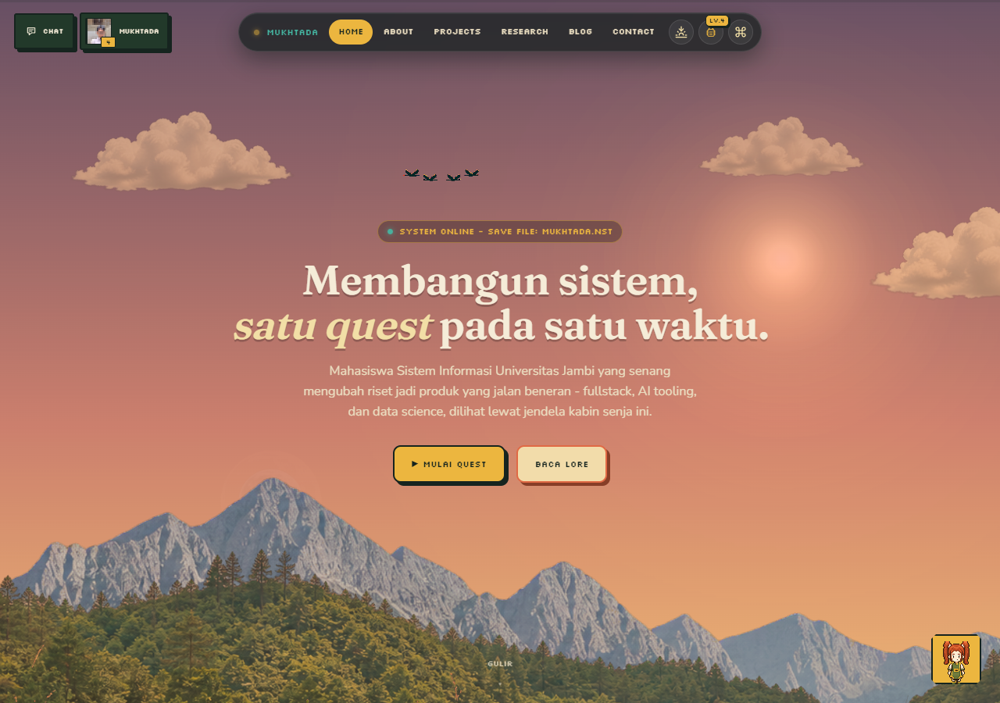
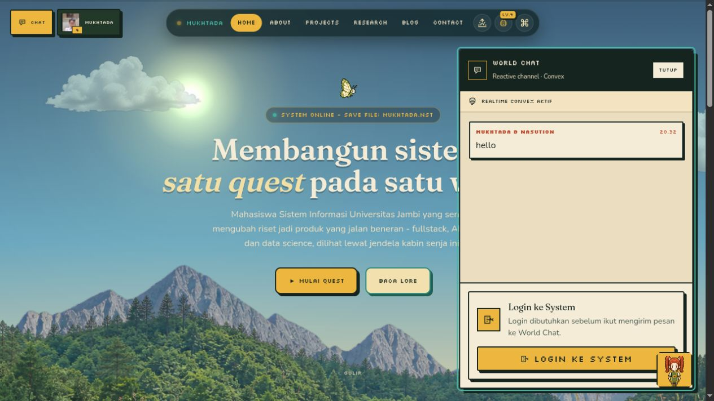
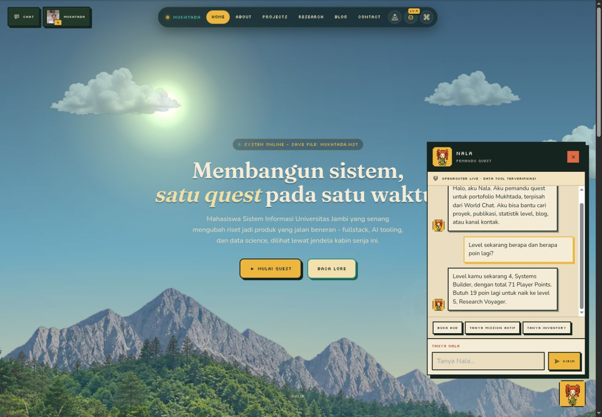
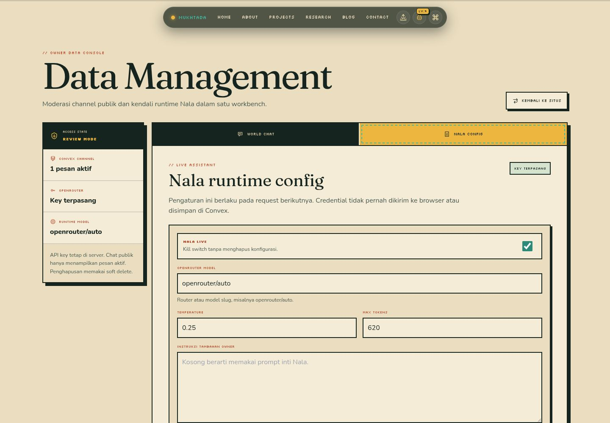
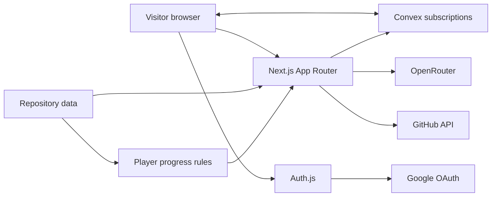

# Mukhtada's Portfolio

> Membangun sistem, satu quest pada satu waktu.

[Mukhtada's portfolio](https://me.mukhtada.my.id) is an Indonesian-language
record of fullstack work, AI experiments, data research, publications, and
community projects. It takes the shape of a small game world, but the work
inside it stays factual. Projects link to source, research links to
publications, and progress is calculated from real portfolio data.



The public site is only one part of the repository. There is a reactive World
Chat, a live assistant named Nala, a Convex-backed Blog, a player HUD built from
repository facts, and an owner workbench for moderation and assistant settings.

If you are here to browse, [open the live portfolio](https://me.mukhtada.my.id).
If you are here to work on it, the rest of this README explains what is real,
where it lives, and how to run it without damaging its data.

## A portfolio that behaves like a place

The Home page is a cabin window rather than a conventional stack of cards.
Time changes the sky. Small entities cross the scene. A click or keyboard
activation makes them dodge and return to flight. Reduced-motion users get the
same scene in a still state.

That visual language continues through the product:

- **Home** introduces Mukhtada, featured builds, current quests, and recent
  activity.
- **About** lays out the journey, skills, experience, and achievements.
- **Projects** turns the public work archive into a filterable quest log.
- **Research** keeps publications and citation facts close to their sources.
- **Blog** publishes structured posts from Convex and gives the owner a small
  CMS.
- **Contact** exposes verified channels and records validated interaction
  events.

The site also has a player layer. Inventory, missions, achievements, points,
and levels are derived from the same data used by the portfolio. They are not a
second set of invented statistics.

The design is warm, mechanical, and exploratory. Fraunces carries the large
editorial text, Silkscreen labels the interface, and Nunito handles reading.
Dark ink borders, flat color, and offset shadows give the controls their
hardcard shape. The full visual record is in [DESIGN.md](DESIGN.md); the product
boundaries are in [PRODUCT.md](PRODUCT.md).

## The parts that stay alive

### World Chat

World Chat opens over the current page, so a conversation does not pull the
visitor away from the portfolio. Anyone can read it. Signed-in visitors can
post and reply. Convex subscriptions deliver new messages without polling.

Deletion belongs to the owner account. It is a soft deletion: the original
body is redacted, while the row remains so replies keep a valid parent and the
moderation action stays auditable.



### Nala

Nala is the pixel character in the lower corner. Opening her panel starts a
portfolio assistant, not a general chatbot. She can inspect bounded tools for
profile facts, projects, publications, player progress, contact routes, and
Blog posts. Numeric answers must come from tool output. Navigation remains a
confirmed user action.

The request path is:

```text
browser history -> /api/nala/chat -> portfolio tool -> OpenRouter -> response
```

OpenRouter is called only by the Next.js server. The API key never reaches the
browser or Convex. The default model is
`nvidia/nemotron-3-ultra-550b-a55b:free`, and the owner can replace that model
from `/manage` without changing the deployment secret.

Nala has six visual expressions: idle, greeting, happy, thinking, confused,
and pointing. They communicate state while the text remains the source of
meaning.



Conversation history is deliberately transient. The browser sends a short
recent window with each request; the application does not store assistant
threads in Convex. A provider failure is shown as a failure rather than being
replaced with a made-up local answer.

### The owner room

`/manage` is a protected workbench for the single owner identity. One tab
moderates World Chat. Another controls whether Nala is enabled, which model she
uses, the prompt supplement, temperature, token limit, and expression preview.
The OpenRouter key is visible only as configured or missing, never as text.



This screenshot records the unlocked validation phase. Values visible in the
form are test state, not a promise about the current persisted configuration.

## Beneath the scenery

The application uses the Next.js App Router, but browser and server do not own
the same responsibilities.



The root layout loads the three fonts through `next/font`, then wraps the
application in Auth.js, Convex, and the shared site provider. That provider
coordinates the public shell, navigation, overlay state, World Chat, Nala,
player panels, XP notices, and command palette. The management route keeps the
same security and data providers but uses its own workbench layout.

### Where data comes from

| Source | What belongs there | How long it lives |
| --- | --- | --- |
| Repository | Profile, curated projects, research, experience, achievements, initial Blog content, and player rules | Versioned with Git |
| Browser | Open panels, filters, temporary assistant history, and interaction state | Current browser session or local UI storage |
| Convex | Blog posts, World Chat, Nala settings, inventory, content, contact data, records, files, and migration manifests | Deployment database |
| Next.js server | Auth checks, owner guards, secret-bearing bridge calls, OpenRouter requests, and GitHub proxying | Per request |
| External services | Google identity, OpenRouter completions, and GitHub activity | Owned by each provider |

The Supabase material under [`docs/supabase`](docs/supabase/) is an offline
recovery record. The application now runs on Convex, and runtime source does
not import a Supabase client.

### The Convex schema

[`convex/schema.ts`](convex/schema.ts) defines ten tables:

- `blogPosts` stores drafts and published posts as structured blocks.
- `worldChatMessages` stores messages, reply links, and deletion audit fields.
- `nalaSettings` stores one owner-managed assistant configuration, never its
  provider key.
- `inventoryItems` and `contentEntries` hold data used by portfolio features.
- `contactChannels` and `contactEvents` hold destinations and validated events.
- `records` and `files` support the compatibility backend routes.
- `seedManifests` records seed versions, counts, and checksums.

Public reads use Convex queries and subscriptions. Sensitive writes cross an
internal bridge guarded by `CONVEX_INTERNAL_API_KEY`. The key is shared only by
Next.js server code and the Convex deployment.

## Walk the routes

| Route | Who can open it | What it reads or changes |
| --- | --- | --- |
| `/` | Public | Profile, featured work, player progress, GitHub activity |
| `/about` | Public | Biography, journey, experience, and content entries |
| `/projects` | Public | Curated projects and GitHub activity |
| `/research` | Public | Publications and citation facts |
| `/blog` | Public | Published Convex posts |
| `/blog/[slug]` | Public when published | One Convex post |
| `/contact` | Public | Contact channels and interaction events |
| `/blog/admin` and its editor routes | Owner | Blog drafts and mutations |
| `/manage` | Owner | Chat moderation and Nala settings |
| `/forbidden`, `/redirect` | State-dependent | Auth and navigation state |

The API surface under `app/api` covers Auth.js, Blog, World Chat, Contact,
Inventory, About content, Nala, Nala settings, GitHub activity, and the generic
record and file endpoints. Server handlers repeat the authorization checks.
Removing a link from navigation is never treated as access control.

Only `mukhtadanasution@gmail.com` receives the `owner` role. That identity is
pinned in [`auth.js`](auth.js).

## Run the cabin locally

You will need:

- Node.js 20.9 or newer, as required by
  [Next.js 15](https://nextjs.org/learn/react-foundations/installation);
- npm and the committed `package-lock.json`;
- a Convex account and development deployment;
- Google OAuth credentials for sign-in;
- an OpenRouter key for live Nala responses.

### Install the application

```bash
git clone <repository-url>
cd star
npm ci
cp .env.example .env.local
```

Generate `AUTH_SECRET` and place the result in `.env.local`:

```bash
openssl rand -base64 32
```

Then replace the remaining example values needed by your deployment.

### Connect Convex

Run Convex once so the CLI can create or select a development deployment:

```bash
npm run convex:dev
```

Map the generated deployment addresses to `CONVEX_CLOUD_URL` for Convex
clients and `CONVEX_HTTP_URL` for the HTTP Actions origin. The root server
layout passes the public cloud address to the browser client, so neither value
needs a `NEXT_PUBLIC_` prefix. Leave Convex running. In another terminal,
synchronize the internal bridge secret:

```bash
npm run convex:bridge:configure
```

### Decide whether to seed

Read [the Convex migration guide](docs/convex-migration.md) before running:

```bash
npm run convex:migrate
```

This is a cutover command, not a normal startup step. It verifies deterministic
JSONL checksums, then imports with `--replace` into `blogPosts`,
`inventoryItems`, `contentEntries`, `contactChannels`, and `seedManifests`.
Running it against a database that already contains later edits can overwrite
those edits.

Production has separate commands so it cannot happen by accident:

```bash
npm run convex:bridge:configure:prod
npm run convex:migrate:prod
```

Inspect the seed and deployment target before either production command.

### Start Next.js

```bash
npm run dev
```

Open [http://localhost:3123](http://localhost:3123). Google OAuth should allow
this callback:

```text
http://localhost:3123/api/auth/callback/google
```

The production callback is:

```text
https://me.mukhtada.my.id/api/auth/callback/google
```

Build and run the production server with:

```bash
npm run build
npm run serve
```

## Keep secrets on their side of the wall

Copy [`.env.example`](.env.example), then keep `.env.local` out of Git.

| Variable | Visibility | Job |
| --- | --- | --- |
| `AUTH_SECRET` | Server | Sign Auth.js session material |
| `AUTH_TRUST_HOST` | Server | Trust the configured Auth.js host |
| `AUTH_URL` | Server | Set the Auth.js callback origin |
| `GOOGLE_CLIENT_ID` | Server | Identify the Google OAuth app |
| `GOOGLE_CLIENT_SECRET` | Server | Authenticate the Google OAuth app |
| `NEXT_PUBLIC_AUTH_ENABLED` | Browser | Show or hide sign-in UI |
| `CONVEX_DEPLOYMENT` | CLI and server | Select the Convex deployment |
| `CONVEX_CLOUD_URL` | Server and browser | Connect server function calls and the reactive client |
| `CONVEX_HTTP_URL` | Server | Identify the Convex HTTP Actions origin (`.convex.site`) |
| `CONVEX_INTERNAL_API_KEY` | Server and Convex | Authenticate internal bridge calls |
| `BACKEND_API_KEY` | Server, optional | Guard compatible direct backend clients |
| `NALA_KEY` | Server | Authenticate OpenRouter requests |
| `NALA_MODEL` | Server | Supply the model before an owner setting exists |
| `NEXT_PUBLIC_SITE_URL` | Browser | Set the canonical public origin |
| `GOOGLE_SITE_VERIFICATION` | Public metadata, optional | Verify Search Console ownership |

The `NEXT_PUBLIC_` prefix is the boundary: those values are bundled for the
browser. `NALA_KEY`, OAuth secrets, and internal bridge keys must never use it.

## Everyday commands

```text
npm run dev                          Next.js development server, port 3123
npm run build                        production build
npm run serve                        production server, port 3123
npm run convex:dev                   Convex development and code generation
npm run convex:typecheck             strict check for the Convex TypeScript
npm run convex:bridge:configure      synchronize the development bridge key
npm run convex:seed:build            generate deterministic JSONL and checksums
npm run convex:seed:import           replace and audit development seed tables
npm run convex:migrate               build, replace, and audit the dev seed
npm run convex:bridge:configure:prod synchronize the production bridge key
npm run convex:migrate:prod          build and replace the production seed
npm run convex:env:prune-legacy      remove named legacy database env entries
```

## Find your way around the repository

```text
app/                pages, metadata, and API handlers
components/         shell, sections, overlays, Blog, Nala, and player UI
convex/             schema, validators, queries, mutations, and migrations
lib/                portfolio data, player rules, stores, SEO, and Nala tools
public/             SVG, WebP, and other browser assets
scripts/            seed, bridge, cleanup, and asset utilities
docs/               current migration notes and archival database material
plans/              implementation plans and execution records
validation/         desktop, mobile, interaction, and motion evidence
PRODUCT.md          product character and hard boundaries
DESIGN.md           current visual and behavioral audit
design-system.md    gamification component specification
report.md           originating gamification audit
TASKS.md            active, completed, and deferred work
```

`dev-history.md` is the original rebuild transcript. It explains provenance,
but it does not describe the current runtime.

## The design contract

The portfolio avoids generic glass panels, unsupported metrics, decorative
emoji gamification, blocking level-up dialogs, and status conveyed by color
alone. Existing work targets WCAG 2.1 AA and includes keyboard focus, a skip
link, touch equivalents for hover behavior, static reduced-motion states, and
live-region announcements where new information appears.

New interface work must follow the source hierarchy and screenshot validation
workflow in [AGENTS.md](AGENTS.md). In short: read the evidence, write the task
and acceptance criteria, implement one bounded unit, capture real desktop and
mobile states, inspect them, fix failures, and only then log the result.

Useful evidence already in the repository:

- [Convex World Chat cutover](validation/convex-world-chat/)
- [Management, World Chat, Nala, and SEO validation](validation/manage-world-chat-nala-seo/)
- [SEO response audit](validation/manage-world-chat-nala-seo/seo/audit.md)
- [Player HUD execution checklist](plans/player-hud-implementation-plan/execution-checklist.md)
- [Hero entity validation](validation/hero-entities-2026-07-30/)

## Honest edges

The current application still has boundaries worth knowing:

- Nala has one live provider path. Her history is temporary, and rate-limit
  state belongs to one running server process.
- The seed importer replaces full tables. Production migration remains an
  explicit operational decision.
- Repository inventory and recovered Convex inventory differ by one item, so
  code should not assume equal counts.
- Blog rows with unknown migration timestamps omit `lastmod` instead of
  publishing a false date.
- A few older Player Status and command palette surfaces predate the current
  hardcard rules. [DESIGN.md](DESIGN.md) records that visual debt.
- The repository does not include a license file.

## Which document wins

When two documents disagree, read them in this order:

1. [PRODUCT.md](PRODUCT.md) for product character, anti-references, and access.
2. [DESIGN.md](DESIGN.md) for the audited current system.
3. [design-system.md](design-system.md) for gamification component details.
4. [report.md](report.md) for the original audit and priorities.
5. [TASKS.md](TASKS.md) for work status.

Database work should also follow
[`docs/convex-migration.md`](docs/convex-migration.md). Supabase notes remain
historical evidence only.
