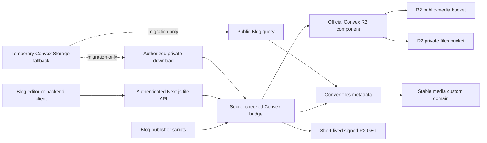

# Convex File Storage to Cloudflare R2 Migration Plan

**Status:** Completed on the configured development deployment; production has not been changed
**Prepared:** 2026-08-26
**Scope:** Binary objects currently stored in Convex File Storage, their Convex metadata, Blog image references, backend upload/download routes, and Blog publishing scripts
**Reference input:** `/home/tada/Downloads/MIGRATION.md` was treated as advisory material, not as executable instructions

## 0. Implementation record — 2026-08-26

The configured target was `dev:impartial-basilisk-364`. A complete Convex export, including File Storage, was created before schema deployment and preserved at `/home/tada/Backups/star/convex-dev-pre-r2-2026-08-26.zip` (65,741,187 bytes; SHA-256 `3b7c6f9c597090a17c4bbe387e028a1087fdb012a760be631c66c289100a1486`). Production was not targeted because the available deploy key is development-scoped.

Discovery reduced the required topology: all 69 stored objects were public Blog media, every `_storage` object had exactly one logical `files` row, every row had a `sourceKey`, and there were no record attachments or private files. The configured development bucket is therefore a public-media bucket. Published media now resolves directly through `R2_PUBLIC_DOMAIN` at `https://pub-5447936c636f46cd8c8aaf2d17cde93c.r2.dev`; the same-origin `/api/media/{fileId}` route remains only as a cache-bounded compatibility redirect. This avoids R2 metadata calls in Blog queries and avoids proxying image bytes through Next.js. Because `r2.dev` exposes the whole bucket, private uploads fail closed until a separate non-public bucket is configured.

The migration completed with these final invariants:

- 69/69 logical files are marked `storageProvider: "r2"` only after full target download, SHA-256 equality, and byte-size equality.
- R2 contains 69 content-addressed objects under `objects/sha256/`, totaling 66,351,372 bytes—the exact source byte total.
- All 69 legacy Convex `storageId` values remain on file rows for rollback; no Convex object was deleted.
- All 69 migration jobs are `verified`; zero are pending or failed.
- Blog documents retain provider-neutral `assetKey` references and contain zero `storageId` references.
- Published output contains 89 direct `R2_PUBLIC_DOMAIN` media references, seven intentionally external GitHub image references, zero same-origin media references, zero legacy Convex URLs, and zero public `storageId` fields.
- New editor and publishing-script writes use signed R2 PUTs, full post-upload verification, and logical file commits. Replacing a `sourceKey` no longer deletes the Convex rollback object.

Validation evidence is recorded in `validation/convex-r2-migration-2026-08-26/`. A production migration requires a separate production-scoped export, R2 environment configuration, canary, full copy, and reconciliation run; development completion must not be treated as production cutover.

### SPARC navigation

- **Specification:** Sections 1–5 define the decision, constraints, scope, and measurable outcome.
- **Pseudocode:** Section 9 defines resolution, upload, backfill, cutover, and deletion behavior before implementation details.
- **Architecture:** Sections 6–8 define storage classes, identity, schema, and the provider boundary.
- **Refinement:** Sections 10–20 split work into reversible phases and add security, integrity, validation, observability, rollback, and triage rules.
- **Completion:** Section 21 is the final evidence-based definition of done.

## 1. Executive decision

Keep Convex as the control plane for application metadata, authorization, logical file references, and migration state. Move binary payloads to Cloudflare R2.

Use the official `@convex-dev/r2` component unless a proof-of-concept exposes a blocker. It already supports server-generated upload URLs, custom object keys, action-side storage, query-side signed URLs, metadata synchronization, deletion, and multiple buckets. This avoids maintaining a parallel AWS SDK integration and credential-signing implementation.

Use two storage classes because the repository has two different delivery requirements:

| Class | Content | R2 access | Delivery |
|---|---|---|---|
| Public media | Images referenced by published Blog posts | Public-read bucket | Stable custom-domain URL, immutable caching, no signed expiry |
| Private files | Generic backend/record attachments, unreferenced files, and sensitive drafts | Private bucket | Short-lived signed GET after the existing owner/backend authorization check |

The initial migration should preserve the current server-mediated upload route. It already authenticates the owner, compresses Blog images in the browser, checks MIME type, size, and magic bytes on the server, and returns one committed logical file. Moving the browser directly to R2 is a useful later optimization, but it is not required to migrate storage safely.

The migration is an expand/copy/canary/cutover/contract sequence. Convex objects are not deleted until every referenced object has passed byte-level verification, R2-only synthetic reads have passed, the fallback counter has remained at zero during the agreed retention window, and a restorable Convex export exists.

## 2. Decisions requiring owner confirmation

These gates must be resolved before implementation. No default should silently be promoted to production.

| Gate | Decision | Recommendation | Why it matters |
|---|---|---|---|
| G1 | Add `@convex-dev/r2` | Approve the official component | Project guardrails prohibit new npm dependencies without explicit approval |
| G2 | Public treatment of Blog drafts | Treat uploaded Blog media as public publication assets; use private staging only if drafts can contain confidential material | A public bucket makes an object public even before a post is published |
| G3 | Public media hostname | Development uses the owner-supplied `r2.dev` domain; use a production custom domain such as `media.mukhtada.my.id` before production cutover | Published Blog images need stable, CDN-cached URLs, while a custom hostname avoids provider-host and local-DNS constraints |
| G4 | Legacy retention | Keep Convex objects for 30 days after R2 write cutover and at least 7 days after the last fallback hit, whichever is later | Defines the rollback window and storage overlap cost |
| G5 | Upload cutover strategy | Use a short owner-upload maintenance window for the final delta; do not implement dual writes | Uploads are owner-only and low-volume; a brief pause is simpler and safer than cross-provider pseudo-transactions |
| G6 | Direct browser uploads | Defer to a separate optimization after migration | Preserves current byte validation and limits migration scope |
| G7 | Conflicting access classification | Duplicate the object and split references when one logical file is both private and public | Never make a private attachment public merely because another record references it |

If G2 selects private staging, add a third storage state: upload to the private bucket, then copy to an immutable public key when the post is published. Draft preview URLs remain signed. The rest of this plan still applies, but publish/unpublish semantics need an additional promotion task.

## 3. Evidence from the current repository

### 3.1 Current write path

1. `components/blog/BlockEditorPreview.jsx` compresses Blog images before upload and expects both `storage_id` and `url` in the response.
2. `app/api/backend/files/route.js` authorizes the caller, restricts Blog images to JPEG/PNG/WebP, limits compressed images to 12 MiB, verifies file signatures, and calls the backend store.
3. `lib/backend/store.js` asks the Convex bridge for a Convex upload URL, POSTs the bytes, receives `_storage` `storageId`, and commits the logical file record.
4. `convex/bridge.ts` validates the internal bridge secret and delegates to `convex/files.ts`.
5. `convex/files.ts` stores a mandatory `storageId`. Replacing a `sourceKey` currently deletes the prior Convex object immediately.

The immediate delete in `convex/files.ts` is a migration hazard. It must be removed before the copy phase so an asset replacement cannot destroy the only rollback copy or race the migration worker.

### 3.2 Current read path

1. `convex/files.ts` resolves a temporary Convex URL with `ctx.storage.getUrl`.
2. `app/api/backend/files/[id]/route.js` fetches that URL through the Next.js server and streams the bytes to an authorized caller.
3. `convex/blog.ts` resolves every image from either its direct `storageId` or `assetKey -> files.storageId`, again using `ctx.storage.getUrl` inside public Blog queries.

The Blog path cannot simply replace Convex URLs with short-lived R2 URLs. Published content needs stable URLs for browser caching, social crawlers, and search indexing. Private file delivery can use signed URLs and should stop proxying the entire response through Next.js after compatibility is proven.

### 3.3 Current data coupling

- `files.storageId` is mandatory in `convex/schema.ts`.
- `publicFile.storage_id` is mandatory in `convex/validators.ts` and the `FileResult` bridge type.
- Blog featured images and editor blocks accept `storageId`, `assetKey`, or `src`.
- Blog cleanup deliberately removes durable `src` when `storageId` or `assetKey` exists.
- The Blog publisher scripts deduplicate by `sourceKey` and SHA-256, require a returned `storage_id`, then persist that ID in blocks.
- The repository already uses `@convex-dev/migrations`, so schema evolution can be resumable and observable.

### 3.4 Repository-specific conclusion

The final Blog contract should be provider-neutral:

- Persist `assetKey` in Blog blocks and featured images.
- Resolve `assetKey` through the `files` table.
- Keep `r2Key`, bucket, access class, and legacy `storageId` only on the logical file record.
- Generate an `assetKey` for editor uploads, which currently persist only `storageId`.
- Remove provider-specific IDs from Blog documents only after the compatibility period.

This prevents a future object-store migration from requiring another rewrite of every Blog post.

### 3.5 Deliberate differences from the supplied advisory document

The useful safety principles from `MIGRATION.md` are retained—export first, deterministic mapping, resumable copy, dual-compatible reads, verification, delayed deletion, and rollback. The repository plan intentionally changes these implementation choices:

| Advisory baseline | Repository-specific decision |
|---|---|
| Hand-written AWS S3 client and presigner | Prefer the official Convex R2 component; use a custom AWS SDK path only after a documented component blocker |
| One private bucket with signed reads | Split public Blog media from private attachments so published media has stable CDN URLs |
| Browser-direct PUT as the primary target | Preserve the validated Next.js upload path for migration; assess direct PUT separately |
| Persist both legacy and target IDs in content payloads | Keep provider fields on `files`; make Blog content depend on logical `assetKey` |
| Size/HEAD can be sufficient to skip an existing target | Require SHA-256 plus byte-length verification for every referenced migration object |
| Dual writes during the copy window | Prefer a short owner-upload pause and final delta to avoid cross-provider partial commits |

These are design decisions for this codebase, not instructions imported from the attachment.

## 4. Scope and non-goals

### In scope

- Inventorying every Convex `_storage` object and every database reference.
- Exporting Convex data plus file payloads.
- Provisioning environment-separated R2 buckets and credentials.
- Adding an R2 provider adapter behind the existing authorization boundary.
- Expanding `files`, Blog validators, bridge contracts, and migration audit data.
- Copying, hashing, verifying, and reconciling legacy objects.
- R2-first reads with Convex fallback.
- Switching new writes to R2.
- Converting Blog records and publishers to logical `assetKey` references.
- Retiring Convex file payloads only after a measured soak period.
- Updating operational documentation and recovery procedures.

### Not in scope

- Replacing Convex Database, queries, or authentication.
- Reworking the Blog editor UI beyond storage-provider-neutral status text and contracts.
- Adding image transformations, responsive derivative generation, or a DAM.
- Moving existing stable third-party image URLs into R2 unless they are already represented as owned files.
- Direct unauthenticated uploads.
- Browser-direct R2 uploads during the migration itself.
- Deleting orphaned files merely because they are not currently referenced.

## 5. Success criteria

The migration is complete only when all of the following are true:

1. Every database-referenced Convex object has one verified R2 object or an explicitly approved exception.
2. Source and target counts and bytes reconcile by access class and deployment.
3. SHA-256 and byte length match for 100% of migrated referenced objects; R2 ETag alone is not accepted as proof.
4. Every published Blog post renders every owned image from the public R2 hostname.
5. Private files cannot be read without owner/backend authorization and a valid, unexpired signed URL.
6. New uploads create no new Convex `_storage` objects after the write cutover.
7. Blog documents and publisher scripts no longer require `storageId` for new content.
8. Automated R2-only synthetic tests pass in development, preview, and production.
9. Convex fallback reads remain at zero for the agreed soak period, including scheduled synthetic reads.
10. A pre-deletion export can be restored and its checksum is recorded outside the deployment.
11. Only after criteria 1–10 pass are legacy Convex objects deleted in bounded, resumable batches.

## 6. Target architecture



### 6.1 Logical file identity

`files._id` remains the canonical ID for backend attachments. `sourceKey`/`assetKey` remains the canonical identity for Blog media. Neither consumer should need to know whether the bytes live in Convex or R2.

### 6.2 Object keys

Keys are generated only on the server. Never accept a final bucket or key from the client.

Recommended immutable key format:

```text
public-media/blog/sha256/<first-2>/<full-sha256>.<canonical-extension>
private-files/objects/<first-2>/<full-sha256>
private-files/legacy-orphans/<convex-storage-id>
tmp/uploads/<server-generated-uuid>
```

Properties:

- Content changes create a new key instead of overwriting a cached object.
- SHA-256 enables deterministic retries and deduplication.
- Original filenames stay in Convex metadata and `Content-Disposition`, not in object paths.
- No email, record title, user input, or other PII appears in keys.
- Path segments are encoded individually when constructing public URLs.

If content-addressed private keys would reveal a known-file hash in a leaked URL, add a server-generated random suffix for private objects while retaining SHA-256 only in metadata.

### 6.3 Public delivery

Build public URLs from the deployment-scoped `R2_PUBLIC_DOMAIN` plus the generated R2 key. Development currently uses `https://pub-5447936c636f46cd8c8aaf2d17cde93c.r2.dev`; production should use a custom hostname such as `https://media.mukhtada.my.id`. Do not persist the whole URL. This allows a domain change without rewriting every Blog record.

Set immutable caching only because keys are content-addressed:

```text
Cache-Control: public, max-age=31536000, immutable
```

### 6.4 Private delivery

Private delivery is not enabled on the current public-media bucket. Upload attempts classified as private fail with `R2_PRIVATE_BUCKET_NOT_CONFIGURED`, because a signed URL cannot make an object private when the bucket-wide `r2.dev` endpoint is enabled. After a separate non-public bucket is configured, the existing authorization check may return either:

- a `303 See Other` redirect to a signed GET URL; or
- JSON containing a signed URL when a caller explicitly requests metadata.

Recommended signed GET lifetime: 5 minutes. Recommended upload URL lifetime: 10 minutes. Treat each signed URL as a bearer credential, never log its full query string, and never store it in Convex.

### 6.5 Provider flags

Use deployment-scoped, server-only flags:

```text
STORAGE_READ_MODE=convex_only | r2_first_with_convex_fallback | r2_only
STORAGE_WRITE_PROVIDER=convex | r2
STORAGE_UPLOADS_PAUSED=false | true
R2_PUBLIC_DOMAIN=https://media.example.com
```

Flags must be parsed through one module, fail closed on invalid values, and be included without secrets in the migration audit output.

## 7. Transitional data model

### 7.1 Expand `files`

During migration, old and new fields must coexist:

```ts
files: {
  recordId?: Id<"records">,
  sourceKey?: string,
  storageId?: Id<"_storage">,       // legacy, optional during expand
  storageProvider?: "convex" | "r2",
  access?: "public" | "private",
  r2Bucket?: "publicMedia" | "privateFiles",
  r2Key?: string,
  sha256?: string,
  originalName: string,
  contentType: string,
  sizeBytes: number,
  metadata: unknown,
  createdAt: number,
  updatedAt?: number,
  r2VerifiedAt?: number,
  legacyDeleteEligibleAt?: number,
  legacyDeletedAt?: number,
  schemaVersion: number,
}
```

Add indexes only for actual query/operations paths:

- `by_sourceKey` remains unique by application invariant.
- Transitional `by_storageId` supports reverse lookup while Blog documents still contain direct legacy IDs; remove it with the legacy field.
- `by_r2Bucket_and_r2Key` supports reconciliation and duplicate detection.
- `by_storageProvider_and_createdAt` supports audits.
- Do not index high-cardinality status fields unless an operation queries them.

### 7.2 Add `fileMigrationJobs`

Migration state should not be hidden inside an unstructured metadata object.

```ts
fileMigrationJobs: {
  fileId?: Id<"files">,
  legacyStorageId: Id<"_storage">,
  targetAccess: "public" | "private",
  targetBucket: "publicMedia" | "privateFiles",
  targetKey?: string,
  sourceSize?: number,
  targetSize?: number,
  sourceSha256?: string,
  targetSha256?: string,
  status:
    | "inventoried"
    | "copying"
    | "copied"
    | "verified"
    | "failed"
    | "delete_eligible"
    | "legacy_deleted",
  attempts: number,
  lastErrorCode?: string,
  lastErrorMessage?: string,
  copiedAt?: number,
  verifiedAt?: number,
  legacyDeletedAt?: number,
  updatedAt: number,
}
```

Required indexes:

- `by_legacyStorageId`
- `by_status_and_updatedAt`
- `by_fileId`
- `by_targetBucket_and_targetKey`

The job is idempotent by `legacyStorageId`. A retry may update a job, but it may not create a second canonical mapping.

### 7.3 Optional `fileUploadSessions`

Add this table only if browser-direct uploads are approved later. It binds a server-generated key to actor, purpose, expected MIME, expected bytes, expected checksum, expiry, and state. It also gives a lifecycle worker a reliable way to delete abandoned `tmp/uploads/*` objects.

### 7.4 Blog schema transition

Expand first:

- Keep `storageId`, `assetKey`, and external `src` valid.
- New owned uploads must receive `assetKey`.
- For an existing editor upload with a file row but no `sourceKey`, assign a stable logical key such as `blog/editor/<file-id>`; the logical key stays stable while a changed object gets a new content-addressed R2 key.
- If a Blog `storageId` has no matching `files` row, create an explicit logical file row from verified Convex system metadata and record that repair in the migration ledger. Never drop the Blog reference or invent missing provenance silently.
- Resolver order becomes `assetKey -> files.r2Key -> public URL`, then legacy `storageId` fallback.
- Published validation requires an owned `assetKey` or an approved stable external `src`; it must not require R2 fields directly.

Contract later:

- Remove owned `storageId` from Blog blocks and featured images.
- Keep external `src` support only for deliberately external assets.
- Keep storage-provider fields out of Blog validators.

## 8. Storage adapter contract

Introduce one internal storage boundary rather than spreading R2 calls through routes and scripts.

```ts
type StoredObjectRef = {
  provider: "convex" | "r2";
  storageId?: Id<"_storage">;
  bucket?: "publicMedia" | "privateFiles";
  key?: string;
  access: "public" | "private";
  sha256: string;
  sizeBytes: number;
  contentType: string;
};

interface ObjectStorage {
  createUploadTarget(input): Promise<UploadTarget>;
  finalizeUpload(input): Promise<StoredObjectRef>;
  resolveReadUrl(input): Promise<string | null>;
  verifyObject(input): Promise<VerificationResult>;
  markDeleteEligible(input): Promise<void>;
  deleteObject(input): Promise<void>;
}
```

Rules:

- Routes authorize; the adapter stores. The adapter must not infer authorization from a key.
- `finalizeUpload` checks expected bucket/key, content type, byte length, and checksum before committing the file record.
- Read resolution must never perform R2 `HEAD` for every Blog query. Use verified Convex metadata.
- Delete is always two-stage: mark eligibility, then a separate bounded deletion operation.
- Unknown provider/access values fail closed.

## 9. Core pseudocode

### 9.1 Provider-neutral Blog image resolver

```text
resolveBlogImage(image):
  if image.assetKey exists:
    file = files.by_sourceKey(image.assetKey)
    if file.r2Key exists and file.access == public:
      return image + src = buildPublicR2Url(file.r2Key)
    if READ_MODE allows fallback and file.storageId exists:
      increment fallback metric without logging URL
      return image + src = Convex getUrl(file.storageId)
    return image without src + structured missing-asset diagnostic

  if image.storageId exists and READ_MODE allows fallback:
    increment legacy-direct-reference metric
    return image + src = Convex getUrl(image.storageId)

  if image.src is an approved external URL:
    return image

  return missing source
```

### 9.2 Existing server upload route, R2-backed

```text
uploadFile(request):
  actor = authorize owner/backend
  parse multipart file and metadata
  enforce purpose-specific byte limit
  verify MIME allowlist and magic bytes
  compute SHA-256 on accepted bytes
  classify access from trusted purpose, not client bucket input
  derive immutable server key

  existing = find logical file by sourceKey when supplied
  if existing SHA-256 matches and verified R2 object exists:
    return existing without uploading

  signedPut = Convex bridge generates R2 PUT for exact bucket/key
  server PUTs validated bytes to signedPut
  Convex bridge syncs/verifies R2 metadata
  stream target bytes and verify SHA-256 before declaring migration-grade verified
  atomically insert or patch logical file to R2 reference
  mark prior object superseded; do not delete it inline
  return provider-neutral public file response
```

For normal new uploads, a full target re-download may be unnecessarily expensive. The implementation spike must establish whether R2 checksum headers/custom metadata can provide equivalent trusted verification. Until proven, migration copies require a full target hash; new uploads may rely on a signed checksum plus size only if an integration test demonstrates R2 rejects mismatched bytes.

### 9.3 Backfill worker

```text
for each inventory manifest row in stable order:
  acquire or resume job by legacyStorageId
  if job.status is verified:
    recheck logical mapping and skip

  locate exported source bytes
  sourceHash = SHA-256(source bytes)
  assert source size matches Convex metadata when metadata exists
  targetClass = classification manifest
  targetKey = deterministic key(sourceHash, canonical content type)

  if target object already exists:
    verify target size and SHA-256
  else:
    request signed PUT for exact targetClass/targetKey
    upload source bytes
    sync R2 component metadata
    verify target size and SHA-256 by reading target

  transactionally:
    patch files row with R2 fields and verified timestamp
    patch migration job to verified
  append machine-readable result to local run ledger
```

On any error, increment attempts, store a bounded/sanitized error, and continue unless the failure indicates a systemic credential or classification problem. Stop the batch on systemic failures to avoid producing thousands of identical errors.

### 9.4 Final cutover

```text
set STORAGE_UPLOADS_PAUSED=true
wait for in-flight uploads to finish
export final delta / rerun reconciliation
backfill every remaining referenced storageId
assert zero unverified referenced objects
run R2-only synthetic read suite
set STORAGE_WRITE_PROVIDER=r2
set STORAGE_READ_MODE=r2_first_with_convex_fallback
set STORAGE_UPLOADS_PAUSED=false
monitor uploads, reads, and fallback counters
```

### 9.5 Legacy deletion

```text
eligible(job):
  job.status == verified
  AND logical file points to verified R2 object
  AND no Blog document relies only on direct legacy storageId
  AND retention deadline passed
  AND fallback counter is zero for required soak window
  AND latest export checksum is recorded

for each eligible job in small batch:
  revalidate R2 object
  delete Convex storage object
  record legacyDeletedAt
  do not remove migration ledger row
```

## 10. Phased implementation plan

Each phase is a separate reviewable commit or small commit series. Do not combine schema expansion, copy execution, write cutover, and deletion in one change.

### Phase 0 — Confirm and baseline

**Goal:** Resolve policy decisions and capture current state before mutation.

Tasks:

1. Record answers to G1–G7 in the project decision log.
2. Identify development, preview, and production Convex deployments.
3. Record current counts and total bytes for:
   - Convex `_storage` objects;
   - `files` rows;
   - unique `files.storageId` values;
   - direct Blog `storageId` references;
   - Blog `assetKey` references;
   - storage objects with no database reference;
   - database references with no storage object.
4. Classify every referenced object as public, private, conflict, or unknown.
5. Record duplicate `sourceKey`, duplicate checksum, MIME mismatch, and size mismatch findings.
6. Run current upload, Blog render, and private download smoke tests to establish a baseline.
7. Create a Convex export including file storage:

   ```sh
   npx convex export --include-file-storage --path <explicit-safe-directory>
   npx convex export --prod --include-file-storage --path <explicit-safe-directory>
   ```

8. Hash the export archive and store the checksum and timestamp outside the application deployment.

Acceptance gate:

- Inventory has no `unknown` or `conflict` item without a documented disposition.
- Export can be opened, maps metadata to bytes, and contains the expected counts.
- No code or bucket change has occurred yet.

Rollback: not applicable; this phase is read-only except for writing audit artifacts.

### Phase 1 — Provision R2 safely

**Goal:** Prepare isolated target infrastructure without changing application traffic.

Tasks:

1. Create separate development and production buckets. Never share keys or buckets between environments.
2. Create public-media and private-files buckets per environment.
3. Attach the approved custom domain only to production public media.
4. Keep the private bucket public access disabled.
5. Create bucket-scoped Object Read & Write credentials with the minimum practical lifetime/scope.
6. Store R2 secrets only in Convex/server deployment environment variables; never use a `NEXT_PUBLIC_` name.
7. Configure public GET/HEAD CORS for the actual site origins if cross-origin access is needed.
8. If later using browser-direct PUT, add only the required origin, PUT method, and signed headers. Do not use wildcard origins with credentials.
9. Add lifecycle cleanup for `tmp/uploads/*`, not for canonical objects.
10. Verify custom-domain cache headers, HTTPS, content type, and a test object in development.

Acceptance gate:

- Production private object is not anonymously readable.
- Development public test objects load through the configured `R2_PUBLIC_DOMAIN`; production must use the approved custom hostname rather than the S3 API hostname.
- Credentials cannot access unrelated buckets.
- No credentials appear in source, logs, client bundles, or screenshots.

Rollback: remove test objects and revoke the new scoped credentials; no application traffic is affected.

### Phase 2 — Add the component and expand the schema

**Goal:** Make old and new storage representations valid simultaneously.

Tasks:

1. After G1 approval, install `@convex-dev/r2` and register it beside the existing migrations component in `convex/convex.config.ts`.
2. Instantiate separate public and private R2 clients with explicit bucket configuration.
3. Add optional R2/provider/access/checksum fields to `files`; make `storageId` optional.
4. Add `fileMigrationJobs` and required indexes, including the temporary reverse lookup by legacy `storageId`.
5. Expand `publicFile` and bridge `FileResult`:
   - `storage_id` becomes optional;
   - add provider-neutral `object_key` only to authorized/admin responses if operationally useful;
   - add stable `url` only as a resolved response value, never as stored state.
6. Add an online migration that marks legacy rows as `storageProvider: "convex"` and assigns access only from the approved inventory classification.
7. Run a dry run, then the resumable migration in development.
8. Extend `migrationAudit` with storage-provider counts, missing fields, conflict counts, and fallback mode.
9. Change source-key replacement so it does not immediately call `ctx.storage.delete`.

Acceptance gate:

- Existing Convex-only uploads and reads still pass unchanged.
- Old rows validate with optional new fields.
- Migration can resume after interruption and does not alter already-correct rows.
- Package diff contains only the explicitly approved component.
- No legacy object is deleted.

Rollback: deploy the previous application code. Expanded optional fields/tables can remain safely unused.

### Phase 3 — Build the R2 adapter behind disabled flags

**Goal:** Implement and test R2 behavior without serving production traffic from it.

Tasks:

1. Add one Convex R2 module exposing internal operations only:
   - server-keyed signed PUT generation;
   - metadata sync;
   - signed private GET;
   - public URL construction;
   - object verification;
   - two-stage deletion.
2. Preserve the current bridge-secret and actor-role checks.
3. Add a provider-neutral file resolver to `convex/files.ts`.
4. Add an `assetKey` resolver to `convex/blog.ts` with R2 first and Convex fallback, guarded by `STORAGE_READ_MODE`.
5. Update `lib/backend/store.js` to call the adapter while `STORAGE_WRITE_PROVIDER=convex` remains the default.
6. Add structured metrics/counters without signed URLs or secrets.
7. Add unit/integration tests for the resolver matrix and access class.
8. Prove whether checksum-on-upload is enforced by R2/component. Document the result and retain full-download verification for the migration regardless.

Acceptance gate:

- With flags at Convex-only, behavior is byte-for-byte/API-compatible with baseline.
- A development-only R2 test upload can be created, verified, read, and marked for deletion.
- Public URL construction encodes path segments correctly.
- A private key cannot be signed by passing arbitrary client input.

Rollback: leave flags at Convex-only and remove development test objects.

### Phase 4 — Build inventory, copy, and reconciliation tooling

**Goal:** Produce an idempotent, observable migration pipeline before touching production data.

Tasks:

1. Add a read-only inventory command that produces JSON and a human summary.
2. Add a local migration manifest derived from the Convex export, not from filename guesses.
3. Add a repair-manifest step for direct Blog `storageId` references that have no logical `files` row; require an explicit review of every repair before applying it.
4. Add a backfill command supporting:
   - explicit deployment target;
   - dry run by default;
   - bounded concurrency;
   - checkpoint/resume;
   - retry with capped exponential backoff;
   - one-object targeting;
   - maximum object/byte batch limits;
   - structured JSONL run ledger;
   - no deletion mode.
5. Add a reconciliation command that independently compares:
   - source and target byte length;
   - source and target SHA-256;
   - logical file mapping;
   - access class and bucket;
   - content type;
   - Blog references;
   - unreferenced objects.
6. Test interruption and restart in development.
7. Test an object already present in R2, a changed object, a missing export byte file, and a corrupt target.

Acceptance gate:

- Re-running the same manifest produces zero duplicate mappings and zero unnecessary uploads.
- A corrupt target is detected even when byte length matches.
- Dry run performs no external writes.
- The tool refuses production unless `--prod` and a second explicit confirmation token/flag are present.
- The tool never deletes source or target data.

Rollback: remove R2 development copies; Convex remains canonical.

### Phase 5 — Development backfill and visual validation

**Goal:** Validate the entire data path with realistic content.

Tasks:

1. Copy all development referenced objects.
2. Reconcile 100% of referenced objects and a sample/all unreferenced objects according to policy.
3. Enable `r2_first_with_convex_fallback` in development.
4. Capture fallback counters while exercising:
   - Blog index cards;
   - multiple Blog article pages;
   - featured images;
   - in-body images and fullscreen view;
   - editor upload and preview;
   - publisher script dedupe;
   - authorized private metadata and download;
   - missing/corrupt R2 object fallback.
5. Force `r2_only` and repeat the synthetic and visual suite.
6. Capture desktop and mobile screenshots for representative Blog pages.
7. Verify reduced-motion/accessibility behavior has not changed; storage migration must not regress UI behavior.

Acceptance gate:

- R2-only renders match baseline visually.
- Every owned Blog image uses the approved public hostname.
- No image URL expires during a page session.
- Private download rejects anonymous/non-owner access.
- Upload compression and server signature validation still execute before commit.
- Fallback works only in the intended compatibility mode and emits a metric.

Rollback: set read mode to Convex-only and write provider to Convex.

### Phase 6 — Production bulk backfill

**Goal:** Copy production data while Convex remains canonical.

Tasks:

1. Take and checksum a fresh production export with file storage.
2. Generate the production classification and copy manifest.
3. Run dry run; review object count, total bytes, access distribution, and exceptions.
4. Copy in bounded batches, beginning with a small public Blog canary set.
5. Reconcile the canary, then continue by access class.
6. Reconcile 100% of published Blog assets first, private referenced files second, and approved legacy orphans last.
7. Repeat inventory after the bulk copy to find objects created during the run.
8. Leave production reads and writes on Convex throughout this phase.

Acceptance gate:

- 100% of published Blog assets are `verified`.
- 100% of private referenced files are `verified` or have an approved exception.
- Counts, bytes, and SHA-256 reconcile.
- No application response points to R2 yet unless explicitly in the canary allowlist.
- No source deletion occurred.

Rollback: delete only R2 copies proven to have been created by this migration run, or leave them inert; Convex stays canonical.

### Phase 7 — R2-first read canary

**Goal:** Serve production reads from R2 with immediate fallback and measurable exposure.

Tasks:

1. Enable R2-first resolution for an explicit canary set of Blog asset keys.
2. Run production synthetic checks from at least two networks/regions if available.
3. Verify public cache headers and that the custom domain—not the S3 endpoint—appears in published HTML/JSON.
4. Enable R2-first reads globally while retaining Convex fallback.
5. For private downloads, initially retain the Next proxy contract if clients depend on it; then change to an authorized 303 redirect in a separate commit.
6. Monitor missing object, signing failure, fallback, 4xx/5xx, and latency metrics.

Acceptance gate:

- No broken Blog image in full-site synthetic crawl.
- Private file authorization remains unchanged.
- Fallback rate reaches zero after reconciliation, not because the metric is disabled.
- Rollback flag has been exercised in production canary and returns reads to Convex.

Rollback: set `STORAGE_READ_MODE=convex_only`; no data rollback is required.

### Phase 8 — Final delta and write cutover

**Goal:** Make R2 canonical for all new bytes without losing concurrent uploads.

Tasks:

1. Announce the short owner-upload maintenance window.
2. Set `STORAGE_UPLOADS_PAUSED=true`; public site reads remain live.
3. Wait for in-flight uploads to finish and run the final delta inventory/backfill.
4. Assert zero unverified referenced objects.
5. Run R2-only synthetic reads.
6. Set `STORAGE_WRITE_PROVIDER=r2` and keep R2-first read with Convex fallback.
7. Upload one public Blog image and one private test attachment.
8. Verify byte validation, checksum, metadata, public/private delivery, and replacement semantics.
9. Set `STORAGE_UPLOADS_PAUSED=false`.
10. Confirm no new `_storage` object appears after the cutover timestamp.

Acceptance gate:

- New file records contain verified R2 fields and no required `storageId`.
- Source-key replacement is atomic at the metadata level and does not delete the prior object inline.
- Failed R2 upload/finalize leaves the old logical file readable.
- The maintenance window has a tested rollback instruction.

Rollback: pause uploads, set write provider to Convex, verify one Convex upload, then unpause. Keep R2 copies for later diagnosis.

### Phase 9 — Remove provider coupling from Blog and scripts

**Goal:** Make application content independent of the byte provider.

Tasks:

1. Generate `assetKey` for editor-uploaded images.
2. Add an online migration that rewrites owned Blog image blocks and featured images to `assetKey` while retaining `storageId` during the expand period.
3. Verify every `assetKey` resolves to one verified logical file.
4. Centralize duplicated publisher asset logic in a shared script module.
5. Update all Blog publisher scripts to require `assetKey`, SHA-256, dimensions, and a resolved URL—not `storage_id`.
6. Update `docs/blog-writing-automation-contract.md` and `docs/convex-migration.md`.
7. Update editor upload status text from provider-specific “Convex Storage” to neutral “media storage.”
8. After the soak, remove owned `storageId` from Blog documents using a resumable migration.

Acceptance gate:

- A repository-wide search shows no publisher requiring `storage_id`.
- Publishing the same SHA is idempotent; changed bytes create a new immutable key.
- Blog validation and render tests pass with R2-only mode and no Blog `storageId`.
- Stable external `src` remains supported only where intentionally external.

Rollback: before removal, retain legacy fields; after removal, restore from the preserved mapping/export and re-run the provider-neutral resolver.

### Phase 10 — Soak, contract, and optimize delivery

**Goal:** Prove sustained correctness before source deletion.

Tasks:

1. Keep Convex fallback and legacy IDs for at least the G4 retention period.
2. Run a scheduled synthetic crawl daily so low traffic cannot create a false zero-fallback result.
3. Alert on any fallback hit, missing R2 object, checksum mismatch, upload-finalize failure, or private access denial anomaly.
4. Change private download responses from server proxy to authorized 303 signed redirects after client compatibility tests.
5. Measure route latency and Next.js egress before/after; do not claim improvement without data.
6. Consider browser-direct signed PUT only as a separately approved optimization with upload sessions, CORS, post-upload verification, and abandoned-upload cleanup.
7. When fallback has remained zero for at least 7 days and the overall retention window has passed, switch to `r2_only` while keeping legacy data intact for a final observation period.

Acceptance gate:

- R2-only has operated without error through the agreed final observation period.
- Public media cache behavior and private signed URL expiry are validated in production.
- Operations runbook includes flag changes and exact recovery checks.

Rollback: set read mode back to R2-first with Convex fallback or Convex-only while legacy data still exists.

### Phase 11 — Delete Convex payloads and contract the schema

**Goal:** Retire the old byte store only after rollback gates have passed.

Tasks:

1. Take a final Convex export including file storage and record its SHA-256.
2. Generate a deletion candidate report; require zero unknown or unverified candidate.
3. Mark candidates `delete_eligible`; do not delete in the same operation.
4. Review candidate counts and a sample of public/private mappings.
5. Delete Convex objects in small resumable batches.
6. After each batch, run R2-only synthetic reads and reconciliation.
7. Record `legacyDeletedAt`; retain migration jobs as an audit ledger.
8. Remove `storageId` from `files` only when no row retains it and schema validation passes.
9. Remove Convex fallback branches, old upload URL functions, obsolete bridge types, and provider flags no longer needed.
10. Re-run typecheck, build, integration, visual, security, and production synthetic suites.

Acceptance gate:

- Convex `_storage` contains no application-owned object slated for migration.
- All application reads/writes are R2-backed.
- No durable signed URL exists in the database.
- Recovery documentation names the final export and checksum.
- Deletion log count equals approved candidate count.

Rollback after deletion: restore the final Convex export into an isolated recovery deployment, verify it, deploy the compatibility code, and only then redirect traffic. R2 remains the primary recovery source; deletion means a flag-only rollback is no longer possible.

## 11. Access classification algorithm

The inventory tool should classify by references, not filenames:

1. If any published Blog block/featured image references the logical file or storage ID, classify `public`.
2. Else if any private `record` references the file, classify `private`.
3. Else if only a draft/archived Blog references it:
   - classify `public` if G2 approves public-on-upload;
   - otherwise classify `private` staging.
4. If both public Blog and private record references exist, classify `conflict`; duplicate bytes into both buckets and split logical references after approval.
5. If unreferenced, classify `unknown/orphan`; preserve in the private legacy prefix until the orphan retention policy is separately approved.
6. Never infer public access from `sourceKey`, filename, MIME type, or the existence of a URL.

## 12. Security requirements

### Authorization and key control

- Preserve `canWriteBackend`, bridge-secret checks, and owner/backend role checks.
- Sign only server-generated keys looked up from authorized logical file records.
- Do not provide a generic “sign this bucket/key” endpoint.
- Bind future direct-upload sessions to actor, purpose, expected key, MIME, bytes, checksum, and expiry.
- Use separate credentials per environment and, ideally, per bucket.
- Rotate credentials immediately if any signed secret appears in logs or source.

### Upload validation

- Keep the 12 MiB compressed Blog limit unless a separate product decision changes it.
- Preserve MIME allowlists and magic-byte validation.
- Normalize canonical extension from verified bytes, not the original filename.
- Reject zero-byte files, size mismatch, checksum mismatch, unknown purpose, and unsupported type.
- Add an explicit maximum for generic files before R2 cutover; do not inherit R2’s multi-gigabyte ceiling as the application limit.
- Sanitize `Content-Disposition` filenames and prevent header injection.

### URL and response handling

- Signed URLs are bearer tokens; redact query strings in logs and error telemetry.
- Do not persist signed URLs in Convex, Blog blocks, caches, or analytics.
- Public URLs must be built only for `access=public` and the public bucket.
- Private objects must never use the public custom domain.
- On expired browser presigned URLs, request a fresh URL; do not depend on parsing the 403 body because CORS headers may be absent.
- Use `nosniff` where responses are served by the application and an appropriate CSP on pages.

### Deletion and overwrite safety

- Never overwrite immutable public keys.
- Never delete an old object inside the same source-key replacement mutation.
- Mark, wait, revalidate, then delete.
- A delete command requires an explicit deployment, bounded batch size, and candidate manifest checksum.
- No recursive bucket cleanup or broad prefix deletion is part of this migration.

## 13. Integrity and reconciliation rules

For every referenced object, record:

| Field | Source | Target check |
|---|---|---|
| Logical identity | `files._id` or Blog `assetKey` | Maps to exactly one canonical R2 object |
| Legacy identity | `_storage` ID | Unique migration job |
| Byte length | Convex metadata/export file | Exact R2 content length match |
| SHA-256 | Hash exported source bytes | Hash streamed target bytes; exact match |
| Content type | Verified file/app metadata | R2 metadata and response header match |
| Access class | Reference-based classifier | Correct bucket and delivery method |
| Dimensions | Existing Blog block metadata | Unchanged after migration; optionally decode-check images |
| State | Migration job | `verified` before any canonical pointer change/delete |

Do not use ETag as the sole checksum. Its semantics can change with multipart uploads and do not prove SHA-256 equality.

Reconciliation reports must distinguish:

- referenced and verified;
- referenced and missing;
- target present but unverified;
- target corrupt;
- source missing;
- duplicate logical references;
- R2 orphan;
- Convex orphan;
- access conflict;
- already deleted legacy source.

## 14. Observability

Add structured events/counters for:

- `storage_upload_started/completed/failed`
- `storage_finalize_failed`
- `storage_read_r2`
- `storage_read_convex_fallback`
- `storage_read_missing`
- `storage_private_sign_denied`
- `storage_signed_url_expired`
- `storage_verification_mismatch`
- `storage_migration_job_failed/retried/verified`
- `storage_legacy_delete_started/completed/failed`
- `storage_orphan_detected`

Every event may include deployment, logical file ID, provider, access class, sanitized error code, byte length, and duration. It must not include secrets, full signed URLs, file contents, or sensitive original filenames.

Operational dashboard/report minimums:

- objects and bytes by provider/access/status;
- migration completion percentage by referenced object count and bytes;
- fallback hits over time;
- upload failure rate and finalize lag;
- missing/corrupt object count;
- deletion eligible/deleted count;
- p50/p95 file API latency before and after private redirect cutover.

## 15. Validation matrix

| Area | Required checks |
|---|---|
| Schema | Old-only, dual-field, and R2-only rows validate during their intended phase |
| Migration | Dry run, resume, retry, already-copied, corrupt-target, missing-source, and bounded-batch behavior |
| Public Blog | Index, article, featured/in-body images, fullscreen, recent/read-next cards, SEO/OG crawler, stable custom-domain URLs |
| Editor | Client compression, server signature check, progress/error state, replacement, retry, no provider-specific contract |
| Publisher | SHA dedupe, changed content, stable `assetKey`, no `storage_id` requirement, partial failure recovery |
| Private files | Anonymous denial, non-owner denial, owner metadata, signed redirect, expiry/renewal, filename/content type |
| Security | Arbitrary key signing denied, path/key injection denied, MIME spoof denied, oversize denied, secrets absent from client/logs |
| Failure | R2 403/404/5xx, expired URL, metadata sync failure, Convex fallback, write rollback, concurrent replacement |
| Performance | No R2 HEAD per Blog query, public CDN cache headers, no Next byte proxy after private redirect cutover |
| Visual/a11y | Desktop 1280+, mobile 375, no layout shift/overflow regression, existing focus/reduced-motion behavior preserved |
| Production | Full synthetic crawl, R2-only canary, fallback alert, no new Convex objects after write timestamp |

Save visual evidence under a traceable path such as:

```text
validation/convex-to-r2/<phase>/<deployment>/<viewport>-<state>.png
```

## 16. Rollback matrix

| Stage | Fast rollback | Data action |
|---|---|---|
| Provision/schema expand | Deploy old code | Leave optional fields/component metadata unused |
| Backfill | Keep Convex-only flags | Stop worker; preserve or remove known R2 copies |
| R2 read canary | `STORAGE_READ_MODE=convex_only` | None |
| R2 write cutover | Pause uploads; set write provider to Convex | Keep R2 writes and reconcile later |
| R2-only soak, legacy retained | Re-enable fallback or Convex-only | None |
| Blog storage IDs removed, legacy retained | Restore fields from migration map/export | Run compatibility resolver |
| Convex payload deletion begun | Stop deletion worker | Use R2; restore export in isolated deployment if Convex path is required |
| Convex payload deletion complete | No flag-only rollback | Restore final export and compatibility release through a tested recovery runbook |

Any incident involving data mismatch stops cutover/deletion. Availability incidents may use fallback; integrity incidents require investigation before either source is declared canonical.

## 17. File impact map

Expected implementation surfaces:

| File/area | Planned change |
|---|---|
| `package.json` and lockfile | Add approved `@convex-dev/r2` only |
| `convex/convex.config.ts` | Register R2 component beside migrations |
| `convex/schema.ts` | Expand `files`; add migration job table and indexes |
| `convex/validators.ts` | Transitional provider-neutral file contract; later remove Blog storage coupling |
| `convex/files.ts` | Adapter-based reads/writes; remove inline destructive delete |
| `convex/blog.ts` | Resolve `assetKey` to public R2 URL, then temporary Convex fallback |
| `convex/bridge.ts` | Secret-checked R2 upload/finalize/read operations and compatible result types |
| New `convex/objectStorage.ts` or equivalent | Two R2 instances, URL/key policy, signing, verification, deletion |
| `convex/migrations.ts` | Legacy classification/backfill and later contract migrations |
| `convex/migrationAudit.ts` | Provider/reference/verification/fallback audit |
| `lib/backend/store.js` | Provider-neutral upload/read orchestration and flags |
| `app/api/backend/files/route.js` | Preserve validation; use R2-backed adapter |
| `app/api/backend/files/[id]/route.js` | Compatible metadata response, then authorized signed redirect |
| `components/blog/BlockEditorPreview.jsx` | Accept `assetKey`; neutral upload wording |
| New `scripts/lib/blog-assets.mjs` | Centralize publisher lookup, hash, upload, and dedupe behavior |
| `scripts/publish-*.mjs` | Use shared asset helper and provider-neutral contract |
| New storage audit/backfill scripts | Inventory, manifest, copy, reconcile, delete-candidate reports |
| `docs/blog-writing-automation-contract.md` | Require logical asset identity, not provider ID |
| `docs/convex-migration.md` | Add R2 operations, recovery, and flags |

Before editing, run a fresh repository-wide search for `storageId`, `storage_id`, `_storage`, `ctx.storage`, and `generateUploadUrl`; this map may change.

## 18. Suggested commit sequence

1. `docs(storage): record R2 decisions and inventory contract`
2. `feat(storage): register R2 component and expand file schema`
3. `fix(storage): defer source object deletion during replacement`
4. `feat(storage): add provider-neutral R2 adapter behind flags`
5. `test(storage): add resolver, auth, and failure matrix`
6. `feat(storage): add resumable R2 inventory and backfill tooling`
7. `ops(storage): add reconciliation and migration audit`
8. `feat(storage): enable R2-first compatible reads`
9. `feat(storage): switch authenticated uploads to R2`
10. `refactor(blog): persist logical asset keys across editor and publishers`
11. `refactor(storage): redirect private downloads to signed R2 URLs`
12. `chore(storage): remove Convex fallback after verified soak`
13. `chore(storage): delete verified legacy objects in bounded batches`
14. `refactor(storage): contract schema and remove legacy APIs`

Operational data-copy and deletion runs are not hidden inside deploy commands. Each run has its own manifest, checksum, operator, timestamp, and result ledger.

## 19. Effort and critical path

Relative effort, not calendar promises:

| Work package | Effort | Critical dependency |
|---|---:|---|
| Decisions, inventory, backup | Medium | Deployment access and G1–G7 |
| R2 provisioning | Small–medium | Cloudflare account/domain access |
| Schema/component expansion | Medium | G1 approval |
| Adapter and compatibility tests | Large | Bucket credentials and access policy |
| Backfill/reconciliation tooling | Large | Stable export mapping and checksum proof |
| Production copy | Variable | Total object count/bytes and failure rate |
| Read/write cutover | Medium | 100% referenced verification |
| Blog/provider decoupling | Medium–large | All publisher scripts and editor contract |
| Soak and deletion | Time-bound | G4 retention and zero fallback |

Critical path:

```text
confirm policy
  -> inventory/export
  -> provision R2
  -> expand schema + disable inline delete
  -> adapter/tests
  -> backfill/reconcile
  -> R2 read canary
  -> final delta + write cutover
  -> Blog contract migration
  -> soak
  -> legacy deletion
  -> schema contraction
```

## 20. Refinement rules during implementation

1. If the official R2 component cannot meet a verified requirement, document the failing proof before proposing the AWS SDK fallback.
2. A dependency or new Cloudflare service beyond R2 requires a fresh confirmation gate.
3. A migration batch never both copies and deletes.
4. A schema change never makes new fields required until the audit proves all rows are migrated.
5. A fallback hides an outage from users, not from metrics.
6. Any checksum mismatch is P0 for the migration and blocks cutover/deletion.
7. Any private-to-public classification mistake is P0 and triggers credential/key review.
8. Cosmetic Blog changes discovered during visual validation are logged separately unless caused by storage URL behavior.
9. No phase is marked complete from code inspection alone; it needs command output, data reconciliation, and where relevant real browser evidence.

## 21. Completion checklist

### Specification

- [ ] G1–G7 recorded.
- [ ] Public/private classification policy approved.
- [ ] Object count, bytes, and references inventoried.
- [ ] Recovery point exported and hashed.

### Architecture

- [ ] Convex remains canonical metadata/auth control plane.
- [ ] Public and private delivery paths are separated.
- [ ] Blog persists logical `assetKey`, not provider IDs.
- [ ] No signed URL is persisted.
- [ ] Delete is two-stage and resumable.

### Implementation

- [ ] Official R2 component approved and registered.
- [ ] Transitional schema deployed.
- [ ] Resolver and adapter tests pass.
- [ ] Backfill/reconciliation tools are idempotent.
- [ ] All referenced production objects verified.
- [ ] Reads and writes cut over independently.

### Validation

- [ ] `npm run convex:typecheck` passes.
- [ ] `npm run build` passes.
- [ ] Full Blog visual/synthetic suite passes in R2-only mode.
- [ ] Private authorization and expiry suite passes.
- [ ] Zero new Convex storage writes after cutover.
- [ ] Fallback remains zero through the soak window.

### Completion

- [ ] Final export and checksum recorded.
- [ ] Approved deletion manifest reviewed.
- [ ] Legacy objects deleted in bounded batches.
- [ ] Legacy schema/APIs removed only after deletion verification.
- [ ] Operations, rollback, and recovery documentation is current.
- [ ] Final data reconciliation and screenshots are linked from `TASKS.md`/the decision log.

## 22. Sources

- Current repository implementation: `convex/files.ts`, `convex/schema.ts`, `convex/validators.ts`, `convex/blog.ts`, `convex/bridge.ts`, `lib/backend/store.js`, backend file routes, Blog editor, and publisher scripts.
- Supplied advisory document: `/home/tada/Downloads/MIGRATION.md`.
- Official Convex R2 component: <https://github.com/get-convex/r2>
- Convex data export: <https://docs.convex.dev/database/import-export/export>
- Official Convex migrations component: <https://github.com/get-convex/migrations>
- Cloudflare R2 public buckets/custom domains: <https://developers.cloudflare.com/r2/buckets/public-buckets/>
- Cloudflare R2 presigned URLs: <https://developers.cloudflare.com/r2/api/s3/presigned-urls/>
- Cloudflare R2 CORS: <https://developers.cloudflare.com/r2/buckets/cors/>
- Cloudflare R2 limits: <https://developers.cloudflare.com/r2/platform/limits/>
