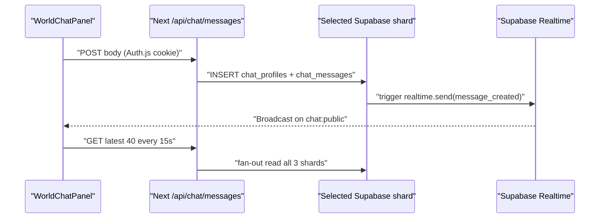
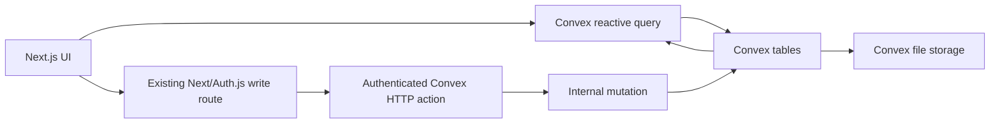
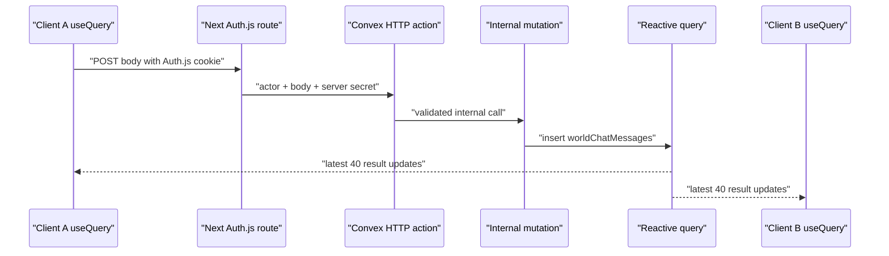

# Supabase → Convex Offline-First Migration Plan

Tanggal: 2026-08-22

Status: **IMPLEMENTED ON DEVELOPMENT / production import pending approval**

Implementation evidence (2026-08-22): the deterministic offline seed and
`@convex-dev/migrations` backfills completed on `dev:impartial-basilisk-364`;
see `docs/convex-migration.md` for the verified counts, production cutover, and
rollback-safe operating notes. World Chat passed a two-client reactive
propagation test, with final desktop/mobile evidence in
`validation/convex-world-chat/`. Nala conversation persistence remains deferred
behind its separate Convex Agent confirmation gate.

Premis dari pemilik proyek: database Supabase lama tidak lagi dapat diakses.

## 1. Outcome

Migrasi mengganti tiga shard Supabase, trigger Realtime, polling chat, dan S3
ledger dengan satu backend Convex. Karena sumber database lama dianggap hilang,
initial dataset Convex akan dibangun hanya dari artefak faktual yang masih ada di
repository. Tidak ada koneksi, dump, atau query ke Supabase dalam prosedur
migrasi ini.

Urutan implementasi yang disarankan:

1. Convex foundation + auth bridge.
2. Offline seed builder + manifest/checksum.
3. World Chat sebagai vertical slice Realtime pertama.
4. Blog, editable captions, inventory, dan contact.
5. Generic records/files dan Nala.
6. Cutover, penghapusan runtime Supabase, dan backup Convex pertama.

Rencana ini tidak mengotorisasi penambahan dependency. Semua dependency baru
tetap melewati CONFIRM gate pada §10.

## 2. Evidence yang Dibaca

### Sumber proyek

- `PRODUCT.md`: data tidak boleh difabrikasi; interaksi harus accessible.
- `design-system.md`: komponen dan guardrail visual tetap berlaku.
- `report.md`: tidak menambah metrik/achievement backend fiktif.
- `TASKS.md`: Home performance tetap active dan tidak boleh ikut melebar.
- `docs/supabase/schema.sql:45-589`: tabel, RLS, trigger Broadcast, publication,
  dan bucket lama.
- `lib/backend/shards.js:4-139`: tiga shard, routed ID `s1_`/`s2_`/`s3_`,
  round-robin write, dan backend header.
- `lib/backend/featureStore.js:234-632`: fan-out read, feature writes, serta
  fallback lokal.
- `lib/backend/store.js:67-259`: generic records, file metadata, dan S3 stream.
- `lib/backend/nalaStore.js:48-197`: round-robin persistence Nala.
- `scripts/seed-supabase-features.mjs:115-239`: satu-satunya reproduksi seed
  database yang dapat diaudit.
- `lib/data.js:5-367` dan `lib/playerProgress.js:19-394`: data faktual/fallback.
- `app/api/chat/messages/route.js:18-47` dan
  `components/world-chat/WorldChatPanel.jsx:52-163`: REST + Realtime + polling.
- Git: tidak ada dump, backup, export, JSONL, CSV, atau snapshot database yang
  tracked; hanya schema SQL dan seed script.

### Dokumentasi Convex yang menjadi dasar

- [Add Convex to an existing project](https://docs.convex.dev/client/react/overview)
  — `ConvexProvider`, `ConvexReactClient`, dan reactive hooks.
- [Next.js App Router server rendering](https://docs.convex.dev/client/nextjs/app-router/server-rendering)
  — `preloadQuery`, `fetchQuery`, `fetchMutation`, dan token server-side.
- [Data import](https://docs.convex.dev/database/import-export/import)
  — JSON/JSONL/CSV, `--replace`, target dev/prod, dan atomic table replacement.
- [Indexes](https://docs.convex.dev/database/reading-data/indexes/)
  dan [pagination](https://docs.convex.dev/database/pagination) — bounded reads,
  `.take(n)`, dan pagination.
- [Custom JWT provider](https://docs.convex.dev/auth/advanced/custom-jwt) — opsi
  advanced bila Auth.js kelak harus memberi identity langsung ke Convex.
- [Convex Auth](https://docs.convex.dev/auth/convex-auth) — opsi migrasi auth
  terpisah; saat ini beta dan dukungan Next.js server-side masih berkembang.
- [Convex Components](https://docs.convex.dev/components) — migrations,
  rate-limiter, Agent, dan persistent streaming.

## 3. Cara Backend Lama Bekerja

### 3.1 Database umum

- `configuredShards()` membaca tiga project descriptor dari env.
- Write memilih shard operational secara round-robin per process.
- ID membawa lokasi fisik: `s1_<uuid>`, `s2_<uuid>`, atau `s3_<uuid>`.
- Read daftar melakukan fan-out ke semua shard, menggabungkan hasil, lalu
  mengurutkan kembali di server.
- Read by ID mengurai prefix dan kembali ke shard asal.
- Next.js/Auth.js menjadi authorization boundary. RLS Supabase mempercayai
  server-only `x-backend-api-key`; Supabase Auth tidak dipakai.
- File binary masuk ke S3-compatible Supabase Storage. Tabel `backend_files`
  menyimpan shard, bucket, dan object path.

### 3.2 World Chat Realtime

Detail penting:

- GET publik membaca maksimum 40 pesan aktif dari semua shard.
- POST membutuhkan Auth.js session dan memotong body ke 280 karakter.
- Trigger menghasilkan `message_created`, `message_updated`, dan
  `message_deleted` pada public channel `chat:public`.
- Client hanya mendengar event `broadcast`, bukan `postgres_changes`; jadi
  trigger `realtime.send(...)` adalah jalur update yang benar-benar dipakai.
  Entri `chat_messages` di publication tidak dibaca oleh UI saat ini.
- Browser membuat tiga Supabase client/channel sekaligus.
- Polling 15 detik selalu aktif walaupun Realtime sudah subscribed.
- UI melakukan local upsert/sort/dedupe dan menampilkan shard badge.
- Tidak ada real user-presence count, typing indicator, atau room lain.

## 4. Recovery Classification: Data Lama

`recoverable` di bawah berarti dapat dibangun ulang dari Git tanpa mengarang
data. `lost` berarti tidak boleh dibuat ulang seolah-olah pernah ada.

| Supabase table/storage | Sumber yang masih ada | Recovery plan | Status data runtime lama |
|---|---|---|---|
| `blog_posts` | 3 entry di `lib/data.js`; transform seed lama tersedia | Generate ulang 3 post published dengan `legacyId` deterministik | Draft, archive, edit CMS, dan post baru setelah seed: **lost** |
| `chat_profiles` | Nama/role hanya dibuat saat user mengirim | Mulai kosong; identity baru dibentuk saat post baru | **lost** |
| `chat_messages` | Tidak ada seed atau export | Mulai kosong; UI menyatakan channel baru, bukan “history restored” | **lost** |
| `inventory_items` | Transform lengkap di seed script: 4 publications + 6 quests + 4 achievements | Reproduce tepat 14 seed rows; simpan `sourceKey` | Manual item/edit setelah seed: **lost** |
| `about_entries` | Seed `intro`; default copy juga ada di page modules | Seed `intro` + default captions untuk About/Projects/Research/Blog/Contact | Owner edits: **lost** |
| `contact_channels` | 5 `socials` di `lib/data.js` | Reproduce 5 channel sesuai order | Override/manual channel: **lost** |
| `contact_events` | Tidak ada seed/export | Mulai kosong | **lost** |
| `backend_records` | Tidak ada consumer selain API dan tidak ada seed | Buat schema compatibility, tetapi mulai kosong | **lost** |
| `backend_files` + bucket | Tidak ada manifest/content export | Mulai kosong; repo static assets tetap di `public/` | **lost** |
| `nala_conversations` | Tidak ada seed/export | Mulai kosong atau diganti Agent thread baru | **lost** |
| `nala_messages` | Tidak ada seed/export | Mulai kosong | **lost** |
| Auth users/sessions | Auth.js JWT stateless; bukan tabel Supabase | Tidak ada data database yang perlu dipindah | Session aktif mungkin perlu login ulang saat strategi auth berubah |

Catatan integritas:

- `0 rows recoverable` bukan bukti bahwa tabel lama benar-benar kosong.
- Routed ID seed lama dapat direkonstruksi dari hash di seed script dan disimpan
  sebagai `legacyId`; Convex `_id` tetap menjadi primary ID baru.
- `legacyShardId` hanya audit metadata. Jangan tampilkan shard badge sebagai
  state aktif setelah cutover.
- Jika kelak ditemukan backup offline, tambahkan adapter import terpisah. Jangan
  mengubah seed baseline atau mengklaim backup ada sebelum filenya tersedia.

## 5. Target Architecture

### 5.1 Staged auth decision

Rekomendasi untuk migrasi database/chat ini: **pertahankan Auth.js dulu** agar
login Google, owner role, Server Components, dan route guards tidak berubah
bersamaan dengan data layer.

Write path sementara:

1. Next.js route memverifikasi Auth.js session/owner role seperti sekarang.
2. Route memanggil Convex HTTP action dengan secret server-to-server.
3. HTTP action memverifikasi secret secara timing-safe.
4. HTTP action memanggil `internalMutation`; actor snapshot (`email`, `name`,
   `role`) berasal dari server yang sudah terautentikasi.
5. Public client tidak pernah menerima secret dan tidak bisa memanggil internal
   mutation.

Ini sengaja menjadi compatibility bridge, bukan auth system baru. Setelah data
cutover stabil, buat task terpisah untuk memilih:

- Convex Auth Google OAuth; atau
- provider OIDC/JWT yang didukung; atau
- custom JWT bridge dengan RS256/ES256 + JWKS (advanced, bukan default).

Jangan mencoba memakai default Auth.js cookie/JWT langsung sebagai Convex token
tanpa issuer/JWKS/claim contract yang diverifikasi.

### 5.2 Proposed application tables

Semua function harus object-form, memiliki `args` dan `returns` validator, dan
default menjadi internal kecuali client memang memanggilnya.

| Convex table/component | Menggantikan | Key/index wajib | Catatan |
|---|---|---|---|
| `blogPosts` | `blog_posts` | `by_slug`, `by_status_and_publishedAt`, optional `by_legacyId` | Typed block union; public query tidak mengembalikan owner-only fields/drafts |
| `worldChatMessages` | `chat_messages` | `by_status_and_sentAt`, `by_authorKey_and_sentAt` | `status` literal; max body 280; latest 40 bounded |
| `inventoryItems` | `inventory_items` | `by_sourceKey`, `by_status_and_createdAt` | Seed key stabil; rarity/type literal unions |
| `contentEntries` | `about_entries` | `by_entryKey`, `by_status_and_updatedAt` | Semua page captions memakai satu canonical source |
| `contactChannels` | `contact_channels` | `by_channelKey`, `by_active_and_sortOrder` | Public query hanya active rows |
| `contactEvents` | `contact_events` | `by_channelKey_and_occurredAt` | Event metadata dibatasi; tentukan retention sebelum volume tumbuh |
| `records` | `backend_records` | `by_collection_and_createdAt`, `by_visibility_and_createdAt`, optional `by_legacyId` | Compatibility surface; jangan pakai unbounded collect |
| `files` + `_storage` | `backend_files` + S3 bucket | `by_recordId_and_createdAt` | Simpan `Id<"_storage">`, bukan signed URL |
| Agent component + small thread map | `nala_conversations`, `nala_messages` | component-owned | Gunakan `@convex-dev/agent` untuk Nala; jangan rebuild custom LLM history |
| `seedManifests` | tidak ada | `by_version` | Commit SHA, source list, row counts, checksums, importedAt |

`chat_profiles` tidak perlu dipertahankan sebagai tabel terpisah. Pesan menyimpan
author snapshot untuk render historis; identity/user profile penuh dibahas saat
auth migration.

## 6. Offline Seed and Migration Scripts

### 6.1 `scripts/build-convex-seed.mjs`

Script ini harus:

1. Tidak membaca env Supabase dan tidak melakukan network request.
2. Mengimpor data faktual dari `lib/data.js`.
3. Menggunakan pure transformation yang dipisahkan dari seed Supabase lama agar
   dapat dites tanpa database.
4. Mereproduksi tepat:
   - 3 blog post;
   - 14 inventory item dari formula seed lama;
   - 6 content entry (`intro` + lima page caption default);
   - 5 contact channel;
   - 0 chat/profile/event/Nala/generic/file row.
5. Menulis JSONL per table ke folder generated yang di-ignore, misalnya
   `.migration/convex-seed/`.
6. Menulis `manifest.json` berisi schema version, Git commit, generated time,
   source files, count per table, dan SHA-256 per file.
7. Gagal keras untuk duplicate slug/key/sourceKey, invalid URL, empty required
   text, unsupported enum, chat body >280, atau block shape invalid.
8. Menjaga old deterministic routed ID sebagai `legacyId`, bukan Convex `_id`.

### 6.2 `scripts/import-convex-seed.mjs`

Script wrapper harus:

1. Default ke dev deployment.
2. Memerlukan flag eksplisit untuk `--prod`.
3. Menolak import bila working manifest checksum tidak cocok.
4. Menjalankan `npx convex import --replace --table <table> <file>.jsonl` hanya
   untuk seed tables.
5. Mengimpor `seedManifests` terakhir.
6. Tidak mengosongkan component-owned/auth tables.
7. Menampilkan before/after count dan berhenti pada mismatch.

Convex Data Import saat ini berstatus beta; karena itu JSONL + manifest harus
tetap disimpan sebagai audit artifact. Untuk live data evolution setelah
cutover, gunakan optional `@convex-dev/migrations` dengan pola
optional-field → backfill → required-field, bukan mengulang initial import.

### 6.3 Optional legacy backup adapter

Jika backup offline ditemukan nanti:

- input harus file eksplisit JSON/JSONL/CSV/ZIP, bukan koneksi Supabase;
- mapping harus menyimpan `legacyId`, `legacyShardId`, dan timestamp asli;
- dedupe memakai `legacyId`, lalu natural key (`slug`, `entryKey`, `sourceKey`);
- invalid rows masuk quarantine report, bukan diam-diam dibuang;
- chat/Nala import harus redaction/privacy-reviewed sebelum production;
- import dijalankan ke preview/dev, direkonsiliasi, baru dipromosikan.

## 7. World Chat Convex Design

### 7.1 Backend functions

`worldChat.listLatest` (public query):

- args: `{ limit?: number }`, clamp `1..40`;
- query `worldChatMessages` memakai index `by_status_and_sentAt` untuk
  `status = "active"`;
- `.order("desc").take(limit)`, lalu reverse untuk oldest → newest;
- returns hanya `_id`, authorName, body, sentAt;
- tidak mengembalikan actor email/key atau internal moderation metadata.

`worldChat.sendFromBackend` (internal mutation):

- hanya dipanggil HTTP action setelah Auth.js bridge lolos;
- validates actor snapshot dan body;
- trim, reject empty, max 280;
- insert atomically with `status: "active"` and `sentAt: Date.now()`;
- returns public message shape.

`worldChat.softDelete` (internal/owner path):

- patch status ke `deleted`;
- reactive query otomatis mengeluarkan row dari semua open client;
- audit actor/reason dapat disimpan bila moderation UI benar-benar di-scope.

### 7.2 Client changes

- Wrap app dengan `ConvexProvider` client component.
- Saat panel terbuka:
  `useQuery(api.worldChat.listLatest, { limit: 40 })`; saat tertutup gunakan
  `"skip"` agar subscription berhenti.
- Hapus manual Supabase clients, `realtime-config`, event handlers, polling
  interval, local upsert/dedupe, dan shard badge.
- POST sementara tetap ke Auth.js-protected Next route; setelah sukses, kosongkan
  draft dan biarkan reactive query menjadi source of truth.
- Jangan append response dan subscription sekaligus; itu menciptakan duplicate.
- Status UI menjadi loading / live / reconnecting-or-error berdasarkan query dan
  mutation state. Jangan tampilkan fake online count.
- Tidak ada polling fallback setelah Convex cutover. Saat offline, tampilkan
  honest error/retry state; chat lama memang tidak tersedia.

### 7.3 Expected flow

## 8. Implementation Phases

### Task A — Convex foundation and compatibility auth bridge

- Sumber spesifikasi: user request; Convex existing-project/runbook docs; §5.
- Halaman/letak: `convex/`, root provider, server env, compatibility HTTP action.
- Dependency baru: **YA → blocked sampai CONFIRM**.
- Token warna baru: TIDAK.
- Butuh konfirmasi data/arsitektur: YA — dependency, deployment, dan auth bridge.
- Guardrail relevan: no dependency tanpa approval; secret server-only; public
  function minimum; tidak menyentuh UI/design di luar provider.
- Acceptance criteria:
  1. Cloud deployment dipakai bila account sudah signed in; anonymous local
     hanya bila tidak ada account/link.
  2. Provider loads tanpa missing URL error.
  3. `convex/schema.ts` memakai validators/indexes pada semua read path.
  4. Public functions minimal; write helpers internal.
  5. Auth bridge menolak missing/wrong secret dan unauthenticated Next request.
  6. `npx tsc --noEmit` dan `npx convex dev --once` lulus.
- Screenshot evidence: tidak wajib untuk backend-only provider; browser smoke
  dicatat pada task chat.
- Temuan triase: pending validation.
- Status: `blocked`.

### Task B — Offline seed builder and dev import

- Sumber: schema lama, seed lama, `lib/data.js`, page fallback copy, §4/§6.
- Halaman/letak: generated migration artifacts dan Convex dev data; tidak ada UI.
- Dependency baru: TIDAK selain Convex foundation.
- Token warna baru: TIDAK.
- Butuh konfirmasi data: TIDAK — inaccessible database adalah premis eksplisit;
  manifest hanya memakai data Git yang dapat dibuktikan.
- Guardrail relevan: no fabricated data; no Supabase access; deterministic,
  repeatable, dan secret-free artifacts.
- Acceptance criteria:
  1. Script berjalan tanpa Supabase env/network.
  2. Manifest count/checksum deterministik.
  3. Dua build dari commit yang sama menghasilkan content checksum sama.
  4. Dev import count = 3 blog, 14 inventory, 6 content, 5 contact.
  5. Lost-data tables tetap kosong; tidak ada fake chat/Nala/event/file row.
  6. Re-run import bersifat repeatable dan tidak menggandakan data.
- Screenshot evidence: N/A; simpan manifest + CLI verification output.
- Temuan triase: pending validation.
- Status: `planned`, menunggu Task A.

### Task C — World Chat vertical slice

- Sumber: current chat code, Supabase Broadcast docs, Convex reactive query docs,
  §7.
- Halaman/letak: global World Chat panel dan `/api/chat/messages` compatibility
  write route.
- Dependency baru: TIDAK setelah Task A.
- Token warna baru: TIDAK.
- Butuh konfirmasi data: TIDAK — chat history mulai kosong sesuai premis.
- Guardrail relevan: no fake history/presence; bounded indexed read; server auth;
  keyboard/mobile/reduced-motion rules existing tetap dipertahankan.
- Acceptance criteria:
  1. Two-browser test: pesan dari A muncul di B tanpa refresh/polling.
  2. Unauthenticated POST 401; logged-in visitor dapat kirim; empty/>280 ditolak.
  3. Query membaca maksimum 40 dengan index + `.take`, bukan `.collect/.filter`.
  4. Close panel menghentikan subscription via `"skip"`/unmount.
  5. Tidak ada `/api/chat/realtime-config`, Supabase client, 15s interval, shard
     badge, atau duplicate optimistic message pada runtime Convex.
  6. Mobile 375px dan desktop ≥1280px tidak overflow; keyboard/focus tetap lolos.
- Screenshot evidence:
  `validation/convex-world-chat/<desktop|mobile>-<empty|live|sending|error>.png`.
- Temuan triase: pending validation; perbaiki P0–P2 sebelum cutover.
- Status: `planned`, menunggu Task A/B.

### Task D — Blog and editable content

- Sumber: featureStore, Blog routes/UI, page caption defaults, §4/§5.2.
- Halaman/letak: Blog public/admin/detail dan editable captions lintas lima route.
- Dependency baru: TIDAK setelah Task A.
- Token warna baru: TIDAK.
- Butuh konfirmasi data: TIDAK untuk baseline Git; runtime edits lama tetap lost.
- Guardrail relevan: no fabricated posts; owner-only write; preserve public URL;
  tidak memperluas editor atau redesign UI.
- Acceptance criteria:
  1. Public hanya melihat published blog posts.
  2. Owner dapat create/update/draft/archive melalui Auth.js bridge.
  3. Slug uniqueness dijaga oleh indexed lookup + mutation transaction.
  4. Five page captions + intro dapat dibaca/edit owner.
  5. Local fallback tetap tersedia sebagai emergency code fallback, tetapi UI
     tidak menyebut Supabase/shard lagi.
  6. Existing public slugs tetap resolve.
- Screenshot evidence: desktop/mobile Blog list/detail/admin + affected headers.
- Temuan triase: pending validation; perbaiki P0–P2 sebelum task berikutnya.
- Status: `planned`, menunggu Task C validated.

### Task E — Inventory, contact, events

- Sumber: seed transform, player progress, Contact routes/UI.
- Halaman/letak: Player Inventory dan Contact cards/events.
- Dependency baru: TIDAK setelah Task A.
- Token warna baru: TIDAK.
- Butuh konfirmasi data: TIDAK — 14/5 baseline rows berasal dari source Git.
- Guardrail relevan: no fake inventory/events; owner-only manual add; no new PII;
  preserve mobile/focus behavior.
- Acceptance criteria:
  1. Exactly 14 reproducible seed inventory rows after first import.
  2. Manual inventory add remains owner-only.
  3. Five active contact channels retain order and URL.
  4. Contact event contains no new PII; define retention before production.
  5. No Supabase/source/shard copy remains in affected UI.
- Screenshot evidence: Inventory and Contact desktop/mobile states.
- Temuan triase: pending validation; perbaiki P0–P2 sebelum task berikutnya.
- Status: `planned`, menunggu Task D validated.

### Task F — Generic records/files

- Sumber: `lib/backend/store.js`, generic API routes, Convex Storage docs.
- Halaman/letak: server-only generic records/files APIs; tidak ada consumer UI
  yang ditemukan.
- Dependency baru: TIDAK setelah Task A.
- Token warna baru: TIDAK.
- Butuh konfirmasi data: TIDAK — empty state mengikuti premis; bila contract API
  eksternal ternyata punya consumer, scope harus dikonfirmasi ulang.
- Guardrail relevan: no fake metadata/files; owner authorization; bounded reads;
  no stored expiring URL.
- Acceptance criteria:
  1. Compatibility API contract is either preserved or explicitly versioned.
  2. Files store `_storage` ID, not URL; download resolves URL/content at read.
  3. Owner/backend authorization applies to metadata and bytes.
  4. File count update is transactional.
  5. Empty initial state is reported honestly; no old file placeholders.
- Screenshot evidence: N/A unless a user-facing uploader/preview exists.
- Temuan triase: pending API/storage validation.
- Status: `planned`, lower priority karena tidak ada frontend consumer saat ini.

### Task G — Nala persistence

- Sumber: Nala route/store and Convex Agent component guidance.
- Halaman/letak: global Nala widget, `/api/nala/chat`, dan component-owned backend.
- Dependency baru: **YA (`@convex-dev/agent`; optional rate limiter/provider
  package) → separate CONFIRM**.
- Token warna baru: TIDAK.
- Butuh konfirmasi data/arsitektur: YA — component/provider dependency dan
  apakah Nala termasuk cutover batch pertama.
- Guardrail relevan: no fabricated portfolio facts; external call hanya action;
  durable rate limit; no custom duplicate LLM history.
- Acceptance criteria:
  1. New conversations use Agent threads/history; no custom duplicate message
     table for LLM history.
  2. Factual local tools remain source of truth.
  3. External LLM calls stay in actions; persistence via internal functions.
  4. Rate limiting is durable, not `globalThis` process memory.
  5. Old Nala history is labeled unavailable, not recreated.
- Screenshot evidence: desktop/mobile Nala new-thread and follow-up states.
- Temuan triase: pending validation; perbaiki P0–P2 sebelum cutover.
- Status: `blocked` pending dependency/scope confirmation.

### Task H — Cutover and Supabase retirement

- Sumber: completed Tasks A–G and dependency audit.
- Halaman/letak: seluruh runtime backend, affected UI copy, package/env/deploy.
- Dependency baru: TIDAK.
- Token warna baru: TIDAK.
- Butuh konfirmasi data: TIDAK setelah manifest production disetujui.
- Guardrail relevan: no destructive removal sebelum backup/verification; no
  silent lost data; full screenshot/security/build gate; preserve unrelated work.
- Acceptance criteria:
  1. No runtime import of `@supabase/supabase-js` / `@supabase/ssr`.
  2. No runtime read of `SUPABASE_*`, `DB_PASSWORD`, S3 access keys.
  3. Old schema/scripts moved to clearly marked legacy docs or removed only
     after their recovery algorithms are preserved in Convex seed tests.
  4. Supabase packages/scripts removed from package/lock only at final cutover.
  5. Production import manifest counts/checksums match dev-approved manifest.
  6. First Convex backup/export is captured immediately after production seed.
  7. Full build, backend push, API/auth, realtime, visual, and a11y gates pass.
- Screenshot evidence: final multi-route set in
  `validation/convex-cutover-YYYY-MM-DD/`.
- Temuan triase: pending full regression; catat deferred P3/P4 di `TASKS.md`.
- Status: `planned`, last.

## 9. Validation and Reconciliation Gates

### Data gate

- Compare generated manifest counts/checksums before dev and prod import.
- Query every natural key/slug/sourceKey for duplicates.
- Verify seed samples from each source category, not only total counts.
- Confirm lost-data tables are empty and UI copy does not imply restoration.
- Export/backup Convex after production import.

### Security gate

- Public queries return only public fields.
- Auth.js role remains server-derived; client role is never trusted.
- Convex HTTP bridge secret is server-only and rotated after accidental leak.
- Internal mutations cannot be called directly from public clients.
- Owner write tests: anonymous denied, visitor denied where owner-only, owner
  allowed.

### Realtime gate

- Two independent browser contexts; send/update/delete propagate without reload.
- Reconnect after temporary offline/network interruption.
- No timer polling and no manually managed WebSocket/channel code.
- Subscription is scoped to open panel and latest 40.
- Burst test (for example 20 sequential messages) preserves ordering/deduping.

### Build/code gate

- `npx tsc --noEmit`.
- `npx convex dev --once` or equivalent clean cloud push.
- `npm run build`.
- `rg` confirms no unexpected Supabase runtime imports/env/copy after Task H.
- Package diff contains only dependencies explicitly confirmed.

### Visual/a11y gate

- Follow AGENTS.md Fase 5 per affected component.
- Desktop ≥1280px and mobile 375px; tablet for chat/utility overlap.
- Empty/loading/live/error/sending/auth-gated states.
- Keyboard focus/Escape/Tab and no horizontal overflow.
- Screenshots visually reviewed, not merely generated.

## 10. Required CONFIRM Gates Before IMPLEMENT

1. **Required npm dependency:** approve adding `convex`. Because the repo has no
   TypeScript compiler, also approve `typescript` as a dev dependency so the
   mandatory typecheck can run.
2. **Deployment:** use a real Convex cloud dev deployment when an account/link
   exists; anonymous local only if no account exists.
3. **Auth migration boundary (recommended):** keep Auth.js during database/chat
   cutover and use the server-to-server Convex HTTP/internal-mutation bridge.
   Full auth migration becomes a separate task after cutover.
4. **Nala dependencies:** approve separately only when Task G starts
   (`@convex-dev/agent`, and any required provider/rate-limit component).
5. **Lost runtime data:** implementation will intentionally start chat,
   profiles, events, generic records/files, and Nala history empty. This follows
   the user-provided inaccessible-database premise; no fake restore is allowed.

## 11. Cutover and Rollback

Karena Supabase lama tidak dapat diakses, tidak ada dual-read/dual-write dan
tidak ada database rollback ke Supabase.

Safe cutover:

1. Build/import seed to Convex dev.
2. Validate vertical slices and manifest.
3. Take Convex dev export/backup.
4. Deploy code with a server-side `DATA_BACKEND=convex` gate if a staged rollout
   is still needed.
5. Import the approved manifest to production.
6. Smoke test auth, chat, Blog, About, Inventory, Contact, Nala/new files as
   applicable.
7. Take first production Convex backup.
8. Remove Supabase runtime code/dependencies/env references.

Rollback options:

- Static pages: switch read path to factual local fallback (`lib/data.js` and
  page defaults) while Convex is repaired.
- Writes: temporarily disable CMS/chat send with an honest maintenance state;
  never write back to inaccessible Supabase.
- Convex data: restore the post-import Convex backup or re-run the approved
  JSONL `--replace` seed for reproducible tables.
- Chat/Nala runtime history created after cutover must be protected by Convex
  backups; re-running baseline seed must not clear those live tables.

## 12. Definition of Done

Migration is done only when:

- production uses Convex for all in-scope reads/writes/storage;
- World Chat is reactive without Supabase Broadcast or polling;
- recoverable seed data matches its manifest;
- unrecoverable data is not fabricated or misrepresented;
- Auth.js/owner authorization remains correct (or a separately approved auth
  migration is complete);
- Supabase packages, runtime env access, shard UI/copy, and migration scripts no
  longer participate in production;
- typecheck, Convex push, Next build, functional/security tests, and required
  screenshots all pass;
- `TASKS.md` and decision log are updated with final evidence paths.
