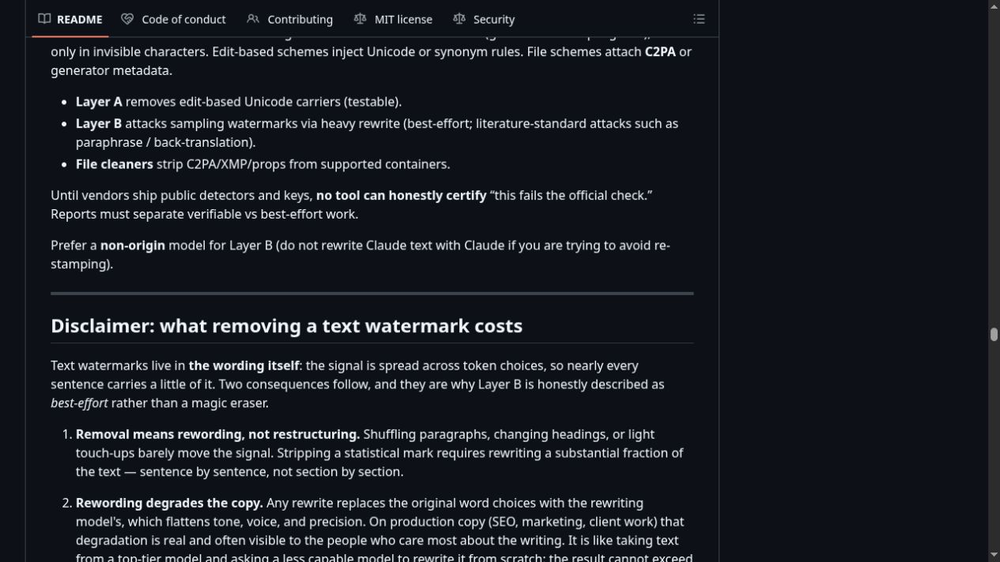

# Anthropic Added Invisible AI Watermarks. Removers Arrived Before the Detector

Anthropic announced an invisible mark whose detector was still private. Within hours, developers were shipping erasers. One launch post then passed two million impressions, according to its maker, even though the repository itself warned that nobody could yet prove the official check had been defeated.

That warning is the story. The new tools can remove hidden Unicode, strip file metadata, and rewrite prose. Those are real operations. They are not interchangeable, and only some can be tested against Claude's announced system today.

The evidence supports an early cat-and-mouse market, not a technical knockout. Provenance has gained an opposition industry before its referee has entered the ring.

## Anthropic promised two marks, not one magic stamp

Anthropic's [marking guide](https://support.claude.com/en/articles/16266773-how-claude-marks-ai-generated-content) says supported Claude models launched in the EU on or after 2 August 2026 carry machine-readable marking from launch. The company says the marks apply worldwide across Claude, Claude Code, Cowork, Tag, the API, and supported cloud partners. Earlier models remain a work in progress.

The date comes from policy, not a surprise security release. The European Commission's [transparency code](https://digital-strategy.ec.europa.eu/en/policies/code-practice-ai-generated-content) offers a compliance route for AI Act obligations that began applying on 2 August 2026.

Claude's plan has two separate parts.

First, supported models weave an imperceptible mark into generated text at the model level. Anthropic says it survives copy and paste and may persist through some editing. The company has not said that it consists of zero-width characters, nor has it published the algorithm, keys, detector, false-positive rate, or a model-by-model coverage table.

Second, supported generated files such as SVG, PNG, and JPEG can carry signed provenance metadata based on C2PA. That record can show that Claude processed a file and whether its signed history remains intact. It is attached to the container, unlike the wording-based mark.

Calling both things a watermark makes the launch easier to explain and harder to evaluate. A text rewrite, a Unicode scrub, and a metadata remover attack different objects.

## A detected mark would prove contact, not authorship

Anthropic's own limitations are unusually important. A detected mark means content *may have been processed* by Claude. It does not establish that Claude supplied the underlying ideas or wrote the original draft. Proofreading, translation, summarization, and file conversion can all leave marked output around human work.

The reverse inference fails too. Anthropic says a missing mark does not prove human origin. Text may be too short, produced by an older model, heavily edited, translated, or mixed with other writing. File metadata may disappear during conversion, resaving, or screenshots.

That leaves a useful but narrow meaning: the signal records a relationship with a supported Claude workflow. Treating it as a clean split between “human” and “machine” would go beyond the vendor's claim.

This restraint is a benefit, not a defect in the disclosure. It gives employers, editors, schools, and platforms a reason to avoid turning one detector result into a misconduct verdict. It also reveals why removal has legitimate users. A person who asked Claude to fix punctuation in an otherwise human manuscript may reasonably object to a downstream system calling the whole text machine-authored.

## The viral remover is three tools wearing one name

The public [watermarks-remover repository](https://github.com/guillaumemeyer/watermarks-remover) separates its work into distinct layers.

| Operation | What it changes | What can be checked | What it cannot prove |
|---|---|---|---|
| Unicode cleanup | Zero-width characters, unusual spaces, direction controls, and similar code points | Before-and-after bytes and character counts | Defeat of an undisclosed model-level mark |
| File cleanup | C2PA, XMP, EXIF, and document properties in supported containers | Metadata inspection before and after | Removal of a signal embedded in pixels or wording |
| Heavy rewrite | Token choices, syntax, and sentence structure | The resulting text and quality change | Failure of Claude's official detector while it remains unavailable |

The first two are deterministic. If a zero-width character is present, a script can remove it and report the count. If a JPEG contains a C2PA manifest, a metadata tool can show whether the rewritten file retains it.

The third is an attack by replacement. Statistical text marks generally depend on the model favoring particular token choices during generation. Disturbing enough of those choices can weaken a detector's signal, but the rewritten copy is no longer the same writing. Tone flattens, precise language moves, and technical meaning can drift.

Peer-reviewed work shows that the attack class is credible. The 2025 ICML paper [“Revealing Weaknesses in Text Watermarking Through Self-Information Rewrite Attacks”](https://proceedings.mlr.press/v267/cheng25c.html) describes a targeted paraphrase attack against the watermark schemes it studied. It does not test Claude. That distinction matters because Anthropic has not identified its algorithm.

Google DeepMind's [SynthID text explainer](https://deepmind.google/blog/watermarking-ai-generated-text-and-video-with-synthid/) supplies a useful comparison: a deployed text mark can influence token selection without inserting a visible tag. It also becomes harder to detect after extensive rewriting or translation. No opened source says Claude uses SynthID, so the comparison explains the class rather than Claude's implementation.

## The repository states the limit more clearly than the hype

The repository says that until vendors publish detectors and keys, no tool can honestly certify that output fails the official check. Its README calls the rewrite layer best-effort and explains that removal means rewording a substantial share of the text.

That admission does not make the project useless. It makes the boundary inspectable.

[BleepingComputer's survey](https://www.bleepingcomputer.com/news/security/ai-watermark-removers-flood-the-web-almost-none-can-prove-they-work/) reached the same split on 13 August: Unicode and metadata cleanup can be checked, while claims about defeating Claude's text mark could not. The publication also said it had not audited or tested the named tools, a limit worth carrying forward.

The tool's viral moment says something different. In an [as-told-to Business Insider interview](https://tech.yahoo.com/ai/meta-ai/articles/created-viral-ai-watermark-remover-113201792.html), Guillaume Meyer said he released a first version within hours, then received more than two million impressions on an August 11 X post. He also called the project imperfect and said it would need adjustment when Anthropic released detectors.

Two million impressions measure curiosity, anger, fear, and opportunism. They do not measure successful removals.

## Open removers create useful pressure and cheap evasion

The argument for open removal tools is stronger than a simple demand to hide AI use. Public code can inspect provenance claims, expose dangerous Unicode handling, let creators audit their own files, and test whether a vendor's mark survives ordinary editing. An independent ecosystem can force detection vendors to publish error bounds and resist treating a secret score as unquestionable authority.

Openness also exposes flaws in the remover. The repository's issue history records character-corruption bugs and container edge cases. Those reports are uncomfortable, but they are visible. A closed web service asking for unpublished manuscripts offers no comparable view into its code, retention, or repair history.

The case against easy removal is just as concrete. Metadata stripping can erase an honest editing trail. Rewriting can help a spammer or dishonest student evade a policy. A popular agent skill also creates a supply-chain surface because users may install fast-moving code and feed sensitive documents through it before anyone has audited the dependencies.

There is a less dramatic cost: the copy may get worse. Replacing enough wording to disturb a statistical signal can sand away the exact choices that made the original useful. A remover may produce a cleaner detector result and a poorer paragraph, with no official test to show that the detector result changed at all.

## Provenance needs more than a secret yes-or-no test

Anthropic's scheme offers real advantages. Model-level marking can travel beyond one app, while signed file records can preserve a tamper-evident processing history. Both give platforms an alternative to guessing from visual style or prose cadence.

Neither should stand alone. The vendor says the signal is not conclusive; the remover says its central bypass is not yet certifiable. Those matching limits point toward a better design for provenance decisions:

- Publish the detector, supported model list, and tested error behavior before institutions attach penalties.
- Report `processed by` separately from `authored by`, especially for proofreading, translation, and formatting.
- Show the type of signal found: text mark, signed file record, self-disclosure, or a general classifier score.
- Preserve an appeal path, disclose the evidence behind the result, and let a person challenge it before one badge becomes a verdict.
- Keep high-stakes decisions tied to work history, source files, and policy, not only to detector output.

Removers will keep arriving because the incentive already exists. Some will protect privacy and audit weak claims. Others will sell concealment. The first version of that conflict appeared almost immediately after Anthropic's announcement, but the public record still lacks the one artifact needed to score the contest: Claude's detector.

Readers comparing later claims can start with [Anthropic's current marking guide](https://support.claude.com/en/articles/16266773-how-claude-marks-ai-generated-content) and the [repository's stated limitations](https://github.com/guillaumemeyer/watermarks-remover). A credible victory claim should name the model, detector version, input length, edit method, false-positive threshold, and repeated result. Anything less is attention dressed as verification.
