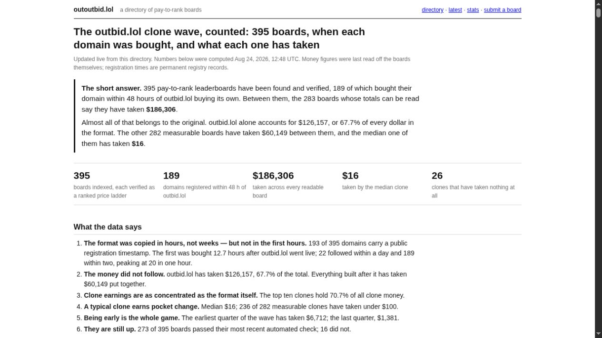

# Pay-to-Rank Websites Sell a Spectacle, Not a Stable Ad Slot

*Research cutoff: August 24, 2026. Revenue figures in this article are attributed to their publishers or to public board counters; none are audited processor records.*

By August 24, one public directory had verified 395 pay-to-rank boards. Its measurable money was radically uneven: Outbid.lol held 67.7% of the directory's board-reported takings, while the median measurable clone had taken $16.

The copy wave was real inside that indexed sample. A repeatable ad market is harder to find.

The [outoutbid.lol research page](https://outoutbid.lol/research) assembled the broadest public record found for this investigation. Its totals come from counters and visible rows on the boards, not payment-processor exports. Its registry also misses projects that were deleted, private, hidden behind free subdomains, or never discovered. The evidence therefore supports a narrow conclusion: hundreds of public copies appeared quickly, and most measurable copies reported little money. It does not establish an internet-wide trend, audited revenue, or advertiser profit.

*Money can move a listing up the board in seconds. Keeping the audience there is the harder trade.*

## The bid was also the launch story

On August 19, maker Jonathan Wilke [announced Outbid on X](https://x.com/jonathan_wilke/status/2090184058810544467) with a compact rule: outbid a competitor to take first place. A quoted prelaunch post showed him [checking a Polar webhook](https://x.com/jonathan_wilke/status/2090180815384633503), which made the payment event part of the public build story.

The updates arrived as performance posts. After 24 hours, Wilke [reported](https://x.com/jonathan_wilke/status/2090548427616555154) more than 200,000 visitors, $21,499 in receipts, and three copies. At 36 hours, he [reported](https://x.com/jonathan_wilke/status/2090713349298196748) $42,000, 1,061,848 visitors, a $10,000 leading bid, and at least ten copies. Those are founder claims, not independently reviewed analytics.

The social reach was visible even without accepting the revenue figures. At the research cutoff, the launch post displayed 3.7 million views. A [Threads post about the project](https://www.threads.com/@kgellci/post/DcSdHxPm03C/someone-created-outbid-lol-hours-ago-and-has-already-made-over-k-in-revenue/) displayed 140,000 views, while a separate maker said Outbid's rising cost had prompted a cheaper [Highrank clone](https://www.threads.com/@raj.script/post/DcUDJEhkyTZ/outbid-lol-is-getting-expensive-so-i-built-highrank-lol-same-simple-idea-put/). These are volatile snapshots from two posts, not a platform trend chart.

The product and its promotion shared a mechanism. A new leader changed the page, supplying a screenshot that could invite another challenger. Outbid did not merely sell a link at the top; it turned the fight for that link into content.

The direct Outbid page showed a Vercel security checkpoint during this review, so its current rules could not be checked from the live product. The discussion below treats Wilke's launch statement as the original rule and does not assume that every later term stayed the same.

## Hundreds of copies, one steep concentration curve

The directory's chronology is stronger than a collection of excited posts. It found registration dates for 193 of the 395 indexed board domains. Of those dated domains, 189 were registered within 48 hours of Outbid's domain; 20 appeared during the busiest hour. Registration is only a proxy for launch, but the cluster is too tight to describe as a random collection of old auction sites.

*Source evidence: [outoutbid.lol's live research summary](https://outoutbid.lol/research), captured August 24, 2026 at 12:48 UTC. The page licenses its figures under CC BY 4.0 and states that its money totals come from board counters rather than audited accounts.*

The money distribution cuts the other way. The directory could read financial signals from 283 boards. Based on those public claims, Outbid accounted for $126,157 of $186,306 in total takings. The other 282 boards reported $60,149 together. Their median was $16, 236 reported less than $100, and 26 showed no payments.

Those numbers describe concentration, not failure in every case. A small board might be a joke, a portfolio experiment, or a lead generator whose value never appears in its counter. A seller might also have private revenue that the directory missed. Still, the public evidence resists a common shortcut: copying a viral purchase mechanic does not copy the original audience.

## Four boards sell four different kinds of position

“Bid website” hides meaningful product differences. The inspected sites used money, time, clicks, and even game skill in different combinations.

| Site | What determines visibility | What the buyer receives | Turnover and limits |
|---|---|---|---|
| Outbid.lol | The launch rule put the highest payment first. | Top rank, plus the status of displacing the prior leader. | Current live terms were not rechecked because the site presented a security checkpoint. |
| [TopBid](https://www.topbids.lol/) | A one-time bid starts at $1. Higher visible thresholds change the presentation. | A ranked listing; bids of $25 or more can add a custom pitch, while bids of $100 or more can take the masthead at access. | The board presented cumulative positions and marked purchases final. Terms can change. |
| [Topple](https://topple.lol/rules) | Rank equals a paid balance multiplied by a quality score. The balance halves every 24 hours and each counted click drains 3%, adjusted by quality. | A labeled paid placement whose rank reacts to time, traffic, and destination quality. | Value decays; payments are final; one visitor can count once per listing per hour under the published rules. |
| [FlappyBid](https://flappybid.lol/rules) | A free daily game score, checked through a server replay according to the rules, determines the winner. | The winner receives the next day's top showcase. Paid coins buy one revive per run; fixed sponsor rows are sold separately. | A winner can appear only once, and the main showcase turns over daily. Anti-cheat and click validity were not independently tested. |

This variation is more useful than the shared visual style. TopBid sells cumulative prominence. Topple sells a balance that loses force. FlappyBid makes the contested slot a prize and moves direct payments into sponsor rails and a revive mechanic. Each design answers the same owner problem differently: how can the top of the page become sellable again after somebody has already paid for it?

## What an advertiser can actually buy

The appeal is easy to see. Price and position are public. A buyer can watch a listing move without waiting for an opaque campaign review. Several boards expose click counts, and the surrounding contest can give a small product a burst of attention from builders watching the experiment.

That can be useful for a narrow launch stunt. A maker with a strange, visual, or developer-facing product may value the social story as much as the referral traffic. The winning bidder becomes part of the board's unfolding plot, especially while spectators are still watching every change.

The weak point is intent. A person visiting an auction board may be curious about the auction, not shopping for the listed product. A public click shows movement off the board. It does not reveal revenue, sign-ups, retention, or qualified leads, and none of the inspected boards supplied comparable conversion evidence. An advertiser may track those outcomes privately.

The contrast with search advertising is instructive. [Google Ads says Ad Rank](https://support.google.com/google-ads/answer/1722122?hl=en) considers the bid alongside quality, thresholds, competition, search context, and the expected effect of assets. A pay-to-rank board can be more legible because its public rule is smaller. That same simplicity can ignore whether the audience has any reason to care about the winner.

## Permanence creates a trap

A permanent leaderboard sounds generous to an early bidder. It also creates a rising entry price and leaves later inventory trapped beneath an old winner. If the board stops attracting new visitors, permanence becomes an archive of payments rather than a continuing market.

Turnover mechanisms soften that problem at a cost. Topple's half-life and click drain give new entries a route upward, but the buyer is purchasing a shrinking balance. FlappyBid resets its primary showcase every day, though a payment does not directly win that slot. A fixed sponsor row gives clearer inventory, while giving up some of the drama that made the format spread.

There is no universally fair duration. The useful question is concrete: how long does a price buy a given position under normal traffic? A board that cannot answer that leaves the buyer paying for a screenshot and hoping the audience arrives before the position disappears.

## Paid placement still needs a label

Outbid's launch copy framed the board as having no ads, but a rank purchased for commercial visibility behaves like paid placement. The label matters because visitors can otherwise mistake price for recommendation or relevance.

The U.S. Federal Trade Commission has long said that paid higher placement should be [clearly distinguished](https://www.ftc.gov/sites/default/files/documents/closing_letters/commercial-alert-response-letter/commercialalertletter.pdf). Its later online guidance says required disclosures should be [clear, conspicuous, and close to the relevant claim](https://www.ftc.gov/news-events/news/press-releases/2013/03/ftc-staff-revises-online-advertising-disclosure-guidelines), including on small screens. Duties vary by country and by the facts of the placement, but “the rules are obvious” is a weak disclosure policy.

Topple provides one useful example. Its rules call the rows paid placements and say outbound links receive `rel="sponsored"`. That statement does not verify every rendered link, but it tells a visitor and a search crawler what kind of relationship is being sold.

Disclosure does not solve adjacency risk. A winner can point toward a scam, hate material, adult content, or an illegal offer unless the owner reviews destinations and enforces rules. Topple publishes prohibited categories and reserves removal rights. The cost is ongoing judgment: a board owner is operating a small advertising venue, even when the interface looks like a weekend joke.

## The payment rail may not share the joke

The launch record introduces a delicate issue. Wilke's prelaunch post referred to a Polar webhook. Polar's [current acceptable-use policy](https://polar.sh/legal/acceptable-use-policy), effective March 25, 2026, lists advertising and sponsorship among prohibited categories.

The public record does not establish a breach. It does not show whether Outbid had approval, received a different classification, used an earlier arrangement, or still uses Polar. The mismatch simply shows why a copied checkout is not a complete business model. An owner needs a processor that knowingly supports the product being sold.

Payment risk also survives a successful charge. Polar's [account-review documentation](https://polar.sh/docs/merchant-of-record/account-reviews) describes fraud checks, payout holds, and card-network monitoring tied to chargebacks. Other processors have their own terms. A viral auction can attract disputed purchases just as quickly as legitimate ones, while a “final sale” sentence on a rules page does not override network processes.

## A screenshot can be spoofed more easily than a payment record

The same visible simplicity that makes these boards shareable makes them easy to imitate. [fakeoutbid.lol](https://fakeoutbid.lol/) openly offers a parody generator for a plausible first-place screenshot with a chosen name, link, and bid. It carries a parody disclaimer and is not evidence that any particular screenshot was fraudulent.

It is evidence that a screenshot alone is weak proof. Advertisers evaluating a board need the live URL, the published ranking rule, a processor receipt, and their own referral data. Owners need server-side payment confirmation and a defensible click-counting rule. Without that record, social proof can collapse into costume.

## The Million Dollar Homepage already sold the page itself

The current boards have a famous ancestor. In 2005, Alex Tew sold 10-by-10 pixel blocks on the [Million Dollar Homepage](https://milliondollarhomepage.com/) for $1 per pixel. Contemporary [Wired reporting](https://www.wired.com/2005/11/how-much-is-a-pixel-worth/) documented the pricing and the rush of buyers. The grid remains online as a dense map of paid attention.

Outbid's format adds motion to that old bargain. A pixel purchase occupied space; a leading bid displaces somebody and gives both parties a reason to talk. That competitive layer can accelerate distribution. It cannot guarantee that the audience will stay after the novelty of the contest fades.

The directory's concentration is consistent with that reading. The original captured the story, while most copies inherited the interface without inheriting the crowd. This is an inference from an observational dataset, not proof of causation, but it fits the split between rapid domain registration and thin reported takings.

## Verdict: a participatory billboard, not a default ad channel

Pay-to-rank boards can work as bounded public stunts. They make price visible, turn a purchase into a social event, and sometimes give a curious product immediate traffic. Owners gain a direct monetization loop and a format that spectators can understand in seconds.

The trade is fragile. Attention may belong to the contest rather than the advertiser. Public click counts stop before conversion. Permanent leaders can freeze inventory; decaying balances shorten the purchase. Moderation, disclosure, processor approval, chargebacks, and spoofed screenshots remain owner work after the launch post succeeds.

Before the next bid, an advertiser should write down five answers:

1. How long can the purchased position last under the published rule?
2. Which outbound clicks and attributed conversions will the advertiser measure independently, and where will those records be kept?
3. What happens after a refund or chargeback?
4. Which content can appear beside the listing, and who reviews it before it goes live?
5. Does the payment provider permit the sale?

If a seller cannot answer those questions, the bid belongs in an entertainment budget, not an acquisition forecast. The useful experiment is not whether money can move a card upward. The useful experiment is whether the resulting attention does anything after the card is clicked.
