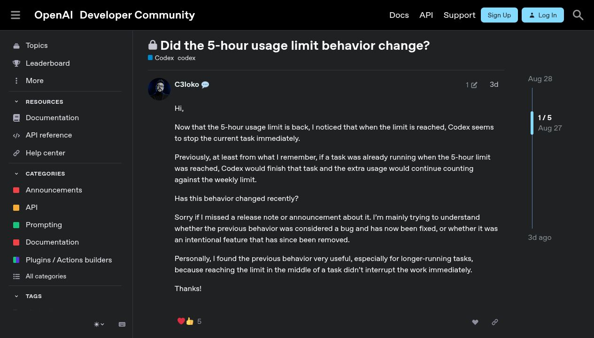

# Some Codex Runs Now Stop at the Five-Hour Limit. OpenAI's Docs Say They Can Continue.

The strange part is not that Codex has a limit. It is that the limit and the documentation do not always agree.

On 27 August, a Codex user [reported](https://community.openai.com/t/did-the-5-hour-usage-limit-behavior-change/1393093) that a running task appeared to stop when the restored five-hour allowance was exhausted. The post remembered earlier work finishing past that boundary. Instead of declaring a verdict, its author asked whether the product had changed or whether an old loophole had finally been closed.

OpenAI's current answer points the other way. Its [Codex Help page](https://help.openai.com/en/articles/11369540-using-codex-with-your-chatgpt-plan) says an active turn can continue after a usage limit, subject to fair-use limits. The current [pricing documentation](https://learn.chatgpt.com/docs/pricing) is stronger: OpenAI says it wants work already in progress to finish and that the agent will be able to continue that active turn, again with the fair-use condition.

That makes “Codex removed the grace limit” a better rumor than a fact. Recent hard stops are credible enough to investigate. A declared universal policy removal is not in the selected evidence.

## The report is real. Its scope is one incident.

The 27 August post is unusually useful because it preserves uncertainty. It identifies the five-hour boundary, says the current task stopped immediately, contrasts that with remembered prior behavior, and asks whether the difference was intentional. It does not identify a client version, plan, model, exact start time, or server response. Those omissions prevent a controlled before-and-after comparison.

*The public post documents one immediate-stop observation and a recollection of earlier behavior. It does not establish prevalence or an announced policy.*

A separate [openai/codex issue filed on 26 August](https://github.com/openai/codex/issues/40905) frames the complaint around Plus, names GPT-5.6 Sol, and says one long-running task had already been interrupted twice by the five-hour limit. The separate venue provides corroboration, but the issue is still a report rather than telemetry from OpenAI's quota service.

Together, those accounts establish a narrow fact: at least two users publicly described interruptions near the five-hour boundary in late August. They do not show that every Codex surface, plan, model, or active turn now behaves the same way.

## “Grace” is shorthand, not a clean product switch

The word *grace* hides several different events.

OpenAI describes a five-hour window shared by local messages and cloud work; some plans can also face an additional weekly limit. The documented exception concerns an **active turn**—work already executing from one instruction at the moment the account reaches its allowance. An entire multi-hour goal can span more than that.

| Event at the boundary | What it could mean | What it does not prove |
|---|---|---|
| An already-running turn finishes | The documented active-turn path worked | Unlimited follow-ups are allowed |
| A new message is refused | The account cannot start another turn | The previous active turn was killed |
| A goal pauses and needs resume | The longer task spans more than one execution state | The server removed all completion allowance |
| The UI displays zero | The client received or calculated a depleted meter | The backend terminated the current tool call |
| A running turn errors | Hard-stop behavior occurred for that incident | A universal policy changed |

The fair-use qualifier matters too. Neither selected official page publishes a guaranteed overage duration or token amount. The documentation therefore supports conditional completion, not an unlimited promise that any autonomous task will run until its broad goal is satisfied.

## The timeline refuses a neat before-and-after story

A clean rumor would have one era when every run finished and a later era when every run stopped. The public record is messier.

| Date | Surface and plan named by reporter | Observed behavior | Evidentiary boundary |
|---|---|---|---|
| May 2026 | Codex CLI; enterprise label on issue | A turn reportedly died mid-task at the usage limit | Hard stops existed before the alleged August change |
| June 2026 | Codex App, Plus | Follow-up messages reportedly allowed work after the five-hour boundary | Filed and labeled as a bug, not proof of intended grace |
| June 2026 | Codex App, Plus | Goal-resume plus steering reportedly bypassed the limit | Explicit bypass reproduction, labeled as a bug |
| 26 August | Codex, Plus context, GPT-5.6 Sol | One long task reportedly interrupted twice | Recent firsthand report; no server trace |
| 27 August | Surface and plan not specified | Current task reportedly stopped immediately | Recent firsthand report and memory comparison |

The May [auto-resume request](https://github.com/openai/codex/issues/21073) is the strongest disconfirming case. Its author said the CLI turn could die while the user slept and asked Codex to retry after the reset. That predates the late-August complaints by months.

The June reports point in the opposite direction, but not cleanly. [Issue #25937](https://github.com/openai/codex/issues/25937) says two follow-up messages caused the app to continue after the five-hour limit; the repository labels it `bug` and `rate-limits`. [Issue #28397](https://github.com/openai/codex/issues/28397) documents a more deliberate goal-resume and steering sequence past the boundary and is also labeled as a bug.

Those cases make one distinction essential: allowing the single turn already in flight to finish is not the same as accepting new instructions, merges, resumes, or steering after depletion. A server-side fix could close the latter and still be intended to preserve the former. The selected sources do not prove that this is what happened, but they make it a credible alternative to “all grace was removed.”

## Why the docs and a hard stop can coexist

Several explanations fit the evidence. None is confirmed.

**The task may be larger than one turn.** A user can give Codex a long-horizon goal, then steer, approve, resume, or answer questions while it works. The human experience is one task. The product may see several turns. A refusal at the next boundary is not necessarily termination of the same active turn promised by the help page.

**Fair use may be the hidden boundary.** OpenAI explicitly conditions continuation on fair use but does not expose the threshold in the selected pages. A sufficiently long or resource-heavy turn might be stopped under that qualifier. Without a server reason code, that remains a possibility rather than an explanation.

**Surfaces can diverge.** The May report names the CLI; the two June bypasses name the Codex App; the August GitHub issue frames its complaint around Plus and names GPT-5.6 Sol but not a reproducible client build in the visible report. Local and cloud work also share a five-hour allowance. A surface-specific bug or rollout can look like a policy change from one account.

**The UI is not the enforcement service.** Client code can display quota state and react to a backend error. It cannot reveal why the server chose that result. A meter reaching zero, a banner appearing, and a currently executing tool chain being cancelled are separate observations that need separate timestamps.

**The documentation may be ahead of, behind, or inconsistent with deployment.** Current official wording promises conditional active-turn completion; late-August users report something else. Without an announcement, resolved issue, or controlled reproduction, calling the gap a regression or enforcement mismatch is more defensible than assigning a motive.

## A harder stop has benefits—and a real operational cost

Strict enforcement is not automatically hostile. A hard boundary can make quota consumption more predictable, prevent post-limit follow-ups from becoming an accidental unlimited path, and reduce ambiguous states in which the app says zero while the agent keeps accepting work. The June bypass reports show why an enforcement team might want a cleaner gate, although OpenAI has not stated that motive.

The cost lands on long-running work. Both the August and May reports describe tasks that stopped while the reporter still expected another step to run. Tests may remain unrun; edits may lack review. Even when every file change survives, a human still has to reconstruct the execution state and return after the quota resets.

The product trade-off is therefore not “limits versus no limits.” It is predictable enforcement versus graceful completion of already-authorized work. OpenAI's own documentation claims both can coexist: new work stops at the allowance, while the active turn receives bounded room to finish. The reports matter because that is precisely the behavior some users say they are not seeing.

## A useful incident report needs eight fields

The next strong report should be boringly specific.

1. **Surface:** name the CLI, desktop app, IDE integration, or cloud task.
2. **Plan and billing path:** record Plus, Pro, Business, Enterprise, credits, or an API key.
3. **Client and model:** preserve the exact version, model, and reasoning effort.
4. **Quota state:** five-hour or weekly meter, reset time, and whether local and cloud work were both active.
5. **Execution state:** one active turn, a follow-up message, approval, steer, goal resume, or fresh turn.
6. **Timeline:** task start, zero-meter time, last tool call, error time, and whether output stopped instantly or after a final step.
7. **Result:** exact sanitized error, unfinished step, files changed, and whether the same thread resumed after reset.
8. **Control:** one bounded reproduction from a fresh thread with the same model and task, if the allowance permits.

This packet separates three very different bugs: a client that labels a still-running turn as stopped, a server that terminates a documented active turn, and a server that correctly refuses a new post-limit turn. One screenshot of the usage bar cannot make that distinction.

## The verdict is a mismatch, not a removal notice

Some Codex users are plainly experiencing hard stops in work they considered active. The late-August cases deserve reproduction. The historical record also shows that mid-task interruption existed in May and that some June continuation paths were treated as bugs. There was no single, stable “old grace” behavior in the selected evidence.

The current official promise remains clear but conditional: an active turn can continue after the allowance is reached, subject to fair-use limits. Until OpenAI changes that text or explains a different enforcement rule, “grace removed” overstates the case.

The useful next step is to compare a real interruption with the live [usage-limit documentation](https://learn.chatgpt.com/docs/pricing), capture the eight fields above, and attach them to a support request or reproducible issue. A timestamped mismatch between the promised active-turn behavior and an actual server stop would be evidence of a regression. A memory of how one long task felt last month is a lead—not the verdict.
