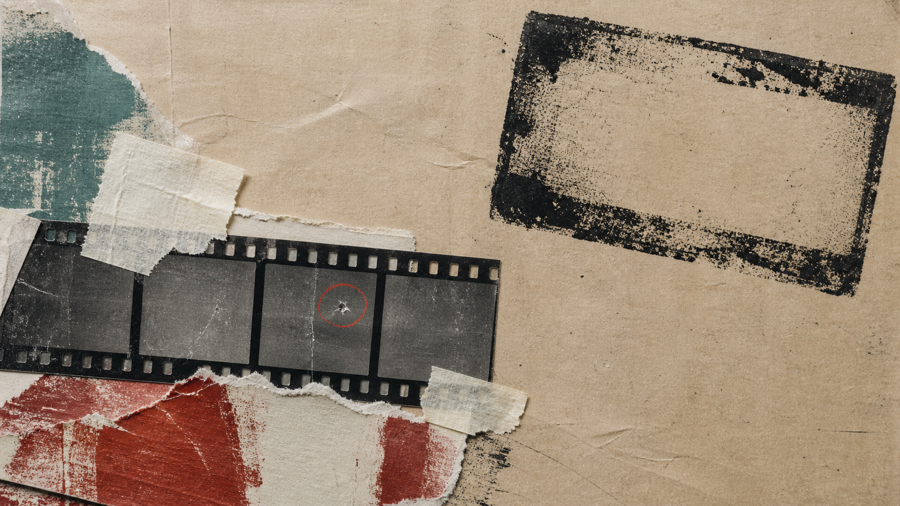
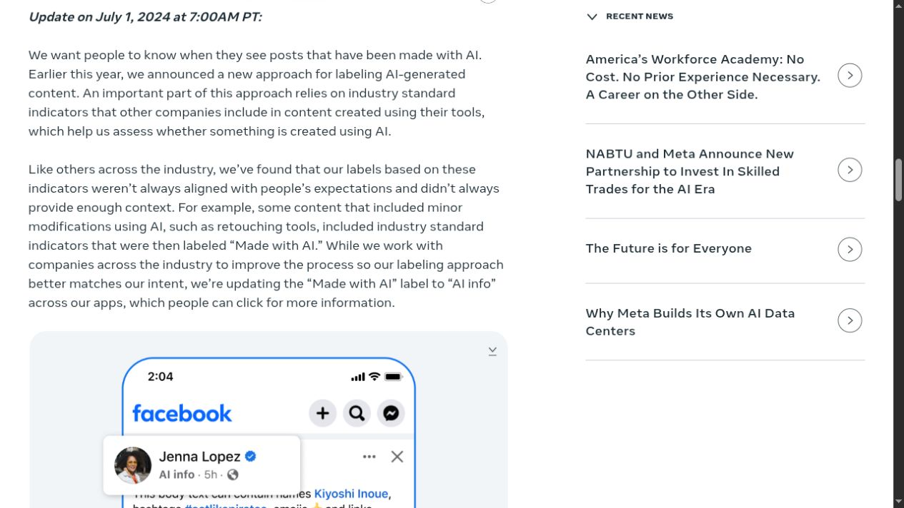

# When Instagram Calls a Real Human “AI”

A scan of a physical Polaroid can arrive on Instagram carrying an AI warning. Gregory Littley told Business Insider that it happened to his photographs; Meta's own policy supplies the uncomfortable mechanism, because a shared signal from even minor AI-assisted retouching once triggered the same public label used for much larger synthetic edits.

The badge detects a relationship with a tool or a disclosure. Viewers often read it as a verdict about authorship.

That gap now carries reputational weight. Creators told Business Insider that brands were adding restrictions on generative AI, while hand-painted art and handmade collages were receiving labels that implied machine involvement. The record does not show that every disputed file was untouched by AI-affiliated software. It shows something more useful: Instagram's label can compress an entire production history into two words that do not explain how much changed.

## Meta's label reads signals, not artistic intent

Meta's [labeling policy](https://about.fb.com/news/2024/04/metas-approach-to-labeling-ai-generated-content-and-manipulated-media/) says its systems can apply an AI label when they detect industry-shared indicators in an image, video, or audio file. A person can also disclose AI use during upload.

That process is broader than looking at a picture and deciding whether it “looks AI.” An editing application can attach provenance information to an exported file. Instagram can read that information even when the final work began as a camera photograph, a scan, or a hand-painted canvas.

The distinction became visible in 2024. Meta had called the badge `Made with AI`, a phrase that sounded like a claim about the whole work. Photographers complained that ordinary photographs received it after small edits. Meta then acknowledged that its indicators did not always match people's expectations.

The company renamed the badge `AI info` in July 2024. A September update went further: labels for content detected as edited or modified by AI would move into a post's menu, while content detected as generated by AI would keep a visible label.

Those changes improved the wording and placement. They did not turn the badge into a measurement of creative contribution.

## One repaired speck can label the whole photograph

PetaPixel tested the mechanism in June 2024. Its [experiment](https://petapixel.com/2024/06/25/this-is-what-makes-instagram-flag-your-photo-as-made-with-ai/) used Photoshop Generative Fill to remove a tiny dust speck from a photograph. Instagram applied `Made with AI` after upload.

The test gives the dispute a solid floor. The underlying photograph was real, yet a generative operation did touch a small part of the exported image. Calling the label entirely false would erase that edit. Calling the photograph “made by AI” would erase the camera work, subject, composition, timing, color decisions, and the rest of the human workflow.

Meta's rename tried to repair that semantic overreach. `AI info` is more cautious than `Made with AI`, but it still asks viewers to open a menu and interpret what may have happened. On a fast-moving feed, many will stop at the badge.

TechCrunch documented the same tension before and after the change. Its [June report](https://techcrunch.com/2024/06/21/meta-tagging-real-photos-made-with-ai/) collected complaints from photographers whose real photographs were labeled after AI-assisted editing. The [July follow-up](https://techcrunch.com/2024/07/01/meta-changes-its-label-from-made-with-ai-to-ai-info-to-indicate-use-of-ai-in-photos/) recorded Meta's rename. The harder problem, describing the extent of an edit without indicting the entire work, remained unresolved.

This is not a classic false positive where a classifier hallucinates a signal from nothing. In the reproducible example, the signal accurately records a generative edit but the interface invites a much larger conclusion. `Label mismatch` is the better name.

## Reported handmade cases raise a harder question

The 2026 cases go beyond one documented Photoshop operation, although the evidence is less complete.

[Business Insider's reporting](https://www.businessinsider.tw/article/5559) says Gregory Littley saw modification warnings on several Instagram posts, including scans of physical Polaroids and photobooth strips. Creator and model Lindsey Lee Lugrin said paintings made entirely by hand received language saying they might have been created or modified with AI.

Ashton McGrady described a related pattern across TikTok and Instagram. TikTok labeled a Disability Pride collage that she said took hours to assemble from images, stickers, and advice; the platform later removed the label without explaining why. McGrady reported a similar experience with a separate Instagram post.

These are named creator accounts supported by platform screenshots in the publication. They are not forensic reproductions. The public material does not include original files, complete export histories, or Meta's internal logs. A careful account therefore says the works were *reported as handmade and mislabeled*, rather than declaring that every technical signal appeared from nowhere.

That limit does not erase the harm. It identifies the missing piece that a fair appeal process would need to expose: which signal triggered the label, what it says about the file, and whether it describes generation, editing, or only a software workflow.

## A provenance credential is a history, not a truth score

Content Credentials, built on C2PA, can attach signed assertions about a file's origin and edits. Their [open-source FAQ](https://opensource.contentauthenticity.org/docs/getting-started/faqs/) explains that a screenshot does not carry the original image's C2PA metadata. Conversion and other workflows can also break the historical chain.

That creates an uneven system. A careful commercial tool may attach a record that Instagram can read. A less responsible generator can omit the same record, while a screenshot can discard it. The labeled post may be the one with the more transparent workflow, not the one with the greater synthetic share.

The absence of a credential cannot prove a human made the image. Its presence can establish that a named tool asserted a step in the file history, but not that the image depicts something true or that the tool supplied its central creative decisions.

The Associated Press captured this concern when Meta first described the plan in February 2024. Cornell researcher Gili Vidan warned that [selective coverage and unclear communication](https://apnews.com/article/415163d053ed915042a04f1ec3d9eafa) could create false confidence. The question was not merely whether platforms could find a mark. It was what viewers would think the mark meant and what they would infer from its absence.

## The badge has benefits, but the nouns are wrong

Broad labeling solves a real problem. It gives viewers context about synthetic or materially altered media. Meta's approach also keeps lawful content online rather than deleting it solely because a model participated, a less restrictive response that its Oversight Board had encouraged.

Self-disclosure has value too. Instagram tested a separate optional `AI Creator` profile label in 2026, according to [Digital Camera World](https://www.digitalcameraworld.com/tech/social-media/this-optional-instagram-ai-creator-label-is-a-step-in-the-right-direction-but-i-think-it-should-be-enforced). A creator who regularly makes synthetic art can state that practice once instead of leaving every audience to guess. The profile label is separate from a post's automatic `AI info` badge, and combining them would create more confusion.

The costs sit in the nouns. `Creator`, `made`, `generated`, `edited`, and `processed` describe different relationships. A platform that collapses them asks a small badge to answer an authorship question it cannot settle.

The tradeoff is visible across four cases:

| Case | Useful information | Risky inference |
|---|---|---|
| Fully generated image with a valid signal | A model created the visual output | Every statement around it is false |
| Camera photograph with a generative object removal | Some pixels came from a model | The model made the photograph |
| Human painting exported through flagged software | A tool or file signal triggered review | The painting itself was generated |
| No visible label | No supported signal appeared to the viewer | The work is certainly human-made |

A better interface would name the relation. `Generated image`, `AI-edited region`, `processed by`, and `creator disclosure` give audiences different facts. A details panel could name the credential issuer and preserve the assertion instead of translating every case into the same social judgment.

## Reputation turns ambiguity into a business risk

Creators no longer experience the badge as neutral metadata. In Business Insider's interviews, Lissette Calveiro compared an AI accusation to a scarlet letter. Five creators and managers said brand briefs or contracts increasingly prohibited generative AI in parts of production, including scripts, captions, or visual editing.

Those interviews do not establish how common the clauses are, and they do not quantify lost income. They do explain the stakes. A mislabeled sponsored post can force a creator to prove a negative while a campaign is live. An audience may treat the warning as dishonesty even if the contract allowed the small retouch that triggered it.

Platforms face the opposite failure. Weak or removable signals miss synthetic spam, and a cautious label can appear too late or too quietly to help. Narrowing labels only to fully generated work would reduce stigma around normal editing, but it would hide cases where a small synthetic change materially alters a face, product, or event.

No one label placement solves both problems. Clear categories and accessible source details can at least stop treating degree as a binary.

## A work trail is stronger than a badge

Instagram's AI label should be read as a prompt to inspect provenance, not as an authorship verdict. Meta's own revisions support that restrained reading. Minor retouching once triggered an overbroad public phrase, and the company changed both its wording and its placement.

Creators have practical evidence that a badge lacks: original camera files, scans, sketches, layered documents, export settings, commission messages, and dated versions. Keeping that trail will not guarantee that Meta removes a label. It can give a brand, editor, or audience a concrete record when the platform's explanation is thin.

The next useful request is equally concrete. A platform should identify the signal, distinguish generation from modification, show its issuer, and provide an appeal route tied to that evidence. “AI info” without those details leaves the most important information behind the label.

Readers can compare [Meta's current policy language](https://about.fb.com/news/2024/04/metas-approach-to-labeling-ai-generated-content-and-manipulated-media/) with the [Content Credentials FAQ](https://opensource.contentauthenticity.org/docs/getting-started/faqs/). The fair question for any disputed post is not simply whether AI touched the file. It is what the machine changed, what the human made, and whether the badge tells those two facts apart.
