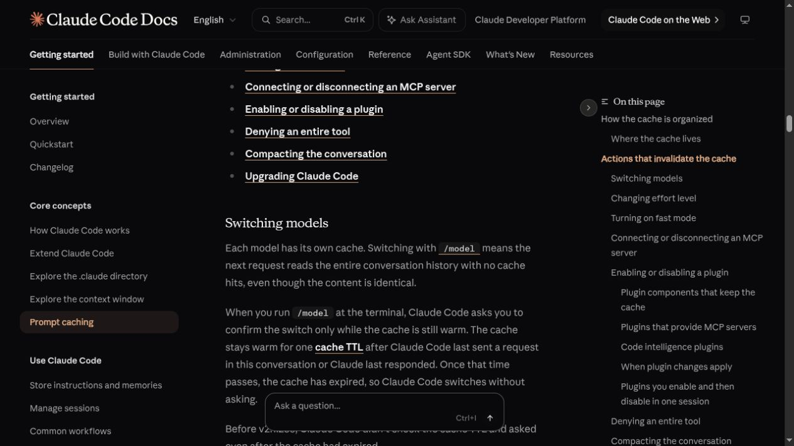

# Changing AI Models Mid-Session Can Cost More Than Staying on the Expensive Model

The cheaper model can be the expensive button when it is pressed late. Claude Code keeps the conversation when a model changes, but it does not keep the computation that made the conversation cheap to reread. Anthropic's recent [session guide](https://claude.com/blog/maximizing-the-value-of-your-claude-code-sessions) says every model has its own cache. The next request after `/model` reads the full history with no cache hits, even when every word in that history is unchanged.

That difference is large enough to reverse the obvious price comparison. With Anthropic's rates on August 24, 2026, a warm 100,000-token prefix costs `$0.05` to read again on Opus 5. Switching that same conversation to Sonnet 5 and writing a five-minute cache costs `$0.25` for the prefix. The nominally cheaper model is five times as expensive for that slice of the next request.

It does not stay that way forever. After the first Sonnet request builds its cache, each later read of the same prefix costs `$0.02`. Under a narrow prefix-only calculation that excludes new prompts and output, the switch catches up on the eighth Sonnet request. That turns the model comparison into a workload question: the amount of warm history being abandoned and the number of turns still expected.


## One session contains two different kinds of continuity

Anthropic's current [Help Center](https://support.claude.com/en/articles/14552983-models-usage-and-limits-in-claude-code) says a model can change mid-session without losing the conversation. The page goes further and calls planning with Opus, followed by execution with Sonnet, a common pattern. That advice is correct. The new model still receives the messages, files, tool results, and plan already present in the session.

The cache account is different. Claude Code assembles a fresh API request on every turn because the model itself retains no state between calls. Most of the next request is identical to the previous one, so the server normally reuses the processed prefix. [Claude Code's technical account](https://code.claude.com/docs/en/prompt-caching) separates the request into a system prompt, project context, and conversation. It also names the two fields that expose the result: `cache_creation_input_tokens` for a write and `cache_read_input_tokens` for a hit.



The transcript retains semantic continuity. The cached attention state does not; computational continuity disappears at the switch. `/model` preserves the first property and breaks the second.

An independent systems paper helps explain why the distinction affects latency as well as price. [Prompt Cache](https://arxiv.org/abs/2311.04934) describes reuse of precomputed attention states for repeated prompt material. Its prototype is not Anthropic's commercial implementation, but the underlying prefill account is consistent: reuse avoids recomputing old input, and the advantage grows with the amount of reusable context.

## The break-even is arithmetic, not folklore

Anthropic's current [pricing page](https://platform.claude.com/docs/en/about-claude/pricing) lists all figures below in USD per million tokens:

| Model | Base input | 5-minute cache write | 1-hour cache write | Cache read | Output |
|---|---:|---:|---:|---:|---:|
| Opus 5 | `$5.00` | `$6.25` | `$10.00` | `$0.50` | `$25.00` |
| Sonnet 5 | `$2.00` | `$2.50` | `$4.00` | `$0.20` | `$10.00` |

The platform's [prompt-caching reference](https://platform.claude.com/docs/en/build-with-claude/prompt-caching) sets the general multipliers at `1.25` times base input for a five-minute write, `2` times for a one-hour write, and `0.1` times for a cache read. Claude Code uses the one-hour TTL automatically on a Claude subscription and the five-minute TTL by default for API-key and third-party-provider sessions. Subscription plans draw from rate limits rather than presenting a direct API invoice. That boundary matters because plan usage and API billing are different accounting systems, even when both respond to the same requests.

For a stable prefix `H`, an old-model input price `P_old`, a new-model price `P_new`, a write multiplier `w`, a read multiplier `r`, and `N` requests on the new model, the prefix-only comparison is:

```text
stay   = N × r × P_old × H
switch = [w × P_new + (N − 1) × r × P_new] × H
```

For Opus 5 to Sonnet 5 with a 100,000-token prefix and five-minute caching:

| Requests after the decision | Stay on Opus 5 | Switch to Sonnet 5 |
|---:|---:|---:|
| 1 | `$0.05` | `$0.25` |
| 2 | `$0.10` | `$0.27` |
| 5 | `$0.25` | `$0.33` |
| 8 | `$0.40` | `$0.39` |
| 13 | `$0.65` | `$0.49` |

The first whole-request break-even is eight requests, including the switch request. With a one-hour cache write, the Sonnet path starts at `$0.40` and reaches prefix-only break-even on request thirteen.

Prefix size changes the dollars, not the turn count in this simplified case, because both paths carry the same stable history. A 500,000-token prefix multiplies every number by five. It also makes the uncached switch turn slower, since the new model must prefill more material.

This model deliberately excludes the newest prompt, newly read files, output tokens, tool charges, retries, regional modifiers, and differences in tokenization. Those terms matter. Sonnet's new input and output are cheaper immediately. A long response can make the switch pay back earlier. A weaker result that needs several corrective turns can move the break-even later, and a task that genuinely needs Opus may never be cheaper on Sonnet after quality is included.

## Why Anthropic can advise both “do not switch” and “plan with Opus”

The sharpest warning comes from an engineering post titled [“Prompt caching is everything”](https://claude.com/blog/lessons-from-building-claude-code-prompt-caching-is-everything). Its example is a conversation already 100,000 tokens deep on Opus. For one easy question, moving to Haiku can cost more than leaving the question on Opus because Haiku must build a new cache. That claim describes a late, one-off switch.

The Help Center's Opus-plan, Sonnet-execute pattern describes a different workload. Planning usually happens early, before the transcript has absorbed dozens of file reads and test logs. Execution then produces many tool round trips. The cache rebuild is smaller, and the cheaper model has enough later turns to recover it. Claude Code's `opusplan` setting implements that pattern, although the caching docs are explicit that each transition between plan and execution starts a fresh cache.

Both pieces of guidance survive once three variables are named:

- Cache age: if the old entry has expired, staying also requires a rebuild, so little warm computation remains to protect.
- Prefix size: an early transition is cheaper than a late transition after a long investigation.
- Remaining work: one answer rarely repays a rebuild; a long mechanical phase often can.

The pattern becomes less attractive when a session bounces repeatedly between modes. Each toggle can create another cold turn. One deliberate planning-to-execution handoff has different economics from model hopping every time a question becomes slightly harder or easier.

## What switching buys, and what it spends

A model change can still be the right operational choice.

It buys lower rates for new input, output, and later cache reads. It can match capability to task shape: Opus for an ambiguous architecture decision, Sonnet for a known implementation, or Haiku for a bounded lookup. It can also be cheap at the start of a session, after `/clear`, after a compaction boundary with a much shorter history, or after the old cache has expired.

It spends a one-time cache write, time to prefill the retained history, and some predictability. The new model may interpret the same transcript differently. A handoff document and fresh session reduce the prefix, but summarization can omit decisions that the full transcript contained. Remaining on the stronger model avoids that transition risk, while continuing to pay its higher new-token and output rates.

Effort deserves the same caution. Claude Code documents effort level as part of the cache key. A mid-session `/effort` change makes the next request reread the conversation without cache hits even when the model name stays fixed. A small reduction in thinking can therefore start with a large input rewrite.

Anthropic's [cost-optimization measurements](https://platform.claude.com/docs/en/about-claude/models/optimizing-for-cost-and-intelligence) show why this deserves attention. Its selected internal agent runs achieved 81% to 90% cache-hit rates and cost reductions of 2.5 to 3.7 times with caching. Anthropic labels those measurements directional rather than guaranteed. They do not predict a particular coding session, but they show that cache behavior can outweigh a modest difference in nominal model price.

## No local benchmark is being smuggled into the numbers

A bounded local check used Claude Code 2.1.233 in a temporary empty directory with first-party OAuth, no tools, low effort, and a fixed short response. The first call exposed JSON usage but resolved the Opus alias to a private routing identifier and produced no cache-creation tokens. The resumed Sonnet call failed at model selection with HTTP 404. It did not produce a comparable pair.

That failed check is a limit, not a result. The eight- and thirteen-request thresholds are analytical examples from documented rates. They are not measured Opus-to-Sonnet task benchmarks. A valid test would need a cacheable fixed prefix, confirmed public model IDs, identical settings, per-turn cache creation and read counts, latency, output tokens, task quality, and repeated trials.

## A better switching record has four fields

A team can make the decision less mysterious by logging four things before and after `/model`: cached prefix tokens, cache creation versus cache reads, expected remaining turns, and the accepted task result. API users can pair those fields with the documented [`/usage` command](https://code.claude.com/docs/en/commands) or provider billing. Subscription users can still watch the token counters and rate-limit behavior without pretending that quota maps exactly to API dollars.

The headline remains conditional. A model switch preserves the transcript but not the model-specific cache. For one cheap question late in a warm session, staying on Opus can cost less. For a long execution phase after an early plan, Sonnet can recover the rebuild and keep saving. The next model decision deserves a break-even estimate, not a reflex.
