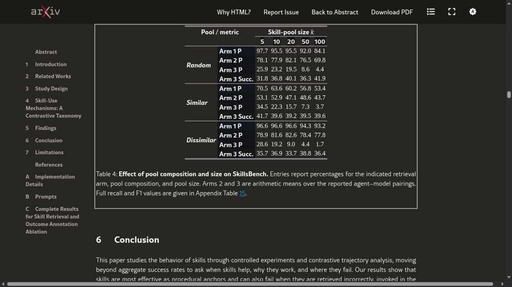

# Why 100 Agent Skills Can Be Worse Than 5

A 100-skill library can make an agent worse at choosing without making it worse at finishing. That is the useful tension inside a new controlled study of agent skills: across two reported agent–model pairings, parsed exact-use precision fell from 29.6% with five candidate skills to 3.3% with 100. Verified task success did not follow it down. It moved from 36.4% to 39.3%.

The result does not prove that five is a magic number, or that every 100-skill installation should be cut to the bone. It shows that skill availability, skill identification, skill use, and task completion are different measurements. A catalog can become noisy long before the agent looks visibly broken.

That noise matters because public skill libraries are already large: [SkillRet](https://arxiv.org/abs/2605.05726), a separate retrieval benchmark, collected 17,810 public skills. The open [Agent Skills specification](https://github.com/agentskills/agentskills/blob/main/docs/specification.mdx) makes those packages portable. Adding another procedure can then be easy; making the correct one legible among plausible neighbors remains the harder job.

## What the 8,135-trial study actually tested

[Demystifying Agent Skills: Why They Work—Until They Don’t](https://arxiv.org/html/2608.14036) normalized 8,135 controlled trial records across terminal-oriented benchmarks, agent harnesses, and models. Its retrieval study used candidate pools of 5, 10, 20, 50, and 100. Every pool contained the task's annotated ground-truth skill set plus real distractor skills sampled in three ways: random, semantically similar, or dissimilar.

The authors ran three independent experiments rather than one retrieval pipeline:

1. An embedding model ranked skill descriptions without executing the task.
2. An agent explicitly selected skills, again without downstream execution.
3. An agent received the full pool, executed the task, and had its accessed skills parsed after verification.

Outputs from the first two experiments were not fed into the third. That detail blocks an easy but incorrect story in which a bad top-one retrieval directly causes every failed run.

The headline 29.6%→3.3% figure belongs to the third experiment. It measures how precisely the skills accessed during execution overlapped the annotated ground-truth set. It is not a task-success rate. At a pool size of 100, recall remained between 54.3% and 73.6% across the reported conditions, which means agents often touched a correct skill alongside extra ones.

*Source evidence from [Jiang et al., Table 4](https://arxiv.org/html/2608.14036#S5.T4). The table separates offline identification, parsed execution-time use, and downstream success. Accessed August 24, 2026.*

## Precision collapsed; task success did not

The benchmark result is bad news for clean routing and better news for resilience.

Gemini's parsed exact-use precision fell from 16.9% to 0.7% as the pool grew from five to 100. Codex fell from 42.3% to 5.9%. Yet Gemini's task success stayed around 36–39%, while Codex rose from 35.4% to 42.0%. Averaged across the pairings, success moved from 36.4% to 39.3%.

The paper gives two reasons not to equate an exact match with a finished task. A related non-ground-truth skill may still contain a useful setup or verification routine. Conversely, loading the annotated skill does not repair an unrelated timeout, missing dependency, numerical error, or brittle implementation.

This is the first major con of the larger catalog: observability gets muddy. A system may complete tasks while reading too many irrelevant procedures, relying on a fortunate near-match, or carrying contradictory assumptions into the run. Aggregate success can therefore hide routing debt: a passing verifier says little about why the router chose what it did.

It is also the first pro. Agents are not simple one-label classifiers. Related skills can supply partial procedural support, and execution feedback can recover from an imperfect choice. A routing metric should not become the sole definition of usefulness.

## Similar skills create the harder problem

Catalog size was not the only stressor. Similarity mattered more for offline identification.

In the embedding-ranking arm, top-one precision on pools with similar distractors fell from 70.5% at five skills to 53.4% at 100. Random pools fell from 97.7% to 84.1%. Dissimilar pools barely moved, from 96.6% to 93.2%.

The practical problem is therefore not a folder containing 100 clearly different capabilities. It is a folder containing `deploy-cloudflare`, `deploy-cloudflare-workers`, `cloudflare-release`, `worker-publish`, and an older procedure that still mentions a retired command. All five may look relevant at the description layer. Only one may match the current resource, precondition, or output contract while the others carry stale or incompatible assumptions.

A second recent preprint, [Right Family, Wrong Skill](https://arxiv.org/abs/2606.10388), isolates that risk. Its benchmark pairs a helpful skill with a query-specific risky sibling from the same capability family. Three public retrieval systems reached Recall@3 between 0.848 and 0.888, but also exposed the risky sibling in the top three 34.6% to 37.2% of the time. The authors call the latter metric Harmful Sibling Rate.

Those numbers are benchmark results, not a measured production incident rate. They still expose a useful failure shape: broad capability matching can look strong while the execution contract is wrong.

## Why the answer is not “delete the skills”

The same 8,135-trial study found that skills often helped. Against matched workflow memory built from the same underlying trajectories, skills improved task success by 6.06 percentage points. In the trajectory taxonomy, procedural anchoring accounted for 65.7% of skill cases, while explicit knowledge injection accounted for 4.5%.

A useful skill did not mainly teach the model a missing fact. It stabilized a sequence: prepare the environment, call the right tool, preserve an output format, start and stop a service correctly, and verify the result. Raw workflow memory kept more failed branches and exploratory noise. A distilled skill turned that history into a procedure.

That creates a genuine tradeoff.

| Larger skill bank: advantage | Larger skill bank: cost |
|---|---|
| More specialized procedures remain available | More near-duplicate descriptions compete at routing time |
| Rare workflows can be preserved outside model weights | Stale preconditions and incompatible commands remain discoverable |
| Teams can reuse verified checks across sessions | Startup metadata and selection work grow with the catalog |
| A related skill may rescue an imperfect match | Aggregate success can hide irrelevant or risky skill access |

The best response is not permanent scarcity. It is a smaller active routing surface over a larger governed library.

## Progressive disclosure saves context, not selection

The open Agent Skills client guide already recommends [progressive disclosure](https://github.com/agentskills/agentskills/blob/main/docs/client-implementation/adding-skills-support.mdx). A compatible agent sees roughly 50–100 tokens of name and description per skill at startup. It loads the full `SKILL.md` only after activation, then reads scripts or references as needed.

That design prevents 100 complete manuals from flooding the initial prompt. It does not remove the selection problem because the names and descriptions still form the catalog the model must interpret. One hundred vague descriptions create a routing task even when none of their bodies has loaded.

The distinction suggests a cleaner architecture:

1. Keep the full library as a cold catalog.
2. Build a small task-specific shortlist before any model-driven activation begins.
3. Load only the selected skill bodies.
4. Track which procedures were accessed and which ones affected verified outcomes.

Five works as an experiment-sized shortlist because it matches the smallest condition in the paper, not because the paper crowned it as an optimum. A security review may need eight candidates, while a narrowly scoped image task may need only two. The number should follow measured confusion, not folklore.

## A better skill description names the boundary

Descriptions often say what a skill can do. Large catalogs also need to say when it should not be used.

A discriminative description can expose four fields:

- capability: the job the skill performs;
- preconditions: the runtime, credentials, ownership, or project state it expects;
- artifact: the file, service, or external resource it changes;
- exclusion: the nearby capability family it must not replace.

That structure is not merely editorial neatness. [Field Aware Agent Skill Retrieval](https://arxiv.org/abs/2608.02880) reports that preserving fields separately improved hybrid retrieval on two benchmarks. Its learned field-aware model reached Recall@10 of 77.95 on SkillRet and 83.78 on SRA-Bench, above corresponding concatenated baselines. The reported advantage grew with larger skill banks.

Retrieval gains do not guarantee better finished work. They do show that flattening a structured procedure into one undifferentiated text blob throws away useful routing signals.

## What a catalog audit should measure

A team can test this problem without reproducing 8,135 trials.

Start with 20 representative tasks and preserve their deterministic checks. Run each task against several catalog views: the full library, a capability-filtered shortlist, a manually curated five-skill set, and a version with deliberately similar siblings. Keep the model, harness, task files, and trial budget fixed.

Then record four separate outcomes:

1. identification: whether the annotated skill entered the shortlist;
2. exposure: whether a stale or risky sibling entered with it;
3. execution: which skill bodies were actually accessed;
4. result: whether the task's verifier passed, plus latency and context cost.

A catalog earns its size when extra procedures improve verified outcomes or cover important rare cases without raising harmful exposure. It has become clutter when near-duplicates add selection work, stale assumptions, and no measured coverage.

## Five is a routing hypothesis, not a law

The primary paper has firm limits. Its experiments emphasize terminal and tool use, not long web interactions or open-ended collaboration. It covers a limited set of agent–model configurations. The mechanism taxonomy comes from a stratified sample of about 3% of normalized records. It is also a preprint at the research cutoff.

The defensible conclusion is narrower than the title's tension. One hundred available skills can be worse than five active candidates when the larger pool contains confusable procedures and the harness cannot sharply distinguish their contracts. The same large library can remain valuable when retrieval produces a small, compatible shortlist and execution keeps a verifier in the loop.

The next useful step is a catalog audit, not a deletion spree. Group skills by capability family, mark stale siblings, rewrite descriptions around preconditions and exclusions, then compare exact-use precision with verified success. The [primary study](https://arxiv.org/html/2608.14036) supplies the measurement split; the [Agent Skills client guide](https://github.com/agentskills/agentskills/blob/main/docs/client-implementation/adding-skills-support.mdx) supplies the loading model. The gap between them is where a better router belongs.
