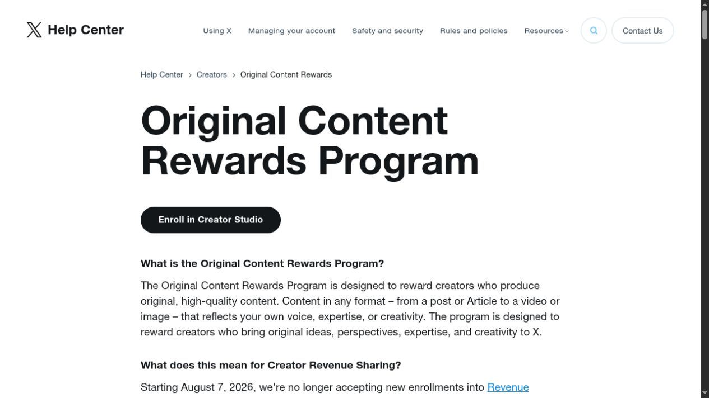

# X Is Replacing Revenue Sharing. Did Repost Culture Break the Incentive?

X has decided that its creator-payment problem is also a content problem. On 7 August 2026, the platform stopped accepting new members into Creator Revenue Sharing and introduced Original Content Rewards, a replacement that is scheduled to begin taking applications from existing participants on 8 September. The change does not prove that engagement payouts created X’s repost economy. It does show that X now treats originality, aggregation, and manipulated attention as payment questions rather than moderation questions alone.

*Original illustration: a paste-up ledger for the contest between making, copying, and getting paid.*

That distinction matters. Reposts existed long before revenue sharing, and the available sources do not measure how much recycled material the old program caused. But incentives decide which behavior becomes a business. When money follows qualified impressions, the cheapest reliable route to those impressions can become more attractive than reporting, filming, drawing, or writing from scratch.

## The outgoing program paid for attention, not a clean chain of authorship

X’s outgoing [Creator Revenue Sharing page](https://help.x.com/en/using-x/creator-revenue-sharing) described earnings as influenced by verified users’ impressions in the Home timeline, the viewer’s subscription tier, and the content format. Eligibility required Premium, at least 500 verified followers, and five million organic impressions over the previous three months. Those rules set a demanding attention threshold, but they did not make original authorship the central test.

That gap gave repost accounts a simple economic advantage. An original report may take days and fail. A clipped video, copied thread, or repackaged meme can be tested many times at low cost. If both reach the same qualified viewer, an impression-led formula can struggle to distinguish the cost and provenance behind them.

In April, X’s head of product, Nikita Bier, said the company was reducing payments to accounts built around aggregation and engagement bait. [TechCrunch reported](https://techcrunch.com/2026/04/12/x-says-its-reducing-payments-to-clickbait-accounts/) his argument that creators were being crowded out by stolen reposts and clickbait. Four months later, the company replaced the program rather than merely tuning it.

The diagnosis came from X, so it should be read as the platform’s account of its own failure, not an independent audit. No public dataset in the inspected sources establishes the share of paid impressions captured by copied posts. Nor does it establish that the payout program caused the wider repost culture. The firmer conclusion is narrower: X believed its payment rules were rewarding too much behavior it no longer wanted to fund.

## What Original Content Rewards changes

The new [Original Content Rewards policy](https://help.x.com/en/using-x/original-content-rewards) keeps an impression-based base but adds an explicit authorship filter.

| Policy question | Outgoing Creator Revenue Sharing | Original Content Rewards |
|---|---|---|
| Main qualifying signal | Verified users’ organic Home impressions, with other factors | Unique qualified Premium Home impressions, at least 50% in view |
| Entry threshold | 5 million organic impressions in three months | 500,000 verified Home impressions in 90 days |
| Follower threshold | 500 verified followers | 500 verified followers |
| Content test | Policy compliance; originality was not the named organizing rule | Original reporting, analysis, commentary, memes, photos, and video can qualify |
| Explicit exclusions | Artificial inflation and policy violations | Copies, weak rewrites, aggregation with little added value, cross-platform reposts, solicited engagement, reply impressions, automated content, and fraud |

The lower impression threshold could open the program to smaller accounts. The stricter content test could also make the qualifying pool narrower once an account applies. X says applications will be reviewed, and it excludes duplicate views, paid impressions, and artificial or fraudulent activity from payment calculations.

*Evidence: X’s current Help Center introduces the replacement and begins the Revenue Sharing transition notice. Captured 24 August 2026.*

The shift is bigger than a renamed fund. It makes provenance part of the commercial contract. A post can be permitted on X yet still fail the payment test. Commentary over existing material can qualify, but merely attaching a caption or reaction does not. That boundary asks reviewers and automated systems to judge added value, a task that is much harder than counting views.

## Did engagement payouts create a repost economy?

The evidence supports a feedback-loop explanation, not a single-cause story.

Repost culture already had non-cash rewards: follower growth, visibility, status, and traffic to outside businesses. Revenue sharing added a direct payment to the same attention stream. Once that happened, high-volume recycling could turn a cultural habit into a repeatable income strategy. Accounts did not need to invent a trend; they needed to recognize it early, package it quickly, and win distribution.

X executives have described that outcome in incentive terms. In August, [TechCrunch quoted creator lead Allegra Jacchia](https://techcrunch.com/2026/08/08/x-replaces-misaligned-revenue-sharing-program-with-original-content-rewards/) saying the old scheme’s incentives were misaligned and that the replacement would reward net-new work. That is useful evidence of intent. It is not proof that every aggregator joined because of payments, or that the new rules will make copying unprofitable.

The likely mechanism runs both ways. Engagement payments may have increased the supply of recycled posts. A feed already good at distributing recycled posts may also have made engagement payment easier to exploit. All of those forces sit inside the loop.

## What the replacement gets right

The best part of the policy is that it states what X wants to buy. Original reporting, analysis, commentary, and media production all have named standing. That gives creators a stronger case against a low-effort duplicate.

The policy also recognizes that originality is not the same as making every pixel alone. A remix can still change what a reader understands. That matters for critics, educators, meme makers, and reporters who work with source material. A blanket ban on reused media would protect ownership at the cost of legitimate transformation.

The lower impression requirement is another credible benefit. Moving from five million organic impressions in three months to 500,000 verified Home impressions over 90 days reduces the scale needed to apply. Smaller specialist accounts may have a better route into the program, provided review is consistent.

Removing reply impressions has another benefit: it weakens a familiar incentive for dropping low-value replies beneath viral posts. X also excludes posts that ask for engagement, automated content, and posts carrying a helpful Community Note. The controls now sit nearer the payout.

## What could still go wrong

Originality is a judgment, and judgment creates edge cases. A reporter can publish a brief factual update that looks similar to many others. A curator can add real context without creating the underlying clip. A meme can have dozens of contributors and no clean origin. Reviewers will need to distinguish these cases at the speed of a global feed.

The policy also leaves X broad discretion. Its [program terms](https://legal.x.com/en/original-content-rewards-terms.html) allow the company to change calculations, reject an application, withhold payment, or remove a participant. Flexibility helps X react to abuse, but it makes expected income harder for creators to plan around. Clear appeal paths and concrete examples will matter as much as the written definition.

Impression pay remains part of the design. A fully original post can still be optimized for outrage, confusion, or cheap curiosity. The program rejects misleading content and disinformation, but enforcement will determine whether that protection is real. Original clickbait is still original.

There is also a risk that provenance enforcement favors established accounts. A large account may be assumed to be the origin because its copy is seen first. A smaller photographer or researcher may need to prove an earlier publication from another platform, even though cross-platform reposting is itself listed as ineligible. The rule needs a way to recognize the actual maker without punishing creators who publish in more than one place.

## Who gains, and who carries the cost

| Participant | Possible upside | Possible cost |
|---|---|---|
| Original reporters and makers | A payment rule that names their work as valuable | More evidence and appeals may be needed when copies outrun the source |
| Commentators and curators | Analysis that materially changes the source can qualify | The “meaningful contribution” line may be applied unevenly |
| Small specialist accounts | A lower impression threshold to apply | Manual review can become a new bottleneck |
| X | Better alignment between payments and the feed it wants | Review, provenance disputes, and false positives become operating costs |
| Audiences | Less incentive for copied posts and bait replies | Aggressive filtering could suppress useful quotation, remix, or archival work |

The new program therefore trades one measurable but crude rule for a richer and less predictable one. Counting qualified impressions is relatively clear. Deciding whether a contribution is original enough to deserve money is not.

## The real test begins after rollout

Before existing-program applications open on 8 September, claims about Original Content Rewards succeeding would be premature. The useful tests come after rollout: whether copied posts lose payment without simply changing format, whether appeals reveal consistent standards, and whether smaller original accounts actually receive a larger share.

Repost culture did not begin with X’s old payout program, and it will not end with a new label. Still, the replacement admits something important. A platform cannot pay for attention and treat the origin of that attention as somebody else’s problem.

The practical next step is to read [X’s originality definitions and exclusions](https://help.x.com/en/using-x/original-content-rewards) before judging the program by its name. The outcome should be judged later by who gets paid, whose work is copied, and whether the two groups finally stop looking so similar.
