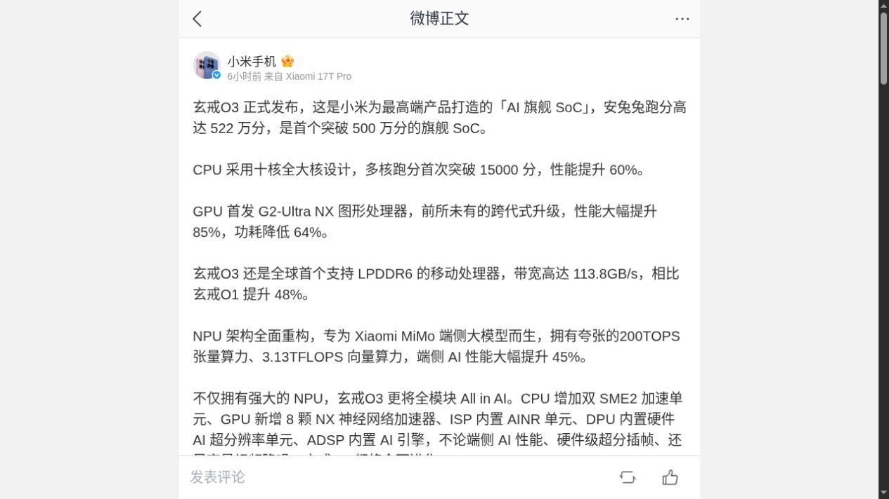

# Xiaomi XRING O3 Is Official. Its Benchmark Case Isn’t.

By the afternoon of 24 August 2026, the strangest part of Xiaomi's new phone chip was no longer its name. XRING O3 was official; its 5.22 million AnTuTu result was still Xiaomi's result.

That distinction sets the terms for any fair assessment. Xiaomi's [verified phone account announced XRING O3](https://m.weibo.cn/status/5335442573754887) and published a dense list of CPU, GPU, memory, and AI figures. At the research cutoff, no independent review had tested O3 in a retail device. The launch therefore proves that Xiaomi's flagship mobile system-on-chip (SoC) program continues. It does not yet prove a benchmark crown.

*Designing the processor moves more decisions inside Xiaomi, while fabrication and licensed building blocks remain part of the route to a finished device. Original editorial illustration.*

## O3 is the official name; the missing O2 remains unexplained

The letter matters. Xiaomi called its 2025 application processor [XRING O1](https://www.mi.com/global/discover/article?hl=en-GB&id=4926). Its verified Weibo account then called the new part **XRING O3**, using the letter O rather than the number zero. Android Authority's English URL and headline use “03,” which helps explain why the name can look like a typo in search results, but [its report traces the announcement back to Xiaomi's post](https://www.androidauthority.com/xiaomi-xring-03-3702037/).

No first-party explanation for skipping the public O2 label appeared in the material inspected by the cutoff. A [public Weibo discussion](https://widget.weibo.com/weiboshow/index.php?dpc=1&fansRow=2&height=500&isFans=0&isTitle=0&isWeibo=1&language=&noborder=1&ptype=1&skin=1&speed=300&uid=1649672924&verifier=76e9736b&width=300) noticed the gap; its O2 speculation cannot establish Xiaomi's reasoning. The safe wording is simple: O3 is official; why the public sequence jumped from O1 to O3 is unknown.

*A bounded capture of Xiaomi's 24 August announcement. It settles the product name and records the claims that later retail tests will need to check. [Original post](https://m.weibo.cn/status/5335442573754887).*

## What Xiaomi announced, and what it did not show

The figures below are not presented as measured findings. They are Xiaomi's launch claims, reported in the original post and in [IT Home's account of the briefing](https://m.ithome.com/html/993519.htm).

| Area | Xiaomi's launch claim | Evidence still missing |
|---|---|---|
| Overall score | 5.22 million in AnTuTu | Device, software version, cooling, run count, power mode, and independent reproduction |
| CPU | Ten cores, up to 4.35 GHz, more than 150,000 in a multi-core run, and 60% higher performance | Exact core models, comparison target, sustained power, and retail-device tests |
| GPU | A 16-core G2-Ultra NX design, 85% higher performance, and 64% lower power | Workload, baseline, power point, driver maturity, and sustained frame rate |
| Memory | LPDDR6 at 113.8 GB/s, 48% above O1 | Shipping memory configuration, latency, application benefit, and energy cost |
| AI | A 200 TOPS NPU plus accelerators in CPU, GPU, ISP, display, and audio blocks | Precision, model, accuracy, tokens or frames per second, power, and software support |

Peak numbers can describe the ceiling of a subsystem. They cannot describe how long a phone stays at that ceiling, how much heat reaches the case, whether a game driver behaves, or how much battery an AI task consumes. Those questions require a device, stable firmware, repeatable workloads, and competing phones tested under the same conditions.

This gap is especially important for the GPU claim. Xiaomi named a G2-Ultra NX graphics processor, but the launch material did not provide the sort of architectural and driver detail needed to compare it cleanly with established mobile GPUs. A percentage without a named baseline is a direction, not a verdict.

## O1 gives Xiaomi credibility, not an O3 result

XRING O1 offers useful history because independent labs could actually test it. Notebookcheck's [Xiaomi 15S Pro review](https://www.notebookcheck.net/Xiaomi-15S-Pro-review-Newfound-independence-and-strong-battery-life-in-a-flagship-smartphone.1047332.0.html) recorded 2,985 single-core and 9,250 multi-core points in Geekbench 6.7. Its Snapdragon 8 Elite Xiaomi 15 Pro comparison reached 3,089 and 9,404. In that test, Xiaomi's first flagship application processor was close enough to count as a serious competitor.

The same independent review also prevents a simple launch-to-victory story for Xiaomi. It measured an upper-surface maximum of 48.2 °C under load and an average 6.3 W draw in its Geekbench power test, compared with 5.51 W for the Snapdragon phone. Sustained stress produced a moderate performance drop. The O1 phone also lasted 25 hours 26 minutes in Notebookcheck's Wi-Fi test, slightly longer than the Snapdragon comparison.

Those results belong to complete phones. Screen power, battery size, cooling, modem behavior, firmware, and test variance all affect them. They show that Xiaomi can field competitive flagship silicon and tune a strong device around it. They do not isolate O1 efficiency, and they cannot be carried forward as proof of O3's claimed gains.

## The case for XRING is control, not independence

The strongest benefit is not a benchmark number. It is the ability to decide which capabilities deserve silicon area and then shape the operating system, camera pipeline, memory system, and device design around those choices.

Xiaomi's O3 announcement describes AI work spread across the NPU, CPU, GPU, image signal processor, display processor, and audio processor. If those blocks are supported well in HyperOS and applications, Xiaomi can tune a camera path or local model for its own hardware instead of waiting for a merchant-chip roadmap. That could give its phones features that are harder to copy and shorten the path between a software problem and a chip-level fix.

Reuters framed the commercial case in similar terms: [greater feature control, differentiation, and bargaining power with outside chip suppliers](https://www.investing.com/news/stock-market-news/xiaomi-launches-new-xring-chip-partners-with-tsmc-production-sources-say-4872712). A working in-house option changes a supplier conversation even when Xiaomi continues buying Snapdragon or Dimensity parts for other products.

There are three clear advantages:

1. **Product fit.** Xiaomi can allocate compute, memory bandwidth, imaging logic, and AI acceleration around its own devices.
2. **Differentiation.** A custom camera or on-device AI path can become part of the product rather than a shared platform feature.
3. **Program knowledge.** Repeated generations build internal experience in physical design, firmware, compilers, drivers, thermal control, and manufacturing coordination.

None guarantees lower cost. A custom design must recover engineering, mask, verification, software, and wafer expenses across a smaller volume than the largest merchant chip vendors. Control can matter even when it is expensive.

## The dependency map changed; it did not disappear

“Self-developed” does not mean every component was invented or manufactured inside Xiaomi. That is normal in modern chip design.

Arm's [technical account of O1](https://newsroom.arm.com/blog/xiaomi-xring-o1-silicon) documents the licensed foundations Xiaomi chose for that chip: Armv9.2 Cortex CPU IP, Immortalis GPU IP, and CoreLink interconnect. Arm also credits Xiaomi's back-end and system work. The division is useful: Xiaomi can own the way licensed blocks are selected, combined, placed, tuned, and supported without owning every instruction set or graphics block.

Manufacturing is another outside layer. Reuters reported, citing two people familiar with the matter, that TSMC would produce O3 on a 3 nm process. Xiaomi and TSMC did not confirm the foundry, node, or product target to Reuters. That makes TSMC and 3 nm reported facts, not Xiaomi-announced specifications.

Capacity also carries a price. [TrendForce described high-performance chip demand as concentrated on 3 nm in 2026](https://www.trendforce.com/presscenter/news/20260430-13028.html), with a temporary TSMC-dominated single-supplier dynamic. In-house design does not grant cheap wafers, good yields, or priority allocation. It can swap dependence on a finished application-processor vendor for dependence on licensed IP, electronic-design tools, foundry capacity, packaging, memory, and other components.

The modem is a particularly important blank. A technical account of O1's die reported [an external modem rather than an integrated one](https://www.androidheadlines.com/2025/05/xiaomi-xring-o1-chip-details-all-you-need-to-know.html). That does not establish O3's arrangement. Xiaomi's O3 post did not identify a modem, and no opened source settled the question. Radio performance and standby power should therefore remain on the test list instead of being inferred from the application-processor announcement.

Policy risk needs the same restraint. U.S. Commerce rules cover [some advanced manufacturing equipment, software, HBM, and chip-design tools under stated conditions](https://www.bis.gov/press-release/commerce-strengthens-export-controls-restrict-chinas-capability-produce-advanced-semiconductors-military). That record shows why a Chinese advanced-chip program must account for changing supply and licensing rules. It does **not** show that XRING O3 is prohibited or unable to ship.

## The expensive part continues after tape-out

Xiaomi's commitment is large enough to be treated as a continuing platform effort. Reuters cited Xiaomi's stated plan to invest 50 billion yuan in chip development over a decade, reported more than 20 billion yuan spent on XRING, and described a team of more than 3,000. Xiaomi's [2025 annual results](https://www1.hkexnews.hk/listedco/listconews/sehk/2026/0324/2026032400608.pdf) reported RMB33.1 billion in company-wide R&D expense and 25,457 R&D staff, though those company totals cover far more than silicon.

Money and headcount can buy design iterations. They cannot skip driver work, compiler tuning, camera calibration, application testing, power management, security maintenance, or years of updates. Custom silicon makes Xiaomi responsible for more of the problems that customers eventually experience as heat, battery drain, camera delay, a broken game, or an unavailable feature.

That burden is also the opportunity. A merchant chip spreads its software investment across many buyers. Xiaomi can tune for fewer products and tighter combinations. Whether that narrower focus wins will appear in ordinary tasks, not in one launch score.

## A fair O3 test needs six answers

A useful retail review should compare O3 with current Snapdragon and Dimensity phones in matched conditions and report:

1. **Sustained CPU and GPU output:** repeated runs, long gaming sessions, and the performance curve after heat builds.
2. **Energy per task:** power used for the same workload, not only peak speed or a percentage from an unnamed baseline.
3. **Case temperature and battery life:** measured in the shipping device with display and network conditions controlled.
4. **Modem behavior:** supplier, network compatibility, weak-signal performance, standby drain, and data-session power.
5. **Software quality:** game compatibility, camera processing, local AI speed and accuracy, and whether Xiaomi's many AI blocks receive real application support.
6. **Availability and updates:** actual device volumes, markets, long-term firmware support, and whether later Xiaomi products reuse the design.

Until those results exist, O3's most defensible achievement is institutional. Xiaomi produced a named successor, says it has entered mass production, and is making a second public attempt at flagship silicon. Reuters reported a foldable-device target of 200,000 to 300,000 units from one source, but no shipment record was available at the cutoff.

## The answer on launch day

XRING O3 is not a typo or an unconfirmed roadmap label. It is Xiaomi's official name for its new flagship application processor. The missing O2 remains an unanswered naming question.

The chip may give Xiaomi more control over product features, software tuning, and supplier negotiations. O1's measured results make that ambition credible. The drawbacks are equally concrete: licensed Arm technology, reported reliance on TSMC, an undisclosed modem arrangement, expensive advanced-node capacity, a larger software obligation, and policy exposure that must be discussed without pretending a specific ban exists.

The benchmark case remains open. Every O3 speed and efficiency figure available by 24 August came from Xiaomi's launch material. The useful next step is to keep [Xiaomi's original O3 post](https://m.weibo.cn/status/5335442573754887) as the claim sheet, then compare each number with independent retail-device tests when they arrive. That comparison will show whether O3 is only a stronger statement of control or a stronger chip in a customer's hand.

---

**Research note:** Sources were checked through 24 August 2026, 23:59 Asia/Jakarta. Logged-out X search required sign-in, and an exact-phrase Threads search returned no public result. Neither surface supplied a material claim. Xiaomi's verified Weibo account provided the accessible first-party social record.
